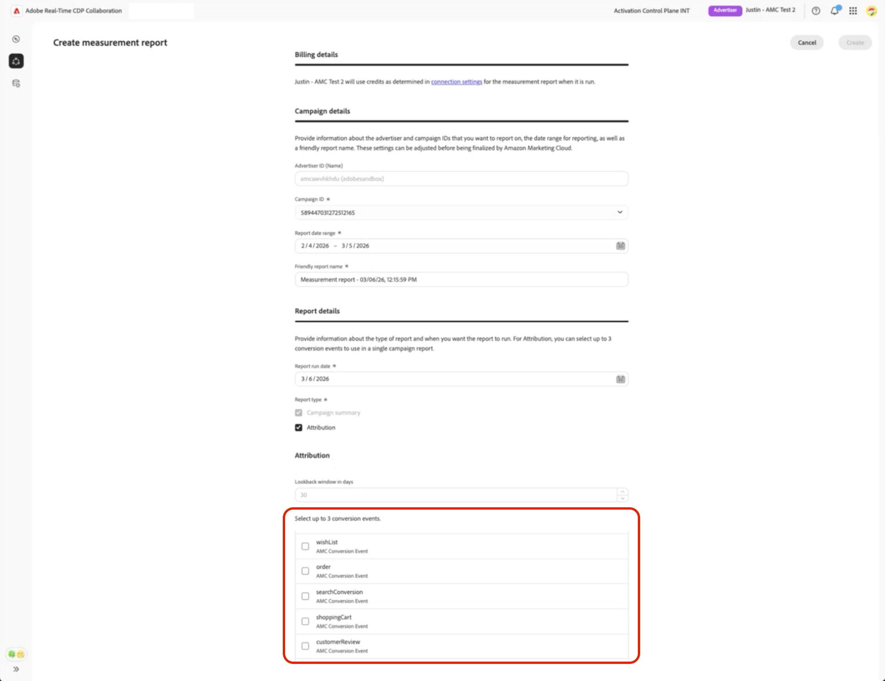
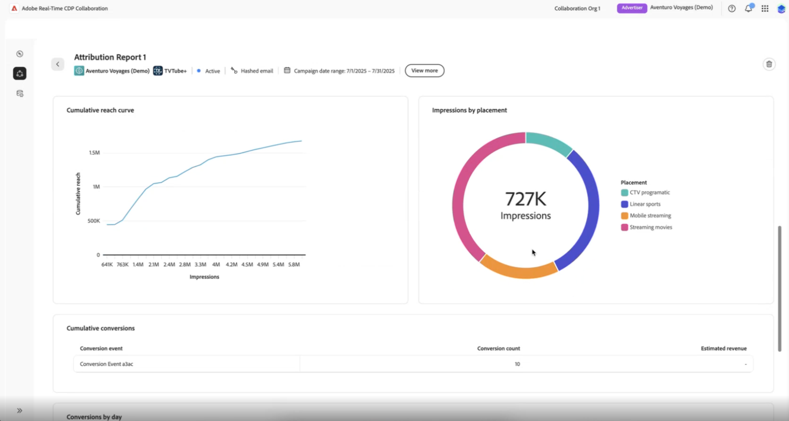
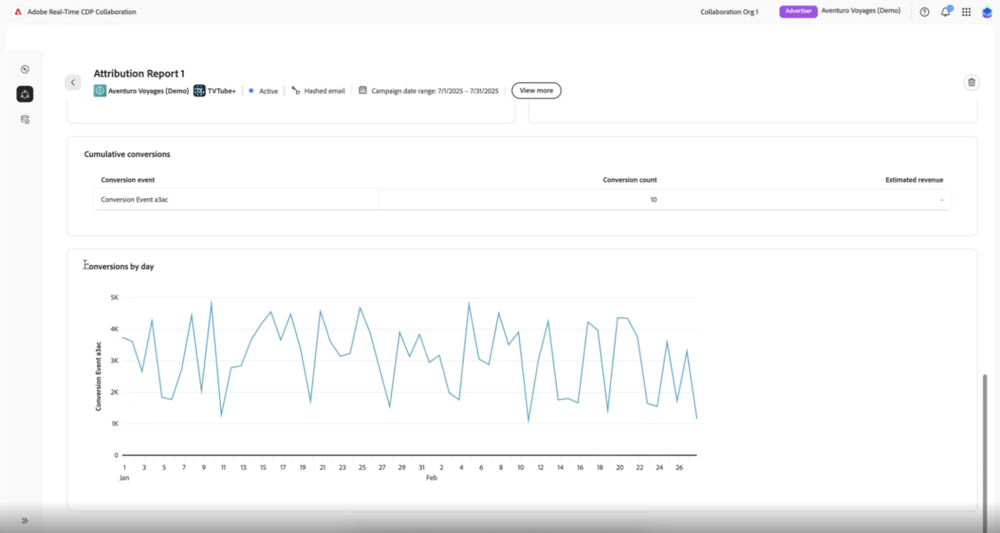

# Create [!DNL Amazon Marketing Cloud] measurement reports {#amc-measurement-reports}

{{limited-availability-release-note}}

The [!UICONTROL Measure] tab helps you evaluate how effectively your [!DNL Amazon Ads] reached your audience and whether impressions drove measurable customer actions. After creating a project with [!DNL Amazon Marketing Cloud] ([!DNL AMC]), you can create measurement reports for campaigns that have already run. Campaign and conversion event data is sourced automatically from your [!DNL AMC] instance, no additional data upload is required. Reports evaluate campaign reach, frequency, and conversion effectiveness once data is available.

The [!UICONTROL Measure] tab appears alongside the [[!UICONTROL Discover]** tab](../discover.md) in your AMC project.

>[!IMPORTANT]
>
>The **[!UICONTROL Measure]** tab displays "No Measurement Data Available" until the background data setup queries are completed. This process can take up to 24 hours. If the 'No Measurement Data Available' message persists after 24 hours, refer to the [Troubleshooting](#troubleshooting) section.

## Prerequisites {#prerequisites}

Before creating a measurement report, ensure you have:

* An active [!DNL AMC] connection and an existing project. Refer to the [Connect to Amazon Marketing Cloud](../../connect/advertising-platforms/amc.md) and [Manage projects](../manage-projects.md) guides.
* Campaigns that ran within the last three months in your [!DNL AMC] instance, with sufficient unique users to meet [!DNL AMC]'s minimum aggregation threshold. Campaign IDs are discovered only within this default lookback window. For details on the aggregation threshold, refer to the [AMC aggregation threshold documentation](https://advertising.amazon.com/API/docs/en-us/guides/amazon-marketing-cloud/aggregation-threshold){target="_blank"}. If no campaigns appear in the report form, refer to the [Troubleshooting](#troubleshooting) section.

## Create a report {#create-report}

To create an [!DNL AMC] measurement report:

1. Navigate to **[!UICONTROL Collaborate]** > **[!UICONTROL My projects]** and select your [!DNL AMC] project.
2. Select the **[!UICONTROL Measure]** tab.
3. Select the add icon () to open the options menu, and then select **[!UICONTROL Measure]**.

![The Measure tab inside an AMC project, showing the Add icon and [!UICONTROL Measure] in the upper-right corner of the workspace.](../../../assets/collaborate/advertising-platforms/add-measure-draft.png){zoomable="yes"}

The measurement report form appears.

{zoomable="yes"}

Complete the measurement report form using the sections below.

### Campaign details {#campaign}

The **[!UICONTROL Advertiser ID]** is the unique identifier for your [!DNL Amazon Advertising] account, sourced from your AMC connection settings. It is pre-populated from your project settings. If the value is incorrect, update it via your [project settings](../manage-projects.md). From the **[!UICONTROL Campaign ID]** dropdown, select the campaign to include in the report. Available campaigns meet the [prerequisites](#prerequisites) described above. If no campaigns appear, see [Troubleshooting](#troubleshooting).

#### Date range, run date, and report name {#dates}

>[!CONTEXTUALHELP]
>id="rtcdp_collaboration_amc_measure_report_date_range"
>title="Date range"
>abstract="Set the start and end dates for the campaign data to include in the report. The date range is limited to a 365-day lookback window with a maximum span of 90 days. You can only report on past campaigns."

>[!CONTEXTUALHELP]
>id="rtcdp_collaboration_amc_measure_report_run_date"
>title="Run date"
>abstract="The date on which the report executes. Must be at least one day after the report end date and can be up to 46 days in the future."

>[!NOTE]
>
>You can only report on campaigns that have already run.

Set the **[!UICONTROL Report date range]** to cover the dates during which the campaign was actively running. [!DNL AMC] supports a 365-day lookback window with a maximum span of 90 days.

Set the **[!UICONTROL Report run date]**. This is the date on which the report executes. The run date must be at least one day after the report end date and can be up to 46 days in the future. For the full set of date constraints, see [AMC constraints reference](#constraints).

>[!TIP]
>
>For attribution reports where the date range is within 30 days of the current date, set the run date 30 days in the future to ensure all conversions within the fixed 30-day lookback window have been captured before the report runs.

Enter a **[!UICONTROL Report name]** to identify the report.

#### Report type {#report-type}

A **[!UICONTROL Campaign summary]** is included in every report. In addition, select the **[!UICONTROL Attribution]** check box if you want to measure whether your campaign impressions drove specific customer actions, such as purchases or sign-ups, within a 30-day window after ad exposure. Select **[!UICONTROL Attribution]** when your campaign goal was to drive measurable conversions and you have conversion tracking enabled in your [!DNL AMC] instance. If your goal was reach or awareness only, **[!UICONTROL Campaign summary]** alone provides the delivery metrics you need.

| Report type | Description |
| --- | --- |
| **[!UICONTROL Campaign summary]** | Provides reach, frequency, and impression metrics for the selected campaign. Always included. |
| **[!UICONTROL Attribution]** | Adds conversion data to the report. Only available if conversion events exist in your [!DNL AMC] instance. See [Conversion events](#conversion-events). |

#### Conversion events (attribution only) {#conversion-events}

>[!CONTEXTUALHELP]
>id="rtcdp_collaboration_amc_measure_conversion_events"
>title="Conversion events"
>abstract="Select up to three conversion events to include in the attribution report. Available events are discovered automatically from your AMC instance. If no events appear, your AMC instance may not have any recorded conversion events and Attribution will be unavailable."

>[!NOTE]
>
>Attribution data requires conversion events to be configured in your [!DNL AMC] instance. If [!UICONTROL Attribution] is not available or was not selected, skip this section and select **[!UICONTROL Create]** to submit the form.

If you selected **[!UICONTROL Attribution]**, the **[!UICONTROL Lookback window]** is fixed at 30 days by [!DNL AMC] and cannot be adjusted.

{zoomable="yes"}

Conversion events represent on-site customer actions tracked by [!DNL Amazon Ads], such as a purchase, wishlist addition, shopping cart action, or product detail view. Select at least one and up to three **[!UICONTROL Conversion events]** from the list, choosing the events that align with the primary goal of the campaign you are measuring. If the [!UICONTROL Attribution] option is grayed out, see [Troubleshooting](#troubleshooting).

Once the form is complete, select **[!UICONTROL Create]**. You return to the **[!UICONTROL Measure]** tab, where the new report appears immediately with a scheduled or pending status.

{zoomable="yes"}

The report does not execute until the run date. After the run date, [!DNL AMC] processes the queries on your behalf; results are available within 24 hours.

## View a report {#view-report}

Once a report has run, navigate to **[!UICONTROL Collaborate]** > **[!UICONTROL My projects]**, select your [!DNL AMC] project, and then select the **[!UICONTROL Measure]** tab. Locate your report and select **[!UICONTROL View full report]** to review the results.

{zoomable="yes"}

The sections available depend on the report type you selected.

### Campaign summary {#campaign-summary-metrics}

A **[!UICONTROL Campaign summary]** report includes the following visualizations, which you can use to evaluate the scale and efficiency of your campaign's delivery. For guidance on interpreting reach, frequency, and impression metrics in Collaboration generally, refer to the [measure performance](../measure.md) guide.

{zoomable="yes"}

| Visualization | Description |
| --- | --- |
| **[!UICONTROL Summary insights]** | High-level totals for the campaign: total impressions, unique reach, and average frequency. High frequency relative to reach indicates overexposure; consider suppressing those audiences in future campaigns. |
| **[!UICONTROL Impressions distribution]** | Breakdown of impressions across [!DNL Amazon] ad products (Sponsored Ads and/or DSP). A heavy imbalance toward one product type may indicate an opportunity to diversify your channel mix. |
| **[!UICONTROL Frequency distribution]** | How many impressions were shown to each unique user, to help identify saturation and suppression opportunities. Users with very high frequency counts are strong suppression candidates for future campaigns. |
| **[!UICONTROL Cumulative reach curve]** | Cumulative growth in unique users reached over the reporting period. A curve that flattens early indicates diminishing returns and potential audience saturation. |
| **[!UICONTROL Impressions by placement]** | Which placements drove the most impressions for the campaign. Use this to prioritize high-performing placements and reduce spend on underperforming ones in future campaigns. |

### Attribution {#attribution-metrics}

If [!UICONTROL Attribution] was selected, the report also includes the following visualizations, which show how many customer actions can be attributed to your campaign impressions within the 30-day lookback window:

| Visualization | Description |
| --- | --- |
| **[!UICONTROL Cumulative conversions]** | Total conversions attributed to campaign impressions within the 30-day lookback window. Low values relative to reach may indicate the campaign drove awareness but not measurable purchase intent. |
| **[!UICONTROL Conversions by day]** | Daily conversion counts attributed to the campaign. Spikes on specific days may correlate with promotions, ad bursts, or seasonal demand. |

{zoomable="yes"}

## AMC constraints reference {#constraints}

The following constraints apply to all [!DNL AMC] measurement reports.

| Constraint | Value |
| --- | --- |
| Date range minimum | 365 days in the past |
| Date range maximum | 45 days after the current date. Use this to pre-configure a report for a campaign that is still running and will conclude within the next 45 days; the report executes automatically on its scheduled run date after the campaign ends. |
| Maximum date range span | 90 days |
| Lookback window | 30 days (fixed, not adjustable) |
| Run date minimum | 1 day after the report end date |
| Run date maximum | 46 days in the future |
| Maximum conversion events per report | 3 |
| Campaign selection | Single campaign per report |
| Report editing | Not available. The existing report is preserved; [create a new report](#create-report) with the updated settings instead. |

## Troubleshooting {#troubleshooting}

**No Measurement Data Available**

The **[!UICONTROL Measure]** tab may display "No Measurement Data Available" until the background data setup queries triggered at project creation have completed. This can take up to 24 hours. If the 'No Measurement Data Available' message persists after 24 hours, verify that your [!DNL AMC] instance has campaigns that ran within the last three months, as this is the default lookback window used during campaign discovery. If eligible campaigns exist and the message persists, check your campaign status in your [Amazon Ads account](https://advertising.amazon.com/sign-in){target="_blank"}.

**No campaigns appear in the [!UICONTROL Campaign ID] dropdown**

Campaigns may be absent even when the **[!UICONTROL Measure]** tab is visible. [!DNL AMC] applies a minimum user threshold to campaign data; if a campaign did not reach a sufficient number of unique users, it will not be returned and the report queries will return null results. Verify that the campaigns you want to report on have sufficient reach. For details on [!DNL AMC]'s aggregation thresholds, refer to the [AMC aggregation threshold documentation](https://advertising.amazon.com/API/docs/en-us/guides/amazon-marketing-cloud/aggregation-threshold){target="_blank"}.

**Results are not visible after the run date**

After the run date passes, [!DNL AMC] runs the report queries on your behalf. Allow up to 24 hours for results to become available. If results have not appeared after 24 hours, check that the run date has fully passed and that the report status in the **[!UICONTROL Measure]** tab is no longer showing as pending.

**Conversion events are unavailable and [!UICONTROL Attribution] is grayed out**

This can occur for three reasons:

1. **Conversion tracking is not enabled.** Your [!DNL AMC] Advertiser account may not have conversion tracking configured. Navigate to your [Amazon Ads account](https://advertising.amazon.com/sign-in){target="_blank"} and verify that conversion events are being tracked for the relevant campaigns.
2. **No recorded conversion events.** Even with tracking enabled, your [!DNL AMC] instance may not have recorded any conversion events yet.
3. **Aggregation threshold not met.** [!DNL AMC] applies a minimum threshold to conversion data. If a conversion event type does not have a sufficient number of occurrences, it will not be returned and will not appear in the list.

**Conversions appear lower than expected**

If the report run date is fewer than 30 days after the end of the date range, [!DNL AMC] may not have captured all conversions within the attribution window. [Create a new report](#create-report) with a run date at least 30 days after the date range ends.

## Next steps {#next-steps}

Once you have reviewed your report, use the insights to inform future campaign planning in Amazon Advertising, for example, by adjusting targeting, suppressing over-exposed audiences identified in the frequency distribution, or reallocating spend toward high-performing placements. To evaluate different campaigns or time periods, create additional reports within the same project. For an overview of all available [!DNL AMC] collaboration capabilities, refer to the [Amazon Marketing Cloud](./amc.md) guide.
