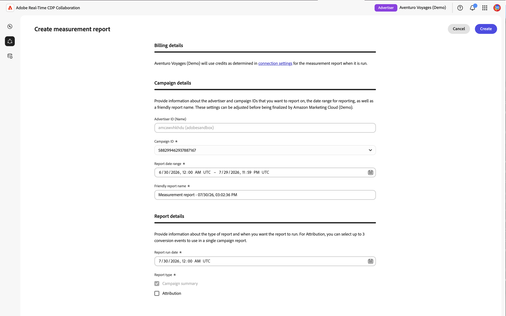

# Create [!DNL Amazon Marketing Cloud] measurement reports {#amc-measurement-reports}

{{limited-availability-release-note}}

Use the **[!UICONTROL Measure]** tab in an [!DNL Amazon Marketing Cloud] ([!DNL AMC]) project to review audience reach, frequency, and conversion outcomes. After you create an AMC project, create measurement reports for campaigns that have already run using the data available in your [!DNL AMC] instance.

>[!IMPORTANT]
>
>The **[!UICONTROL Measure]** tab displays "No Measurement Data Available" until the background data setup queries are completed. This process can take up to 24 hours. If the message persists after 24 hours, refer to the [Troubleshooting](#troubleshooting) section.

## Create a report {#create-report}

To create an [!DNL AMC] measurement report, follow the steps in [Create campaign summary report](../measure.md#create-campaign-summary-report-create-campaign-summary-report).

{zoomable="yes"}

### Campaign details {#campaign}

The **[!UICONTROL Advertiser ID]** identifies the [!DNL Amazon Advertising] account associated with the [!DNL AMC] instance. [!DNL AMC] uses this account context to retrieve campaigns for measurement.

The **[!UICONTROL Campaign ID]** list is populated automatically with campaigns available in the connected [!DNL AMC] instance. A campaign appears only if it falls within the default discovery lookback window and has enough unique users to satisfy [!DNL AMC]’s minimum aggregation threshold. Select the campaign whose [!DNL Amazon Ads] activity you want to measure.

If the campaign you need is not listed, verify that it belongs to the connected [!DNL Amazon Ads] account and review [Troubleshooting](#troubleshooting). For more information about the threshold, refer to the [AMC aggregation threshold documentation](https://advertising.amazon.com/API/docs/en-us/guides/amazon-marketing-cloud/aggregation-threshold).

#### Date range, run date, and report name {#dates}

>[!CONTEXTUALHELP]
>id="rtcdp_collaboration_amc_measure_report_date_range"
>title="Date range"
>abstract="Set the start and end dates for the campaign data to include in the report. The date range is limited to a 365-day lookback window with a maximum span of 90 days. You can only report on past campaigns."

>[!CONTEXTUALHELP]
>id="rtcdp_collaboration_amc_measure_report_run_date"
>title="Run date"
>abstract="The date on which the report executes. Must be at least one day after the report end date and can be up to 46 days in the future."

>[!NOTE]
>
>You can only report on campaigns that have already run.

Set the **[!UICONTROL Report date range]** to the period when the selected [!DNL AMC] campaign ran. [!DNL AMC] supports a 365-day lookback window with a maximum span of 90 days.

Set the **[!UICONTROL Report run date]**. This is the date on which the report executes. The run date must be at least one day after the report end date and can be up to 46 days in the future. For the full set of date constraints, see [AMC constraints reference](#constraints).

>[!TIP]
>
>For attribution reports where the date range is within 30 days of the current date, set the run date 30 days in the future to ensure all conversions within the fixed 30-day lookback window have been captured before the report runs.

#### Report type {#report-type}

All [!DNL AMC] reports include a **[!UICONTROL Campaign summary]**. Optionally, you can include **[!UICONTROL Attribution]** data to measure whether campaign impressions resulted in customer actions, such as purchases or sign-ups, within a 30-day window after ad exposure. Attribution requires the relevant conversion events to be available in your [!DNL AMC] instance. For campaigns focused on reach or awareness, the **[!UICONTROL Campaign summary]** provides the delivery metrics you need.

| Report type | Description |
| --- | --- |
| **[!UICONTROL Campaign summary]** | Provides reach, frequency, and impression metrics for the selected campaign. Always included. |
| **[!UICONTROL Attribution]** | Adds conversion data to the report. Only available if conversion events exist in your [!DNL AMC] instance. See [Conversion events](#conversion-events). |

#### Conversion events (attribution only) {#conversion-events}

>[!CONTEXTUALHELP]
>id="rtcdp_collaboration_amc_attribution_lookback_period"
>title="Attribution lookback period"
>abstract="AMC enforces a fixed 30-day attribution window: conversions that occur up to 30 days after the last impression can be attributed to impressions inside the report date range. This value is not editable; schedule the report run date at least 30 days after the range end to ensure all eligible conversions are captured."

>[!CONTEXTUALHELP]
>id="rtcdp_collaboration_amc_measure_conversion_events"
>title="Conversion events"
>abstract="Select up to three conversion events to include in the attribution report. Available events are discovered automatically from your [!DNL AMC] instance. If no events appear, your [!DNL AMC] instance may not have any recorded conversion events and Attribution will be unavailable."

>[!NOTE]
>
>Attribution data requires conversion events to be configured in your [!DNL AMC] instance. If [!UICONTROL Attribution] is not available or was not selected, skip this section and select **[!UICONTROL Create]** to submit the form.

For [!UICONTROL Attribution] reports, [!DNL AMC] applies a fixed 30-day attribution lookback window. This setting cannot be adjusted.

{zoomable="yes"}

Conversion events represent on-site customer actions tracked by [!DNL Amazon Ads], such as a purchase, wishlist addition, shopping cart action, or product detail view. Attribution reports support up to three events. Select the events that align with the campaign outcomes you want to measure. If the [!UICONTROL Attribution] option is unavailable, see [Troubleshooting](#troubleshooting).

After you create the report, it appears in the **[!UICONTROL Measure]** tab with a scheduled or pending status. On the configured run date, [!DNL AMC] processes the report query and returns the results within 24 hours.

{zoomable="yes"}

## View a report {#view-report}

Once a report has run, the results are available in the **[!UICONTROL Measure]** tab of your [!DNL AMC] project. Locate your report and select **[!UICONTROL View full report]** to review the results.

![The Measure tab in an [!DNL AMC] project showing a completed report card with its run date, report type, and the View full report button highlighted.](../../../assets/collaborate/advertising-platforms/view-full-report.png){zoomable="yes"}

The report displays the results available for the selected report type. **[!UICONTROL Campaign summary]** reports show delivery results for the selected Amazon campaign.

{zoomable="yes"}

Reports that include **[!UICONTROL Attribution]** also show conversion activity associated with the selected Amazon Ads conversion events.

{zoomable="yes"}

For more information on interpreting report results, see [Measure performance](../measure.md#view-reports-view-reports).

## [!DNL AMC] constraints reference {#constraints}

The following constraints apply to all [!DNL AMC] measurement reports.

| Constraint | Value |
| --- | --- |
| Earliest report date range start | 365 days before the current date |
| Latest report date range end | 45 days after the current date. Use this to pre-configure a report for a campaign that is still running and will conclude within the next 45 days; the report executes automatically on its scheduled run date after the campaign ends. |
| Maximum report date range | 90 days |
| Attribution lookback window | 30 days (fixed for [!DNL AMC]) |
| Run date minimum | At least 1 day after the report end date |
| Run date maximum | 46 days in the future |
| Maximum conversion events per report | 3 |
| Campaign selection | Single campaign per report |
| Report editing | Not available. The existing report is preserved. [Create a new report](#create-report) when changes are required |

## Troubleshooting {#troubleshooting}

**No Measurement Data Available**

The **[!UICONTROL Measure]** tab shows "No Measurement Data Available" until the background data setup queries triggered at project creation have completed. This can take up to 24 hours. If the 'No Measurement Data Available' message persists after 24 hours, verify that your [!DNL AMC] instance has campaigns that ran within the last three months, as this is the default lookback window used during campaign discovery. If eligible campaigns exist and the message persists, check your campaign status in your [Amazon Ads account](https://advertising.amazon.com/sign-in){target="_blank"}.

**No campaigns appear in the [!UICONTROL Campaign ID] dropdown**

Campaigns may be absent even when the **[!UICONTROL Measure]** tab is visible. [!DNL AMC] applies a minimum user threshold to campaign data. Campaigns that do not meet the minimum unique users threshold are excluded and report queries will return no results. Verify that the campaigns you want to report on have sufficient reach. For details on [!DNL AMC]'s aggregation thresholds, refer to the [AMC aggregation threshold documentation](https://advertising.amazon.com/API/docs/en-us/guides/amazon-marketing-cloud/aggregation-threshold){target="_blank"}.

**Results are not visible after the run date**

Allow up to 24 hours after the scheduled run date for [!DNL AMC] to process the report queries and return results. If the report remains pending after that period, verify that the run date has passed and that the report status is no longer showing as pending.

**Conversion events are unavailable and [!UICONTROL Attribution] is grayed out**

This can occur for three reasons:

1. **Conversion tracking is not enabled.** Your [!DNL AMC] Advertiser account may not have conversion tracking configured. Navigate to your [Amazon Ads account](https://advertising.amazon.com/sign-in){target="_blank"} and verify that conversion events are being tracked for the relevant campaigns.
2. **No recorded conversion events.** Even with tracking enabled, your [!DNL AMC] instance may not have recorded any conversion events yet.
3. **Aggregation threshold not met.** [!DNL AMC] applies a minimum threshold to conversion data. If a conversion event type does not have a sufficient number of occurrences, it will not be returned and will not appear in the list.

**Conversions appear lower than expected**

If the report run date is fewer than 30 days after the end of the date range, [!DNL AMC] may not have captured all conversions within the attribution window. [Create a new report](#create-report) with a run date at least 30 days after the date range ends.

## Next steps {#next-steps}

Use the report results to evaluate campaign performance and inform future campaign planning in [!DNL Amazon Advertising]. For example, you can adjust targeting, suppress overexposed audiences identified in the frequency distribution, or reallocate spend to high-performing placements. To analyze a different campaign or reporting period, create another measurement report with the appropriate settings.

For an overview of all available [!DNL AMC] collaboration capabilities, see [[!DNL Amazon Marketing Cloud]](./amc.md).
