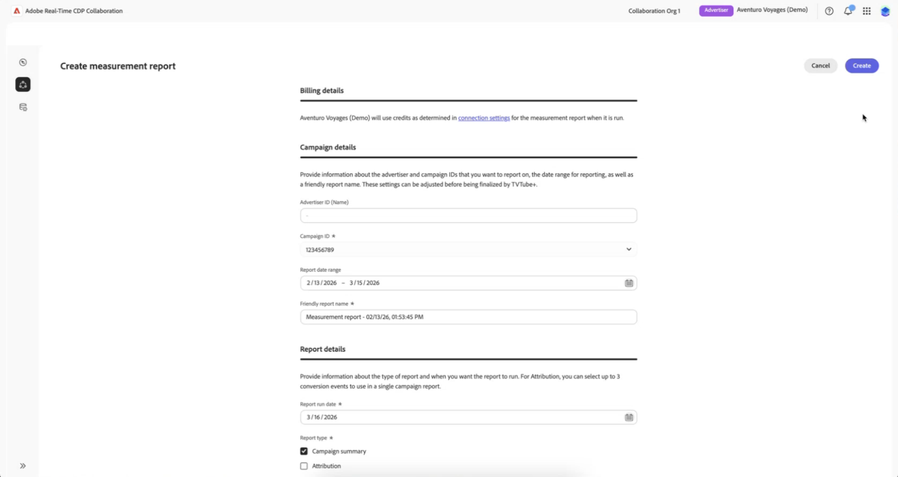
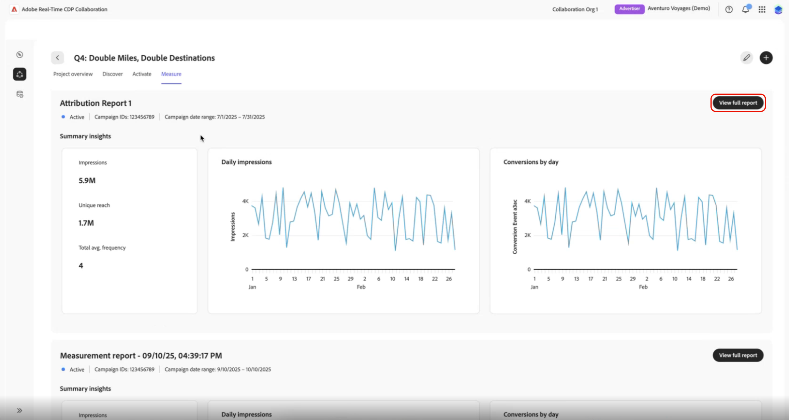

# Create [!DNL Amazon Marketing Cloud] measurement reports {#amc-measurement-reports}

{{limited-availability-release-note}}

After creating a project with [!DNL Amazon Marketing Cloud] ([!DNL AMC]), you can create measurement reports covering campaigns that have already run. Use these reports to evaluate how effectively your Amazon Ads reached your audience and, if you track conversion events, whether those impressions drove measurable customer actions. No additional data upload is required; campaign and conversion event data is sourced automatically from your [!DNL AMC] instance (the [!DNL AMC] clean room environment linked to your Amazon Advertising account) via background queries that run when the project is created.

>[!IMPORTANT]
>
>The **[!UICONTROL Measure]** tab is only visible when campaign IDs have been discovered in your [!DNL AMC] instance. If the tab is not visible, see [Troubleshooting](#troubleshooting).

## Prerequisites {#prerequisites}

Before creating a measurement report, ensure you have:

* Established a connection with [!DNL AMC] and created a project. Refer to the [connect to Amazon Marketing Cloud](../../connect/advertising-platforms/amc.md) and [manage projects](../manage-projects.md) guides.
* Campaign IDs available in your [!DNL AMC] instance. If campaigns are missing from the report form, see [Troubleshooting](#troubleshooting).

## Create a report {#create-report}

>[!CONTEXTUALHELP]
>id="rtcdp_collaboration_amc_measure_create_report"
>title="Create measurement report"
>abstract="Select your campaign, set the date range and run date, choose a report type, and optionally add conversion events for attribution data."

To create an [!DNL AMC] measurement report:

1. Navigate to **[!UICONTROL Collaborate]** > **[!UICONTROL My projects]** and select your [!DNL AMC] project.
2. Select the **[!UICONTROL Measure]** tab.
3. Select the add icon followed by **[!UICONTROL Measure]** from the dropdown options.

![The Measure tab inside an AMC project, showing the Add icon and [!UICONTROL Measure] in the upper-right corner of the workspace.](../../../assets/collaborate/advertising-platforms/add-measure-draft.png){zoomable="yes"}

Complete the measurement report form using the sections below.

{zoomable="yes"}

### Campaign details {#campaign}

The **[!UICONTROL Advertiser ID]** is pre-populated from your project settings. From the **[!UICONTROL Campaign ID]** dropdown, select the campaign to include in the report. Available campaigns are populated from your [!DNL AMC] instance at project creation. If no campaigns appear, see [Troubleshooting](#troubleshooting).

#### Date range and run date {#dates}

>[!CONTEXTUALHELP]
>id="rtcdp_collaboration_amc_measure_date_range"
>title="Date range"
>abstract="Set the start and end dates for the campaign data to include in the report. The date range is limited to a 365-day lookback window with a maximum span of 90 days. You can only report on past campaigns."

>[!CONTEXTUALHELP]
>id="rtcdp_collaboration_amc_measure_run_date"
>title="Run date"
>abstract="The date on which the report executes. Must be at least one day after the report end date and can be up to 46 days in the future."

Set the **[!UICONTROL Date range]** to cover the flight dates of the campaign you want to evaluate. [!DNL AMC] supports a 365-day lookback window with a maximum span of 90 days. You can only report on campaigns that have already run.

Set the **[!UICONTROL Run date]**. This is the date on which the report executes. The run date must be at least one day after the report end date and can be up to 46 days in the future. For the full set of date constraints, see [AMC constraints reference](#constraints).

>[!TIP]
>
>For attribution reports, set the run date at least 30 days after the date range end. This ensures all conversions within the fixed 30-day lookback window have been captured before the report runs.

Enter a **[!UICONTROL Report name]** to identify the report.

#### Report type {#report-type}

A **[!UICONTROL Campaign summary]** is always included in every report. In addition, select the **[!UICONTROL Attribution]** check box if you want to measure whether your campaign impressions drove specific customer actions, such as purchases or sign-ups, within a 30-day window after ad exposure.

| Report type | Description |
| --- | --- |
| **[!UICONTROL Campaign summary]** | Provides reach, frequency, and impression metrics for the selected campaign. Always included. |
| **[!UICONTROL Attribution]** | Adds conversion data to the report. Only available if conversion events exist in your [!DNL AMC] instance. See [Conversion events](#conversion-events). |

### Conversion events (attribution only) {#conversion-events}

>[!CONTEXTUALHELP]
>id="rtcdp_collaboration_amc_measure_lookback_window"
>title="Lookback window"
>abstract="The attribution lookback window for AMC reports is fixed at 30 days and cannot be adjusted."

>[!CONTEXTUALHELP]
>id="rtcdp_collaboration_amc_measure_conversion_events"
>title="Conversion events"
>abstract="Select up to three conversion events to include in the attribution report. Available events are discovered automatically from your AMC instance. If no events appear, your AMC instance may not have any recorded conversion events and Attribution will be unavailable."

>[!NOTE]
>
>If you did not select [!UICONTROL Attribution] in the previous step, skip this section and select **[!UICONTROL Create]** to submit the form.

If you selected **[!UICONTROL Attribution]**, the **[!UICONTROL Lookback window]** is fixed at 30 days by [!DNL AMC] and cannot be adjusted.

Conversion events represent on-site customer actions tracked by [!DNL Amazon Ads], such as a purchase, wishlist addition, shopping cart action, or product detail view. Select at least one and up to three **[!UICONTROL conversion events]** from the list, choosing the events that align with the primary goal of the campaign you are measuring. If no conversion events are available, the [!UICONTROL Attribution] option is grayed out and unavailable for selection.

Once the form is complete, select **[!UICONTROL Create]**. The report is created immediately and appears in the **[!UICONTROL Measure]** tab with a scheduled or pending status, but does not execute until the run date. After the run date, [!DNL AMC] processes the queries on your behalf; results are typically available within 24 hours.

## View a report {#view-report}

Once a report has run, locate your report in the **[!UICONTROL Measure]** tab and select **[!UICONTROL View full report]** to review the results.

{zoomable="yes"}

The sections available depend on the report type you selected.

### Campaign Summary {#campaign-summary-metrics}

A Campaign Summary report includes the following visualizations, which you can use to evaluate the scale and efficiency of your campaign's delivery. For guidance on interpreting reach, frequency, and impression metrics in Collaboration generally, refer to the [measure performance](../measure.md) guide.

| Visualization | Description |
| --- | --- |
| **[!UICONTROL Summary]** | High-level totals for the campaign: total impressions, unique reach, and average frequency. |
| **[!UICONTROL Impressions distribution]** | Breakdown of impressions across [!DNL Amazon] ad products (Sponsored Ads and/or DSP). |
| **[!UICONTROL Frequency distribution]** | How many impressions were shown to each unique user, to help identify saturation and suppression opportunities. |
| **[!UICONTROL Reach curve]** | Cumulative growth in unique users reached over the reporting period. |
| **[!UICONTROL Impressions by placement]** | Which placements drove the most impressions for the campaign. |

### Attribution {#attribution-metrics}

If [!UICONTROL Attribution] was selected, the report also includes the following visualizations, which show how many customer actions can be attributed to your campaign impressions within the 30-day lookback window:

| Visualization | Description |
| --- | --- |
| **[!UICONTROL Cumulative conversions]** | Total conversions attributed to campaign impressions within the 30-day lookback window. |
| **[!UICONTROL Conversions by day]** | Daily conversion counts attributed to the campaign. |

## AMC constraints reference {#constraints}

The following constraints apply to all [!DNL AMC] measurement reports.

| Constraint | Value |
| --- | --- |
| Date range minimum | 365 days in the past |
| Date range maximum | 45 days after the current date |
| Maximum date range span | 90 days |
| Lookback window | 30 days (fixed, not adjustable) |
| Run date minimum | 1 day after the report end date |
| Run date maximum | 46 days in the future |
| Maximum conversion events per report | 3 |
| Campaign selection | Single campaign per report |
| Report editing | Not available. The existing report is preserved; create a new report with the updated settings instead. |

## Troubleshooting {#troubleshooting}

**The Measure tab is not visible or no campaigns appear in the Campaign ID dropdown**

Both symptoms indicate that campaign IDs have not yet been discovered in your [!DNL AMC] instance. [Create a new project](../manage-projects.md#create-project) to trigger a fresh discovery of campaigns and conversion events.

**Results are not visible after the run date**

After the run date passes, [!DNL AMC] runs the report queries on your behalf. Allow up to 24 hours for results to become available. If results have not appeared after 24 hours, check that the run date has fully passed and that the report status in the **[!UICONTROL Measure]** tab is no longer showing as pending.

**Conversion events are unavailable and Attribution is grayed out**

Conversion events are discovered dynamically from your [!DNL AMC] instance. If none are listed, your [!DNL AMC] instance may not have any recorded conversion events, and attribution reporting is not available.

**Conversions appear lower than expected**

If the report run date is fewer than 30 days after the end of the date range, conversions within the attribution window may not yet have been captured. [Create a new report](#create-report) with a run date at least 30 days after the date range ends.

## Next steps {#next-steps}

Once you have reviewed your report, use the results to assess your campaign's delivery and, if you included attribution, its effectiveness in driving conversions. To evaluate different campaigns or time periods, create additional reports within the same project. For an overview of all available [!DNL AMC] collaboration capabilities, refer to the [Amazon Marketing Cloud](./amc.md) guide. For broader guidance on interpreting campaign performance metrics in Collaboration, refer to the [measure performance](../measure.md) guide.
