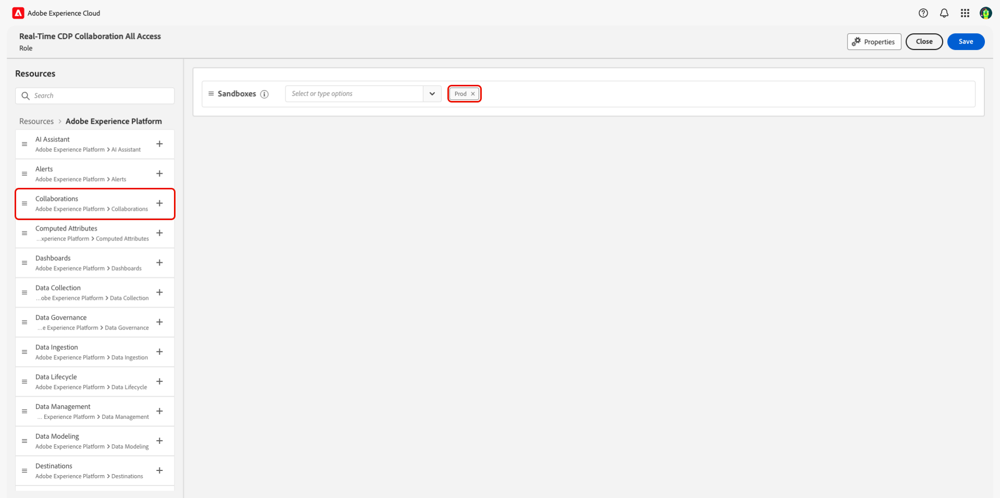
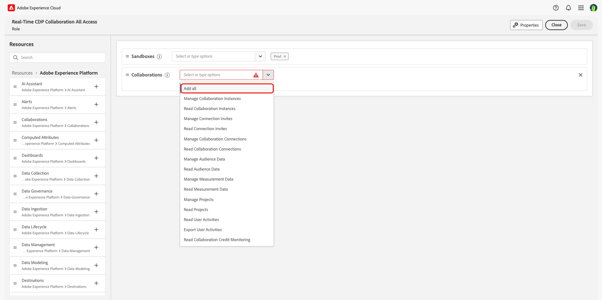
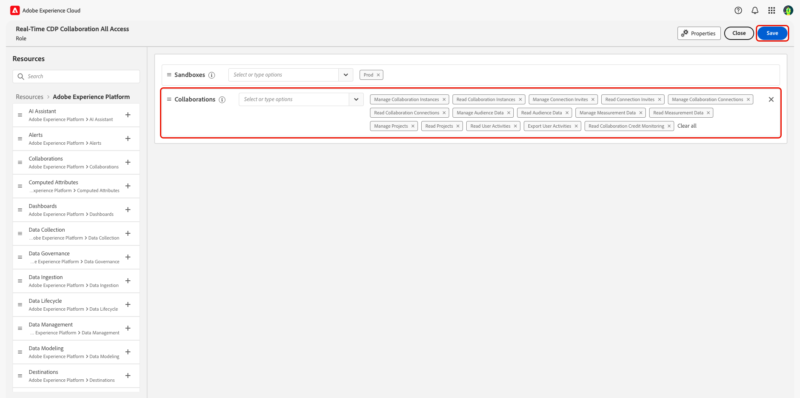

# Manage roles {#manage-roles}

>[!AVAILABILITY]
>
>Adobe Real-Time Customer Data Platform (CDP) Collaboration is currently a beta product, available to select customers. The product and documentation are subject to change. Contact your Adobe representative to learn more.

To manage user access to different components of the Real-Time CDP Collaboration UI, an [administrator](./mange-user-access.md#system-admin-gain-access) can define and assign roles. Roles define the access that an administrator or user has to [resources](https://experienceleague.adobe.com/en/docs/experience-platform/access-control/home#permissions) in your organization. To learn how to create and manage roles, refer to the [roles](https://experienceleague.adobe.com/en/docs/experience-platform/access-control/abac/permissions-ui/roles) guide.

## Create an all-access role {#all-access-role}

As an administrator, you need to create and assign yourself an all-access role that contains two core resources:

- access to the `Prod` sandboxe
- access to all resources within Real-Time CDP Collaboraton

Begin by [creating a new role](https://experienceleague.adobe.com/en/docs/experience-platform/access-control/abac/permissions-ui/roles#create-new-role), providing a clear name such as **Real-Time CDP Collaboration All Access**. Within the resources workspace, ensure that **[!UICONTROL Sandboxes]** has **Prod** added (this should be added by default when creating the role). Next, select **[!UICONTROL Collaborations]** from the list of resources.

Select the dropdown menu next to **[!UICONTROL Collaborations]** and then select **[!UICONTROL Add all]**. 

The dashboard will display all the added permissions next to the **[!UICONTROL Collaborations]** resource. Select **[!UICONTROL Save]** to finish creating your role.

## Create specific access roles {#specific-access-roles}

You'll likely want to create additional roles to provide varying levels of access to different users. When creating roles, you can manage different access levels by selecting specific permissions within the **[!UICONTROL Collaborations]** resource.

Below is a list of available permissions within the Collaborations resource:

| High Level Permission | Description |
| --- | --- |
| Manage Collaboration Instances | View, create, update, and delete an organization's collaboration instances. Discover other organizations' collaboration instances. |
| Read Collaboration Instances | Read an organization's collaboration instances and discover other organizations' collaboration instances. |
| Manage Connection Invites | View, create, and delete connection invites initiated by your organization. Accept and decline connection invite initiated by other organizations. |
| Read Connection Invites | View connection invites. |
| Manage Collaboration Connections | An advertiser can view, create, and update settings as well as submit and delete connections. A publisher can view, accept, or decline connections. |
| Read Collaboration Connections | View connections. |
| Manage Audience Data | Onboard and discover audiences. Update public, private, and custom audiences and manage Audience Inventory metadata settings |
| Read Audience Data | Read and discover audiences. Update public, private, and custom audiences and manage Audience Inventory metadata settings. |
| Manage Measurement Data | Onboard, update, and delete measurement data. |
| Read Measurement Data | Read measurement data. |
| Manage Projects | View, create, update, and delete projects. |
| Read Projects | View projects. |
| Read User Activities | Read user activities. |
| Export User Activities | Export user activities. |
| Read Collaboration Credit Monitoring | Credit wallet monitoring at the organization and instance level. |

## Next steps

After creating roles that define access to Real-Time CDP Collaborations, you'll need to [assign the roles](./mange-user-access.md) to administrators and users. Refer to the [manage permissions for a role](https://experienceleague.adobe.com/en/docs/experience-platform/access-control/abac/permissions-ui/permissions) guide for a complete overview of managing roles. 
