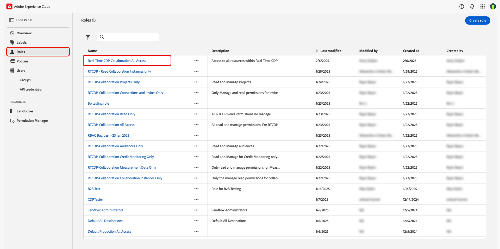
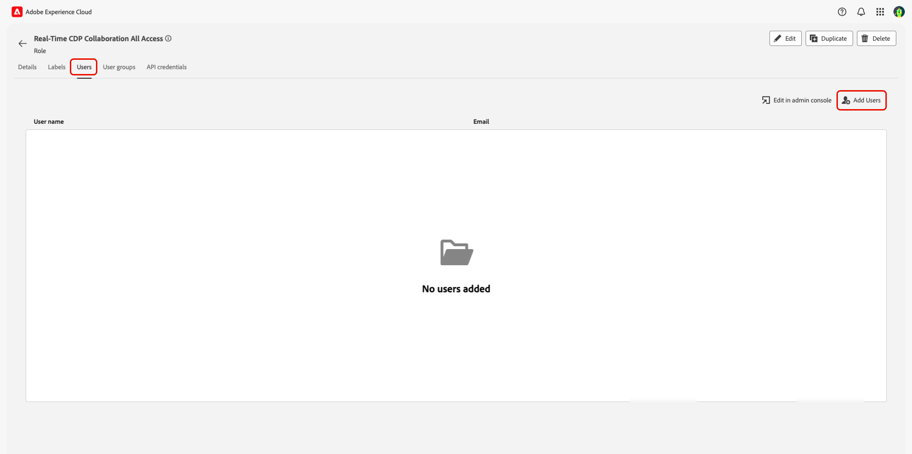
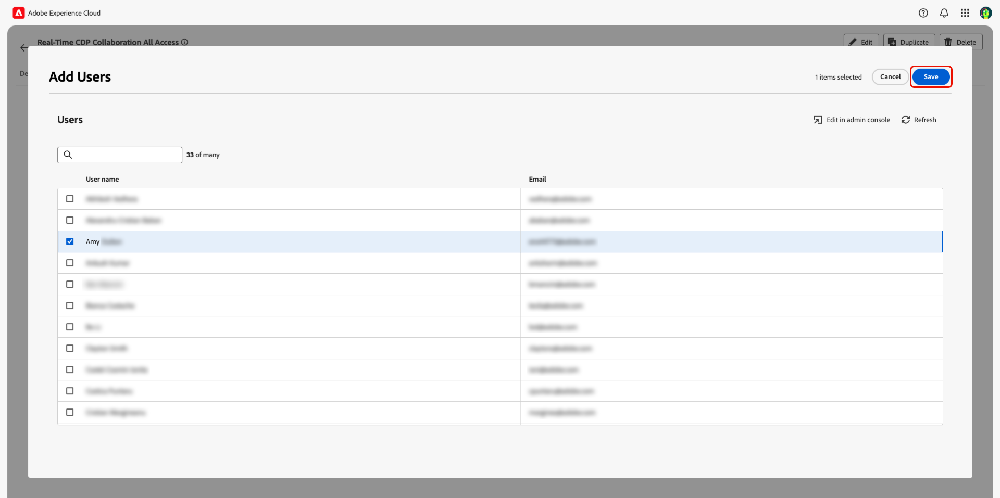
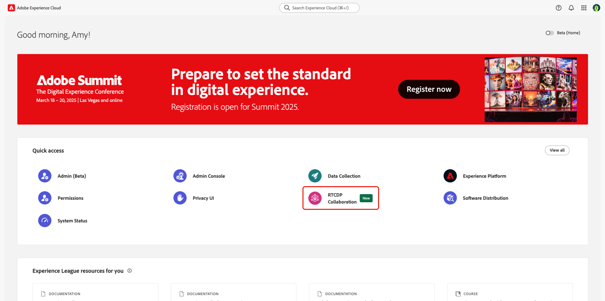

# Manage user access through Permissions {#manage-user-access}

{{limited-availability-release-note}}

Manage permissions and user access to individual components within Real-Time CDP Collaboration through the Experience Cloud [Permissions](https://experienceleague.adobe.com/en/docs/experience-platform/access-control/abac/permissions-ui/browse){target=_blank} interface. Permissions allows system and product administrators to define [roles](./manage-roles.md){target=_blank} to manage user access to specific features and resources. 

## Configure access to Permissions {#permissions-access}

To access Permissions, you must have both product administrator and user access to the Adobe Experience Platform product. A system administrator is required to configure product administrator privileges, while user privileges can be configured by a system or product administrator. For more information on the administrative roles, read the [access control heirarchy](./overview.md#hierarchy){target=_blank} guide.

>[!TIP]
>
>Throughout this guide, an **administator** will refer to **both system and product administators**.

### System Administrators: configure product administrator access {#admin-access}

Grant a user product administrator access to give them administrative capabilities within the Experience Platform product through the following steps:

>[!IMPORTANT]
>
>As a system administrator, you have out-of-the box access to specific Experience Cloud products, such as Adobe Admin Console. However, to use Permissions, you are required to give yourself product administrator and user access to the Experience Platform product. Follow the step-by-step guide below to give yourself access as a system administrator.

Log in to [Adobe Experience Cloud](https://experience.adobe.com/){target=_blank} with your credentials. The home view displays with a list of your available products within the **[!UICONTROL Quick access]** section. Select **[!UICONTROL Admin Console]**.

{zoomable="yes"}

The [Adobe Admin Console](https://adminconsole.adobe.com/) overview dashboard displays. Select **[!UICONTROL Adobe Experience Platform]** from the **[!UICONTROL Products]** list under **[!UICONTROL Products and services]**.

{zoomable="yes"}

The Adobe Experience Platform dashboard displays. Select the **[!UICONTROL Admins]** tab and then select **[!UICONTROL Add admin]**.

{zoomable="yes"}

The **[!UICONTROL Add product administrators]** dialog appears. Enter the user email or username into the **[!UICONTROL Email or username]** text field and then select the correct account from the dropdown. Select **[!UICONTROL Save]** to finish adding the user as a product administrator.

{zoomable="yes"}

The user now has product administrator privileges and can perform administrative functions, such as adding users or other admins, to the product within the Admin Console. Next they'll need user access to the Experience Platform product to access and perform functions within Permissions.

### Administrators: configure user access to Experience Platform {#user-access}

Now that you've granted the user product administrator access, you need to provide them user access to the Experience Platform product. As part of the access configurations, you'll assign the user specific [product profiles](https://helpx.adobe.com/enterprise/using/manage-product-profiles.html).

>[!TIP]
>
>If you're following along from the previous section, you'll already be within the Adobe Experience Platform product and you may skip the first step.

Navigate to the [Admin Console](https://adminconsole.adobe.com/){target=_blank} and select **[!UICONTROL Adobe Experience Platform]** from the **[!UICONTROL Products]** list under **[!UICONTROL Products and services]**.

{zoomable="yes"}

Select the **[!UICONTROL Users]** tab and then select **[!UICONTROL Add users]**.

{zoomable="yes"}

The **[!UICONTROL Add users to this product]** dialog appears. Enter the user's name or email into the **[!UICONTROL Name, user group or email address]** text field and then select the correct account from the dropdown. Next, select the **[!UICONTROL Products]** add option.

{zoomable="yes"}

The **[!UICONTROL Select product profiles]** dialog appears. Select **[!UICONTROL AEP-Default-All-Users]** and **[!UICONTROL Default Production All Access]** and then select **[!UICONTROL Apply]**.

{zoomable="yes"}

Confirm the information is correct and then select **[!UICONTROL Save]**.

{zoomable="yes"}

The user should now have product administrator and product access to Experience Platform, gaining them access to Permissions. Next, you need to assign the user two fundamental roles to give them access to the Experience Plaform UI.

### Administrators: configure Experience Platform UI access {#product-access}

In Real-Time CDP Collaboration, administrators and end users will be working with data from Experience Platform, such as audiences and audit logs. This data is held within instances of Experience Platform called sandboxes. To ensure users can interact with this data, you need to assign [default roles](https://experienceleague.adobe.com/en/docs/experience-platform/access-control/home#default-roles){target=_blank} to the user.

To begin, navigate to [Adobe Experience Cloud](https://experience.adobe.com/). You should now see **[!UICONTROL Experience Platform]** and **[!UICONTROL Permissions]** inside of **[!UICONTROL Quick access]**. 

{zoomable="yes"}

>[!NOTE]
>
> The products can take several minutes to gain access to and you'll receive an email alerting you that you've recieved access. If you're not seeing Experience Platform or Permissions in Adobe Experience Cloud after receiving the email, log out and then back in to your account. 

At this stage, you can now access **[!UICONTROL Permissions]**. If you try to access **[!UICONTROL Experience Platform]**, you'll get a warning that no sandboxes are enabled, as shown below. To solve this, you need to assign the default roles to your user. To begin, select **[!UICONTROL Permissions]**.

{zoomable="yes"}

The **[!UICONTROL Permissions]** dashboard will display. Select **Users** from the left panel and then select the user's name.

{zoomable="yes"}

Select the **[!UICONTROL Roles]** tab and then select **[!UICONTROL Add roles]**.

{zoomable="yes"}

The **[!UICONTROL Add Roles]** dialog appears. Select **[!UICONTROL Default Production All Access]** and **[!UICONTROL Sandbox Administrators]** and then select **[!UICONTROL Save]**.

{zoomable="yes"}

You now have access to Experience Platform and Permissions. In the final step, you'll grant access to Real-Time CDP Collaboration.

### Administrators: configure Real-Time CDP Collaboration access {#RTCDP-collaboration-access}

To grant users access to Real-Time CDP Collaboration, you'll use an access control concept called roles. Roles define the level of access a administrator or user has to [resources](https://experienceleague.adobe.com/en/docs/experience-platform/access-control/home#permissions) in your organization.

When configuring individual access to Real-Time CDP Collaboration, you'll assign users' roles containing permissions from the Collaborations resource. You can use the [manage roles](./manage-roles.md) guide to find out information on:

- the [two standard roles](./manage-roles.md#standard-roles) and the levels of access they grant to Real-Time CDP Collaboration
- creating [custom roles](./manage-roles.md#specific-access-roles) using the Collaboration resource
- the list of permissions included in the Collaborations resource

Once you've chosen or created a role that encompasses the level of access your user needs, you need to assign the user to that role.

#### Assign a role

You may assign multiple roles to a single user or assign multiple users to a single role. The first case was covered earlier when [assigning the default roles](#product-access) to give a user access to Experience Platform. In the next steps, you'll assign users directly to the role you've selected.  

In **[!UICONTROL Permissions]** select **[!UICONTROL Roles]** from the left panel and then select your role from the list.

{zoomable="yes"}

The role's detail page displays. Select the **[!UICONTROL Users]** tab and then select **[!UICONTROL Add Users]**.

{zoomable="yes"}

The **[!UICONTROL Add Users]** dialog appears. Select the user(s) from the list and then select **[!UICONTROL Save]**.

{zoomable="yes"}

The user should now see **[!UICONTROL RTCDP Collaboration]** listed as a product under **[!UICONTROL Quick Access]** in Experience Cloud.

## Next Steps

Now that users have access to Real-Time CDP Collaboration, they can begin using the product. To learn more about the product as a whole, read the [overview guide](../home.md). 

