# Manage user access through Permissions

>[!AVAILABILITY]
>
>Adobe Real-Time Customer Data Platform (CDP) Collaboration is currently a beta product, available to select customers. The product and documentation are subject to change. Contact your Adobe representative to learn more.

Manage permissions and user access to individual components within Real-Time CDP Collaboration through Experience Cloud's [Permissions UI](https://experienceleague.adobe.com/en/docs/experience-platform/access-control/abac/permissions-ui/browse). Permissions allows administrators to define [roles](https://experienceleague.adobe.com/en/docs/experience-platform/access-control/abac/permissions-ui/roles) to manage users access to specific features and resources. 

To access the Permissions UI, you must be an administrator that has a subscription to Adobe Experience Platform. Refer to the sections below to gain access as a system administrator, or to grant access to your team.

## System administrators: grant the necessary permissions for yourself and your role

### Gain access to Experience Platform and Permissions

As a [system administrator](https://helpx.adobe.com/enterprise/using/admin-roles.html), you have out-of-the box access to specific Experience Cloud products, such as Adobe Admin Console. However, to use products such as Permissions and Experience Platform, you are also required to give yourself administrator and user access to the Experience Platform product. This access allows you to use the product as well as grant and manage user access to your team. Follow the step-by-step guide below to give yourself administrative access to these products as a system admin.

Log in to [Adobe Experience Cloud](https://experience.adobe.com/) with your credentials. The home view displays with the **[!UICONTROL Quick access]** section providing access to your available products. To begin gaining access to Experience Platform and Permissions, select **[!UICONTROL Admin Console]**.

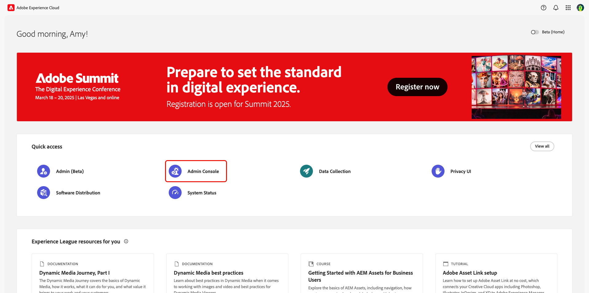

The [Adobe Admin Console](https://adminconsole.adobe.com/) overview dashboard displays. Select **[!UICONTROL Adobe Experience Platform]** from the **[!UICONTROL Products]** list under **[!UICONTROL Products and services]**.

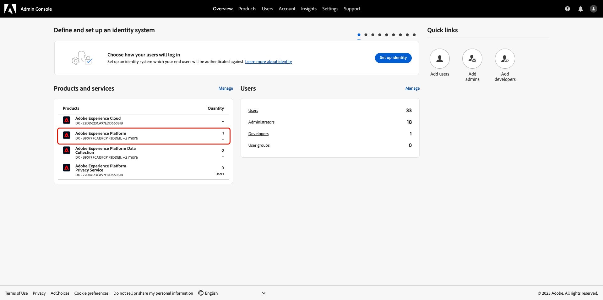

The Adobe Experience Plaform dashboard displays. Select the **[!UICONTROL Admins]** tab and then select **[!UICONTROL Add admin]**.

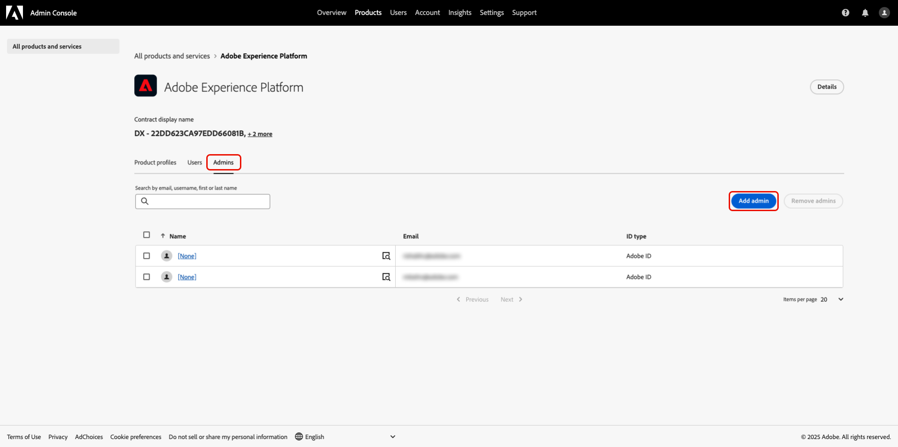

The **[!UICONTROL Add product administrators]** dialog appears. Enter your email or username into the **[!UICONTROL Email or username]** text field and then select your account from the dropdown. Select **[!UICONTROL Save]** to finish adding yourself as an administrator.

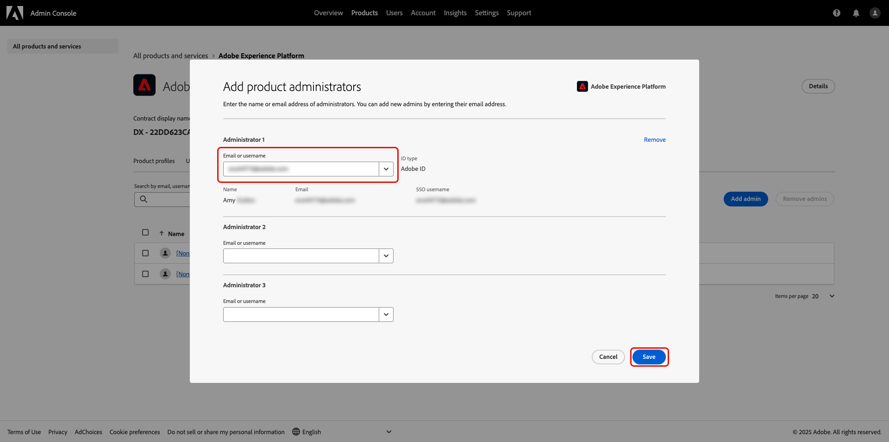

Next, select the **[!UICONTROL Users]** tab and then select **[!UICONTROL Add users]**.

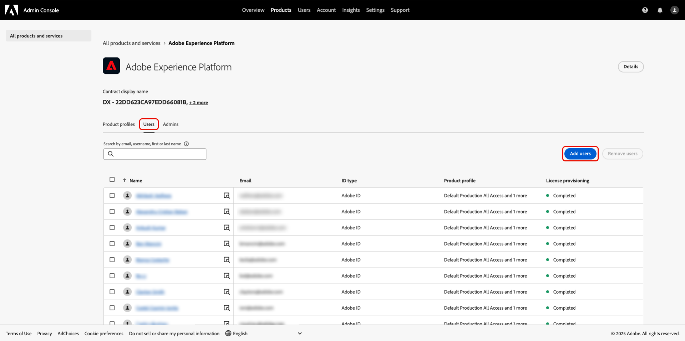

The **[!UICONTROL Add users to this product]** dialog appears. Enter your name or email into the **[!UICONTROL Name, user group or email address]** text field and then select your account from the dropdown. Next, select **[!UICONTROL Products]** add option.

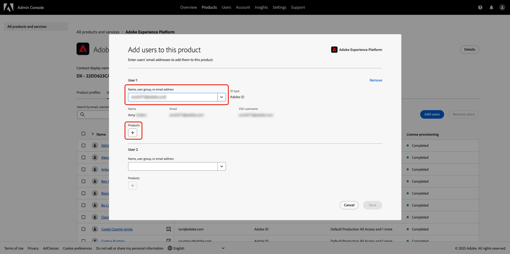

The **[!UICONTROL Select product profiles]** dialog appears. Select **[!UICONTROL AEP-Default-All-Users]** and **[!UICONTROL Default Production All Access]** and then select **[!UICONTROL Apply]**.

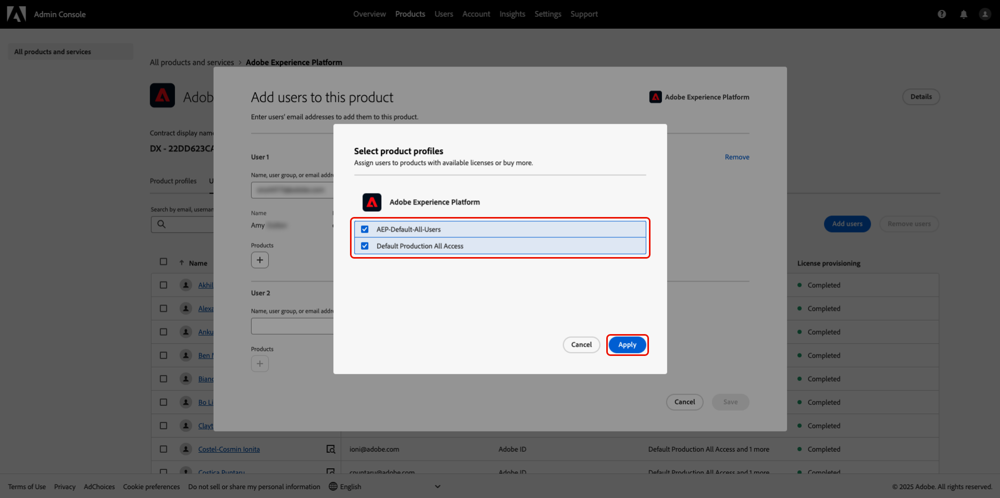

Confirm your information is correct and then select **[!UICONTROL Save]**.

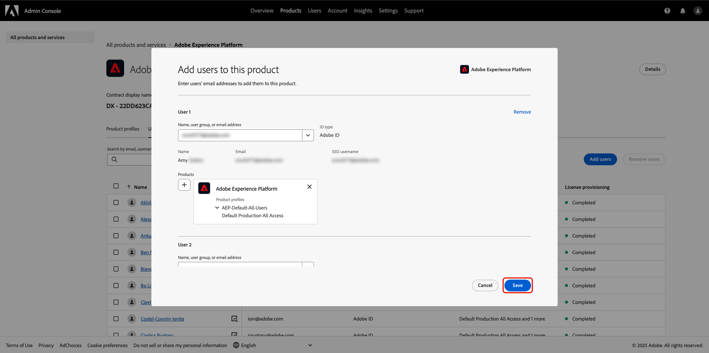

Return to Adobe Experience Cloud. You should now see **[!UICONTROL Experience Platform]** and **[!UICONTROL Permissions]** inside of **[!UICONTROL Quick access]**. 

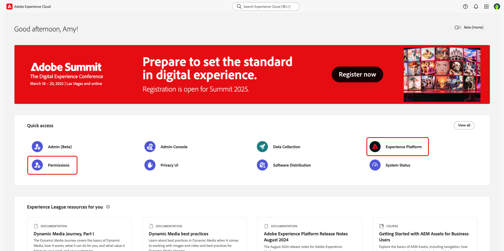

>[!NOTE]
>
> The products can take several minutes to gain access to and you'll receive an email alerting you you've recieved access. If you're not seeing Experience Platform or Permissions in Adobe Experience Cloud after receiving the email, log out and then back in to your account. 

At this stage, you can now access **[!UICONTROL Permissions]**. If you try to access **[!UICONTROL Experience Platform]**, you'll get a warning that no sandboxes are enabled, as shown below. To solve this, select **[!UICONTROL Permissions]**

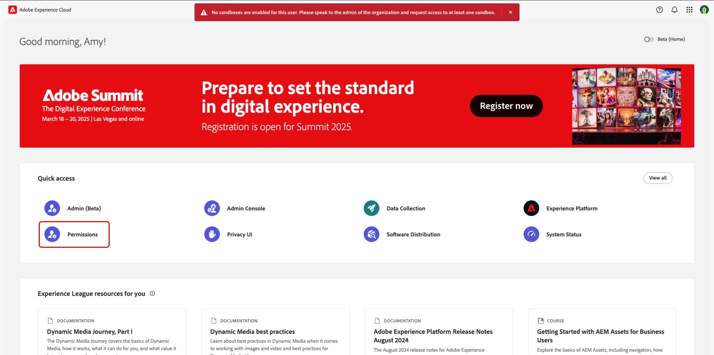

The **[!UICONTROL Permissions]** dashboard will display. Select **Users** from the panel and then select your name.

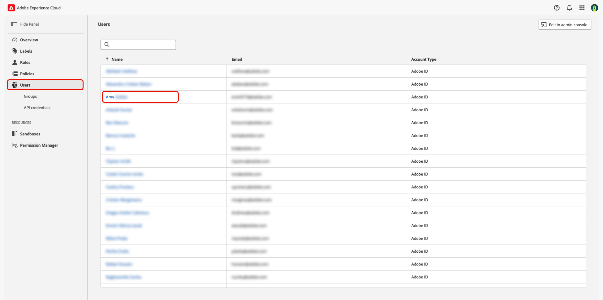

Select the **[!UICONTROL Roles]** tab and then select **[!UICONTROL Add roles]**.

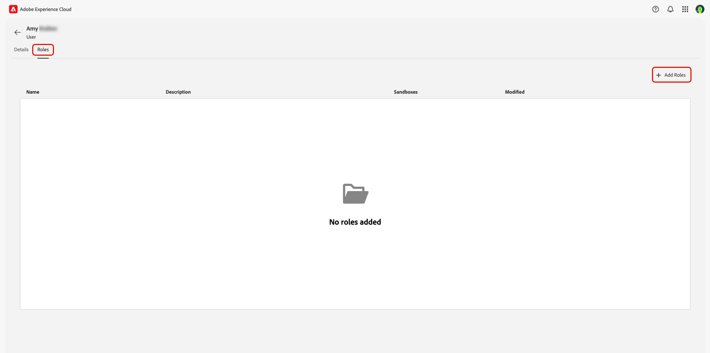

The **[!UICONTROL Add Roles]** dialog appears. Select **[!UICONTROL Default Production All Access]** and **[!UICONTROL Sandbox Administrators]** and then select **[!UICONTROL Save]**.

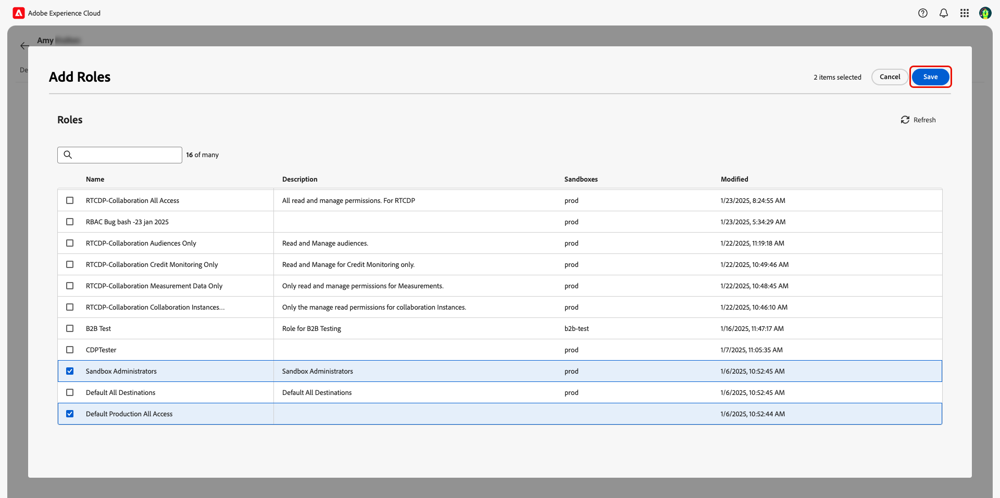

You now have access to Experience Platform and Permissions. Next, you'll give yourself access to Real-Time CDP Collaboration.

### Gain access to Real-Time CDP Collaboration

## System administrators: grant the necessary permissions for the team
