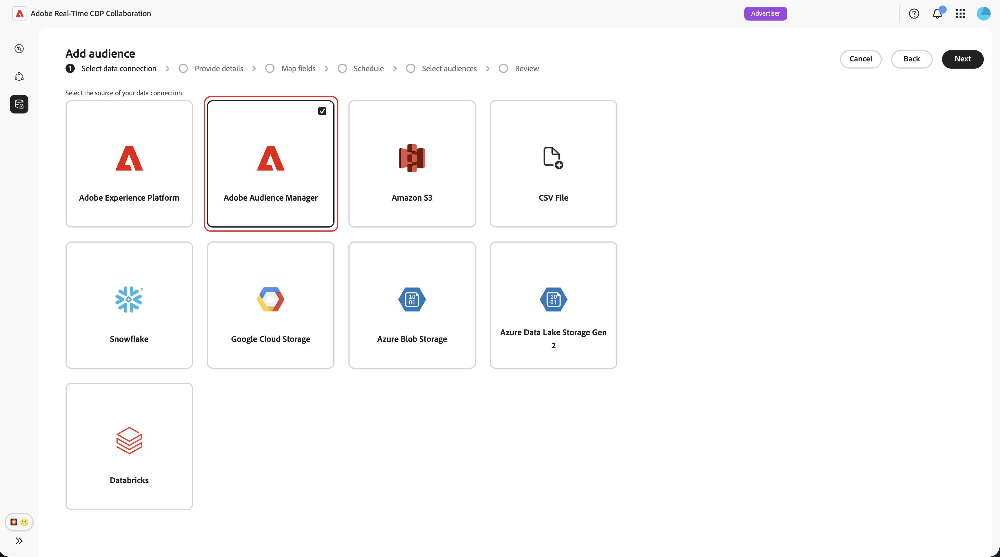
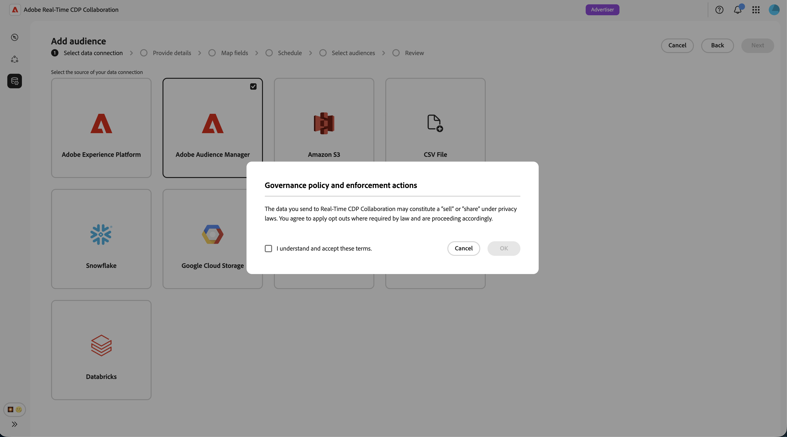
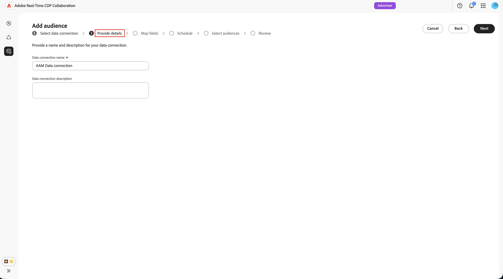
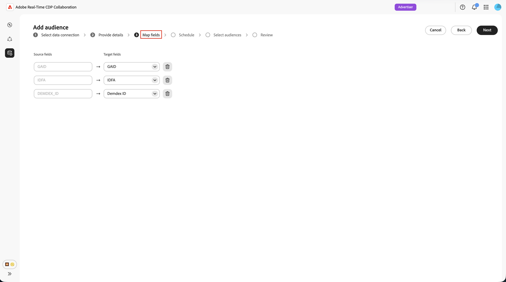
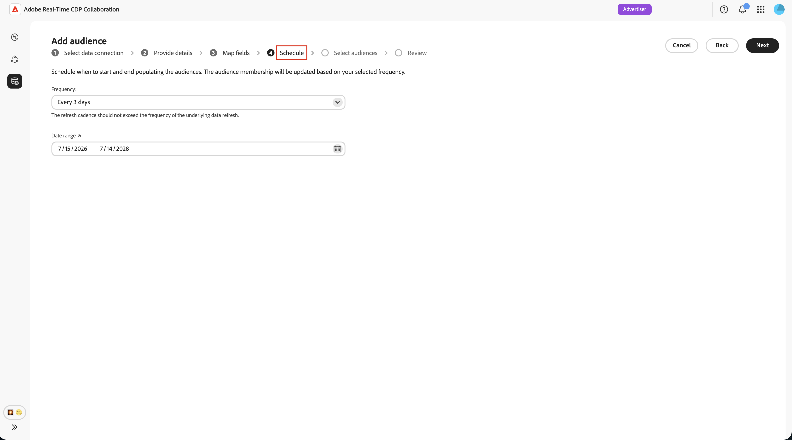
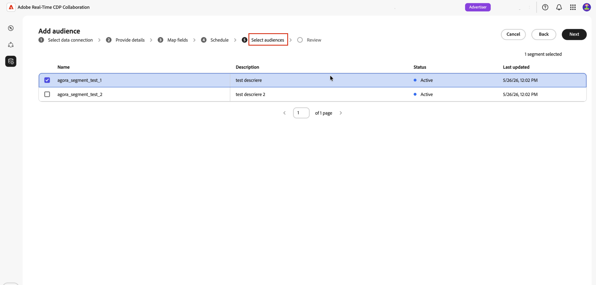
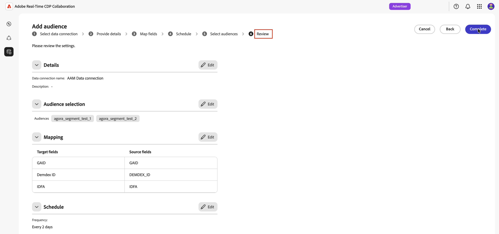
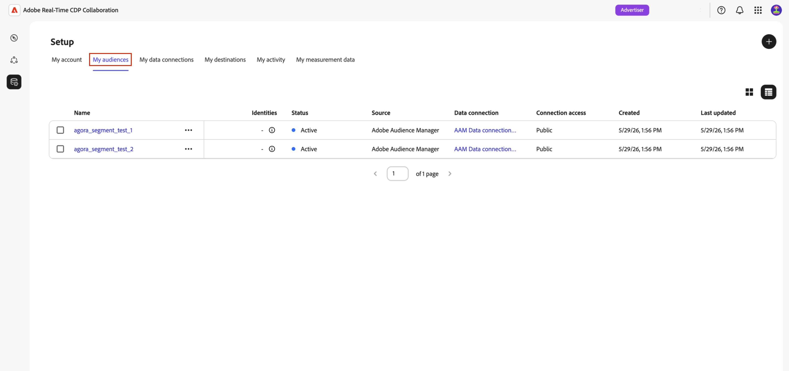

# Configure Adobe Audience Manager for audience sourcing

Learn how to connect your Adobe Audience Manager (AAM) instance to Adobe Real-Time CDP Collaboration so you can source eligible first-party segments into the platform. After you create the connection, Collaboration retrieves audience membership from Adobe Audience Manager on a recurring schedule and makes those audiences available for overlap analysis and activation within your collaboration projects.

>[!NOTE]
>
> Audiences sourced from Audience Manager follow the same governance and data handling rules as audiences sourced from Adobe Experience Platform. Only segments built from first-party data sources are eligible. Segments that include third-party data or Audience Marketplace sources are not supported.

## Prerequisites {#prerequisites}

Complete all items in this section before starting the configuration workflow. Incomplete prerequisites are the most common reason setup fails or audiences do not appear after sourcing. Before following this guide, you must have completed [account onboarding and setup](./onboard-account.md). 

### Adobe Audience Manager access and permissions {#aam-access-and-permissions}

Before proceeding, confirm that you have:

  * An active Adobe Audience Manager contract and a provisioned Audience Manager instance. 
  * Access to the Audience Manager user interface with permission to view the segments that you want to source.
  * Your Audience Manager instance and Collaboration account provisioned under the same Adobe IMS Organization. Cross-organization sourcing is not supported.

### Segment eligibility requirements {#aam-segments-requirements}

When you configure the connection, Collaboration automatically filters the segment list based on the following rules.

**First-party data only**

Only segments based on your own first-party data are available for sourcing. Segments that include traits from third-party data providers or AAM Audience Marketplace are excluded.

**Recency filter**

Only segments that were created or updated **within the last 13 months** are available for sourcing. Older segments are excluded during connection setup and on each subsequent refresh.

### Consent requirements {#consent-requirements}

All AAM segments sourced into Collaboration must be post-consent filtered. If an opt-out marker is present for a profile at export time, that profile is excluded before it reaches Collaboration.

>[!IMPORTANT]
>
>You are responsible for ensuring that consent is correctly configured and enforced within your Audience Manager instance before connecting to Collaboration. Adobe does not re-apply consent rules after data leaves Audience Manager.

## Configure your Audience Manager connection {#configure-aam-connection}

The configuration workflow is a multi-step wizard inside the **[!UICONTROL Setup]** workspace. Complete each step in sequence. You can return to any step using the pencil icon on the final review screen before you create the connection.

### Add a data connection {#add-data-connection}

From the **[!UICONTROL My audiences]** tab within the **[!UICONTROL Setup]** workspace, select the add icon () and then select **[!UICONTROL Audience]**.  

If this is your first audience, you may also select the **[!UICONTROL Add audience]** option.

The Add audience workflow appears. Select **[!UICONTROL Add a new data connection]** and then select **[!UICONTROL Next]**.

{zoomable="yes"}

### Select Adobe Audience Manager as the data connection {#select-aam}

The data source selection screen lists all available connection types. Select **[!UICONTROL Adobe Audience Manager]** as a data connection, and then select **[!UICONTROL Next]**. 

### Confirm consent and data use {#confirm-consent-data-use}

Before proceeding, confirm that you have applied any opt-outs required by law to the audience data you send to Collaboration. If you are unsure whether your data meets this requirement, review the [governance policy and enforcement actions](./onboard-audiences.md#governance-policy-and-enforcement-actions) guide before proceeding. Select the confirmation checkbox and then select **[!UICONTROL OK]** to proceed.

### Provide connection details {#provide-connection-details}

Next, enter a name and an optional description for this data connection. After the connection is created, the name you provide appears in the **[!UICONTROL My data connections]** tab and helps you identify this source in the future. 

* **[!UICONTROL Data connection name]** (required)
* **[!UICONTROL Data connection description]** (optional)
  
When finished, select **[!UICONTROL Next]**. 

### Review identity mapping {#review-identity-mapping}

The **[!UICONTROL Mapping]** screen is read-only. Collaboration automatically maps supported identity output from your AAM segments to Collaboration identity fields. See the following table for more information.

| AAM identity output | Collaboration identity field | Notes |
| ------------------- | ---------------------------- | ----- |
| `Demdex ID`         | `DEMDEX_ID`  | Supported identity output for this integration. Collaboration does not translate Demdex ID to ECID during sourcing. |
| `GAID`         | `GAID`  | Supported identity output for this integration. |
| `IDFA`         | `IDFA`  | Supported identity output for this integration. |

{style="table-layout:auto"}

You can review the mapping, but you cannot modify it at this stage. Select **[!UICONTROL Next]** to continue. 

### Schedule data refresh {#schedule-data-refresh}

In the **[!UICONTROL Schedule]** view, set the refresh frequency at which Collaboration retrieves updated audience membership data from your AAM segments, and define the active date range for sourcing.

Use the **[!UICONTROL Frequency]** dropdown to select a refresh interval between one and six days. Then use the calendar to set start and end dates for audience sourcing. When the end date is reached, sourcing stops and previously sourced audiences expire.

>[!IMPORTANT]
>
>Audience Manager segments typically refresh every 24–48 hours based on trait recency and frequency rules. Setting a Collaboration refresh interval shorter than this may consume Collaboration credits without updated results. To monitor your credit usage, see [Track your credit consumption activity](./my-activity.md).

Once finished, select **[!UICONTROL Next]**.

### Select audiences {#select-audiences}

You can view a list of eligible segments that use first-party data source traits and were created or updated in the last 13 months.

Select the segments that you want to source into Collaboration. You can search by name or scroll to find specific segments. Select **[!UICONTROL Next]** when you are finished.

>[!TIP]
>
>If a segment you expect to see is not listed, verify that it was updated in the last 13 months and uses only first-party data source traits. Segments with third-party or Audience Marketplace traits are excluded.

### Review and complete the connection {#review-and-complete}

Review the full configuration summary before creating the connection. The summary screen shows the following sections: 

* **[!UICONTROL Details]**: The name and optional description of this data connection. 
* **[!UICONTROL Audience selection]**: The AAM segments you selected.
* **[!UICONTROL Mapping]**: The identity field mapping from AAM source fields to Collaboration identity fields. 
* **[!UICONTROL Schedule]**: The refresh frequency and active date range. 

Select the pencil icon () next to any section if you need to make changes. Select **[!UICONTROL Complete]** to confirm all sections.

A confirmation dialog appears, indicating that the data connection was created and that audience sourcing is in progress.

## Review sourced audiences {#review-sourced-audiences}

After you complete the wizard, Collaboration begins retrieving audience membership data from your selected AAM segments asynchronously. Navigate to **[!UICONTROL Setup] > [!UICONTROL My audiences]** to monitor progress. 

### Monitor audience sourcing progress {#monitor-progress}

While Collaboration is retrieving your AAM segment data, a banner at the top of the **[!UICONTROL My audiences]** workspace indicates that sourcing is in progress. Individual audiences appear in the list as sourcing completes for each segment. 

### View sourced audience details {#view-sourced-audience-details}

Once sourcing completes, your AAM segments appear in the **[!UICONTROL My audiences]** tab. The **[!UICONTROL Source]** column identifies them as **[!UICONTROL Adobe Audience Manager]**.

Select a row or the **[!UICONTROL View audience]** option to open the detail view of a specific audience.

The detail view shows:

* **[!UICONTROL Identities]**: The total identity count and any available breakdown information. 
* **[!UICONTROL Categories]**: Any tags you have applied to organize or filter the audience. 
* **[!UICONTROL Connection access]**: Whether the audience is private, public, or shared with specific collaborators. 
* **[!UICONTROL Metadata visibility]**: What audience information is visible to collaborators. 

Use this view to confirm audience configuration and visibility settings before using the audience in collaboration projects. To update categories, connection access, or metadata visibility, see [View and manage individual audiences](./onboard-audiences.md#view-individual-audiences).

## Known limitations 

Be aware of the following constraints when configuring and using the Audience Manager source connector: 

* **First-party data only:** Segments that include traits from third-party data providers or Adobe Audience Marketplace cannot be sourced. Only segments built entirely from your own first-party data sources are eligible. 
* **13-month segment recency window:** Only segments created or updated within the past 13 months are available for selection during setup and on each scheduled refresh. 
* **No on-demand refresh:** Audience data refreshes on the schedule you configure. Manual, immediate refresh is not supported. 
* **One active AAM connection per organization:** Only one active AAM data connection is supported per IMS organization.  
* **Match key constraints:** Once a match key is enabled for a data connection, it cannot be removed. To change active match keys, delete the connection and create a new one. 

## Troubleshooting {#troubleshooting}

Read this section to resolve common issues after you establish the initial connection.

**Audiences are not appearing or sourcing is taking longer than expected**

* Sourcing time scales with the number of selected segments and the size of each segment population. 
* If audiences do not appear within 24 hours, confirm that the segments you selected are still active in Audience Manager and have non-zero population counts. 
* Check the **[!UICONTROL My data connections]** tab for any error indicators on the connection. 
* If the issue persists, contact Adobe customer support with your data connection name and the names of the segments that are not appearing.

**A segment I expected to select was not available during setup**

Confirm that the segment:

* Was created or last updated within the past 13 months. Older segments are not shown.
* Uses only first-party traits. Segments with third-party or Audience Marketplace traits are excluded.
* Belongs to the IMS Organization configured for the connection. 

**The data connection shows a failed status after initially succeeding**

* Confirm the IMS organization relationship between your AAM instance and Collaboration account has not changed.
* Confirm the selected segments still exist in AAM and have not been deleted.
* If the issue persists, [delete the connection](./manage-data-connection.md#delete-data-connection) and create a new one, or contact Adobe customer support.

## Next steps {#next-steps}

You have now configured Audience Manager as a data source in Collaboration. After sourcing completes, your audiences are available in the **[!UICONTROL My audiences]** workspace and ready for use in collaboration projects. If your audiences do not appear after the initial sourcing process completes, review the [troubleshooting](#troubleshooting) section on this page.

From here, you can:

* [Create and manage collaboration projects](../collaborate/manage-projects.md)
* [Activate audiences within a project](../collaborate/activate.md)
* [Review overlaps and measure performance](../collaborate/measure.md)
* [Manage audience settings and visibility](./onboard-audiences.md)
* [Manage your data connections](./manage-data-connection.md)

For other audience sourcing methods, see:

* [Configure [!DNL Amazon S3] for audience sourcing](./configure-aws-s3-audience-sourcing.md)
* [Configure [!DNL Google Cloud Storage] for audience sourcing](./configure-gcs-audience-sourcing.md)
* [Configure [!DNL Snowflake] for audience sourcing](./configure-snowflake-audience-sourcing.md)
* [Source audiences from Experience Platform](./onboard-audiences.md)
* [Upload a CSV file for audience sourcing](./upload-csv-audience-sourcing.md)
