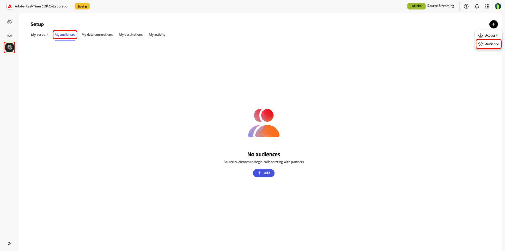
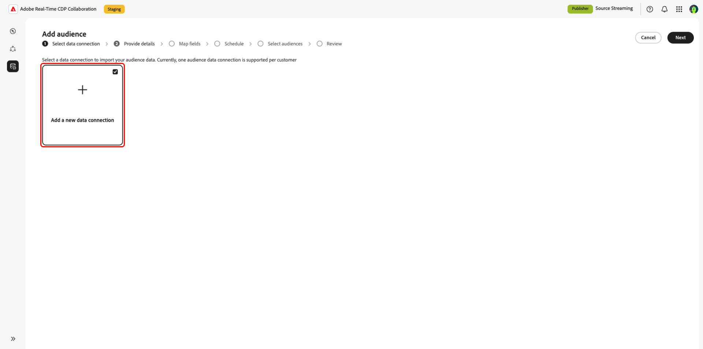

# Configure Amazon S3 for Audience Sourcing

Learn how to connect your Amazon S3 storage as a self-service data source to ingest audience data into **Real-Time CDP Collaboration**. This guide walks you through the configuration workflow within the Collaboration UI.

>[!IMPORTANT]
>
>Before following this guide, you must have completed the steps to authorize Adobe's IAM role within your AWS account.  
>Refer to the **Configure AWS permissions for audience sourcing** guide for detailed AWS setup instructions.

<!-- Question: is that the bet doc name? -->

## Overview {#overview}

Use this workflow to source and manage your first-party audiences directly from [!DNL Amazon S3] without requiring Adobe engineering assistance. Once configured, audiences stored in your S3 bucket are automatically sourced by Collaboration and made available for activation and overlap analysis.

Audiences sourced through S3 follow the same governance and data handling rules as those sourced from Adobe Experience Platform.

## Prerequisites {#prerequisites}

Before configuring your S3 data connection, ensure the following:

* You have access to an active **[!DNL Amazon S3] bucket** containing audience files that conform to the **[Audience Sourcing Specification (v1.1)](../../assets/quick-start/RTCDP_Collaboration_Audience_Sourcing_Spec_v1.1.pdf)**.
* You have created an **IAM role** in Amazon that grants Adobe permission to access your bucket using the **assumed role** method (not access/secret keys).  
  The IAM role must include the following permissions:
  
  * `ListBucket`
  * `GetBucketLocation`
  * `GetObject`

* You have the following values ready:
  
  * **IAM role Amazon Resource Name (ARN)**
  * **S3 bucket name**
  * **Folder path** (the directory prefix containing your audience files)

>[!NOTE]
>
>Audience files must be located in the **root folder path** of your authorized S3 bucket. Subfolder structures are not supported.

## Configure your Amazon S3 connection {#configure-aws-s3-connection}

From the **[!UICONTROL My audiences]** tab within the **[!UICONTROL Setup]** workspace, select the add icon () and then select **[!UICONTROL Audience]**.  

If this is your first audience, you may also select the **[!UICONTROL Add]** option.

The Add audience workflow appears. Select **[!UICONTROL Add a new data connection]** and then select **[!UICONTROL Next]**.

{zoomable="yes"}

### 1. Select Amazon S3 as the data connection {#select-aws-s3}

Select **[!UICONTROL Amazon S3]** as a data connection, followed by **[!UICONTROL Next]**.  

### 2. Review audience file requirements {#review-audience-requirements}

A dialog appears that explains how your audience files must be structured. Use the link to the **[!UICONTROL [audience sourcing specification]](../../assets/quick-start/RTCDP_Collaboration_Audience_Sourcing_Spec_v1.1.pdf)** to learn how to format and structure audience data from Amazon S3 for Real-Time CDP Collaboration to read it correctly.

Copy:  
Title: *Prepare Your Data for Sourcing*  
Body:  
*Before starting audience sourcing from Amazon S3, please ensure that:*

>[!IMPORTANT]
>
>You must have authorized Adobe as an Amazon S3 user so that Adobe can retrieve data from your Amazon S3 storage for processing.
>Your data must comply with the audience sourcing specification, as the match keys are auto-mapped based on the prescribed format. Key considerations include: <ul><li>Audience files must be CSV with commas for fields and pipes (|) for multiple values.</li><li>All files must have identical columns if multiple are uploaded.</li><li>Each audience record includes identifiers such as AUDIENCE_ID, HASHED_EMAIL_SHA_256, HASHED_PHONE_SHA_256, HASHED_IPV4_SHA_256, CRM_ID, LOYALTY_ID, or ADFIXUS_ID.</li><li>Data is refreshed every 1–6 days; if not refreshed within 7 days, it's deleted.</li><li>Users are responsible for ensuring consent compliance—Adobe only reads what's provided and doesn't filter or alter the data.</li></ul>

### 3. Authenticate your S3 connection {#authenticate-s3-connection}

>[!CONTEXTUALHELP]
>id="rtcdp_collaboration_sources_s3_folderpath"
>title="Folder path format"
>abstract="Enter the folder path (prefix) within your Amazon S3 bucket where your audience files are stored. <ul><li>Do not start paths with a forward slash (/).</li><li>Include a trailing slash at the end of the path.</li><ul> Example: `base/path/`"

Provide your credentials to connect your Amazon S3 bucket to Real-Time CDP Collaboration.

**Input fields**

* IAM Role (required)
* S3 Bucket Name (required)
* Folder Path (required)

Copy:  
*To connect your Amazon S3 storage, please authorize Adobe's service user to retrieve your audience data for processing. Follow the steps outlined in {Experience League} to grant Adobe access to your Amazon S3 storage.*

### 4. Confirm consent acknowledgment {#confirm-consent}

You must acknowledge that consent opt-outs have been removed before proceeding. Check the confirmation box followed by **[!UICONTROL OK]** to confirm.

### 5. Validate authentication results {#validate-authentication}

After connecting, the system validates your credentials and displays one of the following messages:

| Status                      | Message                                         | Description |
|---| ---|---|
| **Success**                 | **[!UICONTROL Authentication successful]**      | Your connection to Amazon S3 has been established successfully.  |
| **Failed**                  | **[!UICONTROL Authentication failed]**          | Please review your credentials and try again. |
| **Access denied**           | **[!UICONTROL Access denied]**                  | Your credentials don't have the required permissions to access this Amazon S3 bucket. Please verify access settings or contact your administrator. |
| **Invalid file format**     | **[!UICONTROL Invalid file format]**            | The audience data doesn't match the expected structure. Please ensure your files comply with the Audience Sourcing Specifications.                 |
| **No audience files found** | **[!UICONTROL No audience files found]**        | Please confirm that your audience files exist in the specified folder path and that the path is accessible.                                        |
| **Internal error**          | **[!UICONTROL An internal error has occurred]** | Please try again. If the problem persists, contact customer support. (ACPS - XXXX-XXX) Reference id: XXXXXXX-XXXXX-XXXX-XXXX-XXXXXXXX.             |

<!--  -->

<!--  -->

### 6. Provide connection details {#provide-connection-details}

Enter a descriptive name and optional description for your S3 data connection.

**Fields**

* Data connection name (required)
* Data connection description (optional)

### 7. Review auto-mapped identity fields {#auto-mapped-fields}

<!-- (1.8) -->

The source and target fields are auto-populated based on the underlying audience tables. The **Field mapping** screen is read-only. You cannot add or delete fields or apply transformations. Source and target fields are automatically mapped based on the underlying audience tables.

Copy across top of page:  
*Source identity fields from your data connection are auto-mapped to target identity fields in Real-Time CDP Collaboration based on the {Audience Onboarding Specifications}.*

### 8. Schedule refresh frequency and date range {#schedule-refresh}

<!-- (1.9) -->

Set how frequently your data connection refreshes and specify the date range during which the connection remains active.  
Available frequencies range from **daily up to every six days**.

>[!IMPORTANT]
>
>Do not configure the refresh cadence to be more frequent than the refresh cadence of the underlying S3 data source.

### 9. Review and complete the connection {#review-and-complete}

<!-- (1.11) -->

Review your configuration in the summary screen. Confirm all sections before selecting **[!UICONTROL Complete]**.

**Summary sections**

* **[!UICONTROL Data connection]**
* **[!UICONTROL Details]**
* **[!UICONTROL Mapping]**
* **[!UICONTROL Schedule]**

## Review sourced audiences {#review-sourced-audiences}

<!-- (1.13) -->

After completing the configuration, Collaboration begins sourcing audiences from your S3 bucket. Audiences sourced through an Amazon S3 bucket appear in the "My Audiences" tab and have the same functionality and information as audiences sourced from Experience Platform.

If sourcing is in progress, a banner appears to indicate that your audiences are being sourced.

Copy:  
Title: *Audience sourcing in progress*  
Body: *Audiences are being sourced from [Cloud Source Name] via the [Data Connection Name] data connection and will appear once the process is complete.*

If sourcing fails, you see the following message:

Copy:  
Title: *Audience sourcing failed*  
Body: *Audience sourcing from [Cloud Source Name] via the [Data Connection Name] data connection failed. Please try again. If the problem persists, contact customer support. Reference id: XXXXXXX-XXXXX-XXXX-XXXX-XXXXXXXX.*

Once the S3 audiences are sourced, your list of available audiences are provided in a tabulated view.

## View your S3 data connection {#view-s3-connection}

Your newly added Amazon S3 connection appears in the **[!UICONTROL My data connections]** tab. The audience source is displayed as [!UICONTROL Amazon S3].

Your S3 data connection includes the same functionality and details as other audience data connections, except that you cannot add audiences directly from this view. Navigate to the the "My data connections" tab to add another audience.

## Next steps {#next-steps}

After successfully sourcing your audiences, they appear in the **[!UICONTROL My audiences]** workspace.  
You can now [view and manage your audiences](./onboard-audiences.md) to make them available for collaboration, activation, and overlap analysis.
