# Configure AWS S3 for Audience Sourcing

From the **[!UICONTROL My audiences]** tab within the **[!UICONTROL Setup]** workspace, select the add icon ( Add icon. ) and then select **[!UICONTROL Audience]**. If this is your first audience, you may also select the **[!UICONTROL Add]** option.

<!-- another screenshot needed here -->

The Add audience workflow appears. Select **[!UICONTROL Add a new data connection]** and then select **[!UICONTROL Next]**.

{zoomable="yes"}

1.1 
You can see AWS S3 as a selectable data connection. 
Previously created AWS S3 connections appear grayed out, and you see the following copy within the card:  
Copy: To add additional audiences, please update the audiences files within the connected Amazon S3 storage

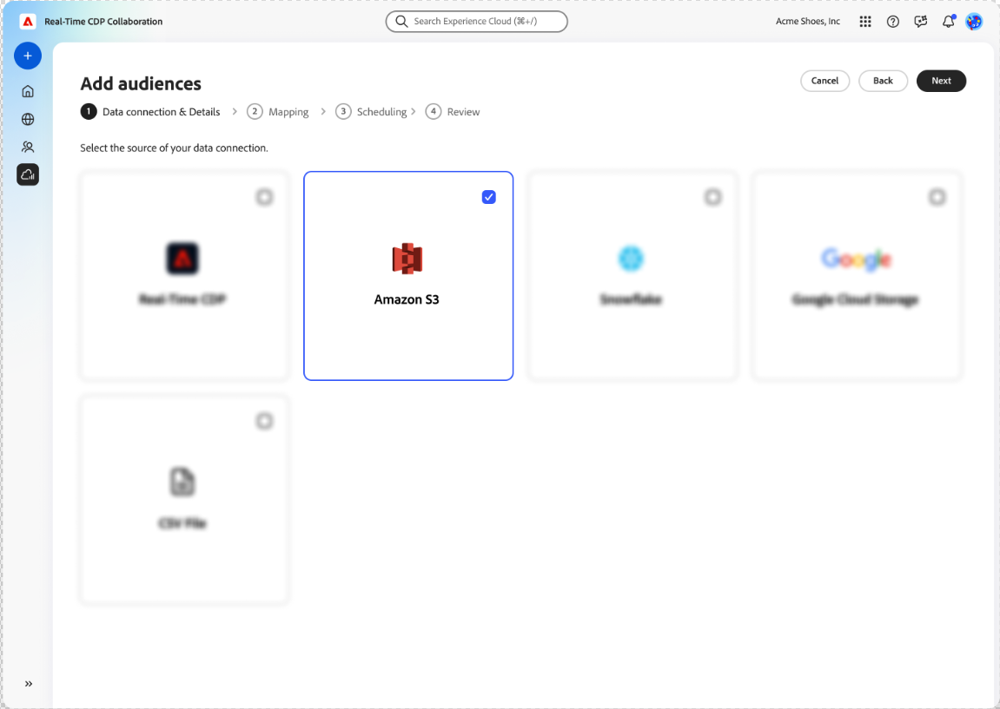

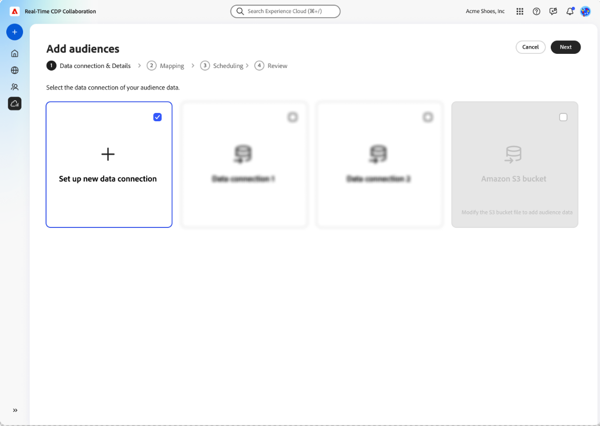

1.2    
You see a pop-up with a link to the Audience Onboarding specification that explains how your audience files must be structured.  
Copy:  
Title: Prepare Your Data for Sourcing  
Body: Before starting audience sourcing from Amazon S3, please ensure that:  
You have authorized Adobe as a user so that Adobe can retrieve data from your Amazon S3 storage for processing.  
Your data complies with the {Audience Sourcing Specifications}, as the match keys are auto-mapped based on the prescribed format.

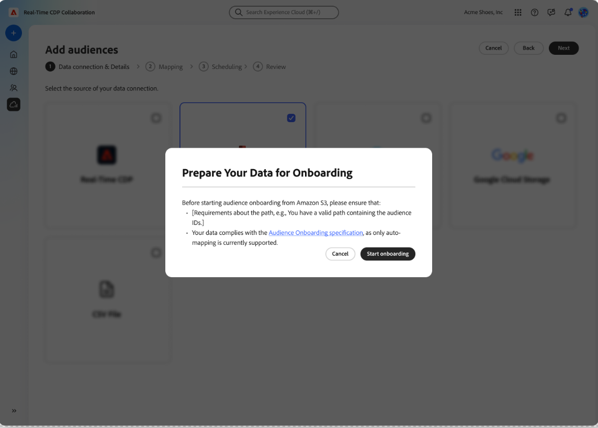

1.3    
You provide your credentials to connect your AWS S3 bucket to RTCDP Collaboration.  
Input Fields  
IAM role (required)  
S3 Bucket Name (required)  
Folder Path (required)  
Copy:  
To connect your Amazon S3 storage, please authorize Adobe's service user to retrieve your audience data for processing. Follow the steps outlined in {Experience League} to grant Adobe access to your Amazon S3 storage.

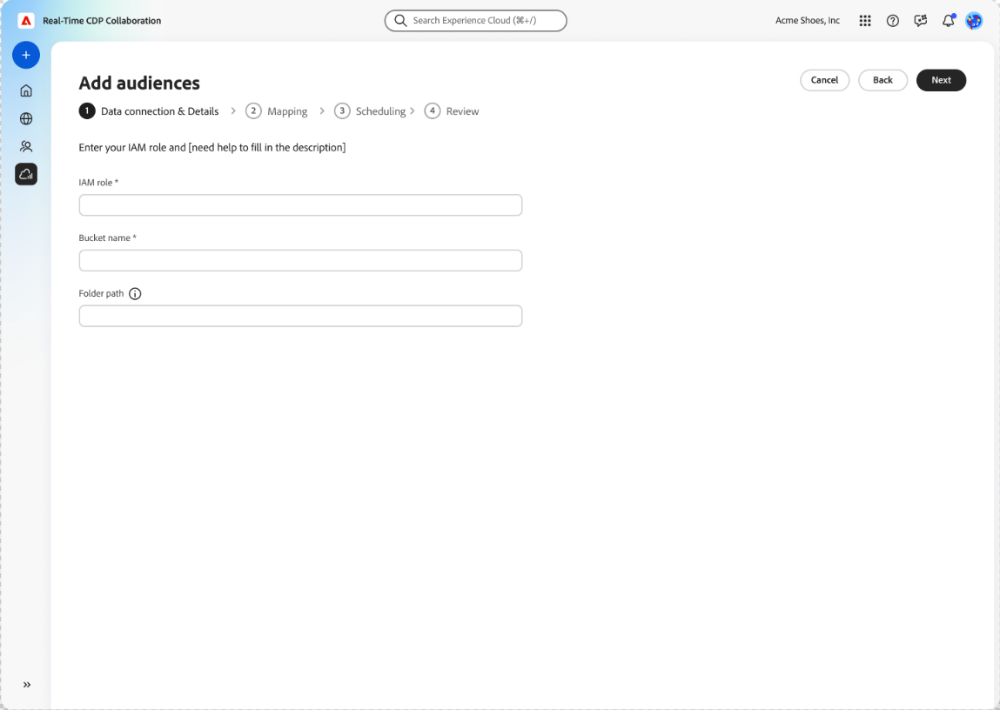

1.4    
You provide an acknowledgment that you have removed consent opt-outs after selecting "Next" on the authentication step.  
You must acknowledge this before moving forward.

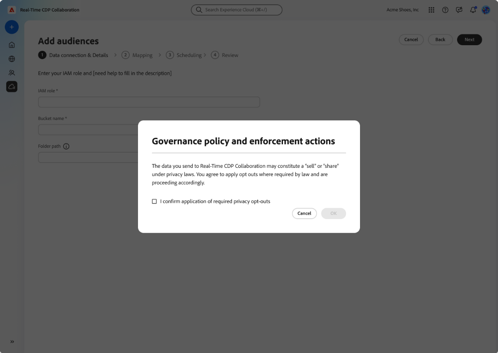

1.5    
You connect to your AWS S3 bucket.  
You receive a success message if authentication is successful.  
Copy: Authentication successful. Your connection to Amazon S3 has been established successfully.  
You receive an error message if authentication fails.  
Copy: Authentication failed. Please review your credentials and try again.  
You receive an error message if access is denied.  
Copy: Access denied. Your credentials don't have the required permissions to access this Amazon S3 bucket. Please verify access settings or contact your administrator.  
You receive an error message if the audience files are not in the expected format (per the Audience Onboarding specification).  
Copy: Invalid file format. The audience data doesn't match the expected structure. Please ensure your files comply with the Audience Sourcing Specifications.  
You receive an error message if the audience files are not found.  
Copy: No audience files found. Please confirm that your audience files exist in the specified folder path and that the path is accessible.  
For any other error (for example, an unknown error), you see the following:  
Copy: An internal error has occurred. Please try again. If the problem persists, contact customer support. (ACPS - XXXX-XXX) Reference id: XXXXXXX-XXXXX-XXXX-XXXX-XXXXXXXX

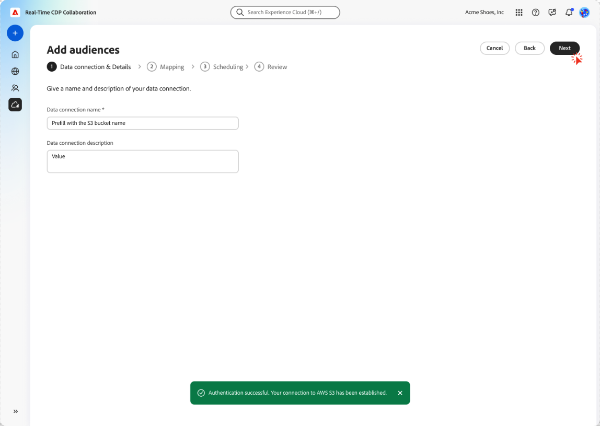

1.6    
You provide an account name and description for the S3 bucket you are connecting.  
Data connection name (required)  
Data connection description (optional)

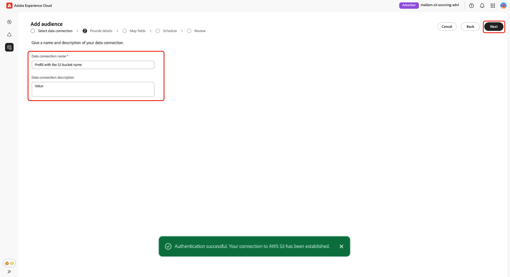

1.8    
You see the field mapping screen.  
The "Apply transformation" toggle is not visible.  
The "Add field" call to action is not visible.  
The source and target fields are auto-populated based on the underlying audience tables. This is read only and the configuration cannot be changed. 
Copy across top of page  
Copy: Source identity fields from your data connection are auto-mapped to target identity fields in Real-Time CDP Collaboration based on the {Audience Onboarding Specifications}.

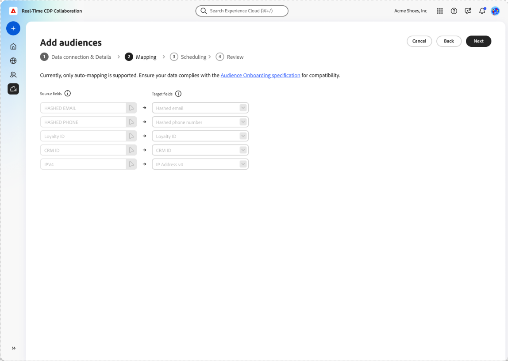

1.9    
You set the refresh schedule and the date range for which the connection is available.  
Frequency options:  
Daily up to every 6 days  
You see copy that informs you that the refresh cadence should not be more frequent than the refresh cadence of the underlying data.

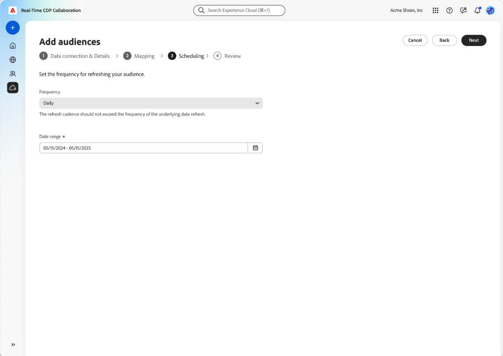

1.11    
You see a summary screen that asks you to review the data connection before completing it.  
Summary sections  
Data connection  
Details  
Mapping  
Schedule

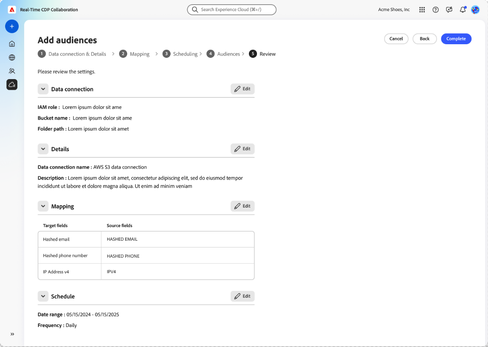

1.13    
Audiences sourced through an AWS S3 bucket appear in the "My Audiences" tab and have the same functionality and information as audiences sourced from AEP.  
The audience source is "AWS S3".  
If sourcing is in progress, you are informed of that.  
Copy:  
Title: Audience sourcing in progress  
Body: Audiences are being sourced from [Cloud Source Name] via the [Data Connection Name] data connection and will appear once the process is complete.  
You see the message above for any or all S3 data connections that are currently sourcing audiences.  
If sourcing fails, you are informed of that.  
Copy:  
Title: Audience sourcing failed  
Body: Audience sourcing from [Cloud Source Name] via the [Data Connection Name] data connection failed. Please try again. If the problem persists, contact customer support. Reference id: XXXXXXX-XXXXX-XXXX-XXXX-XXXXXXXX

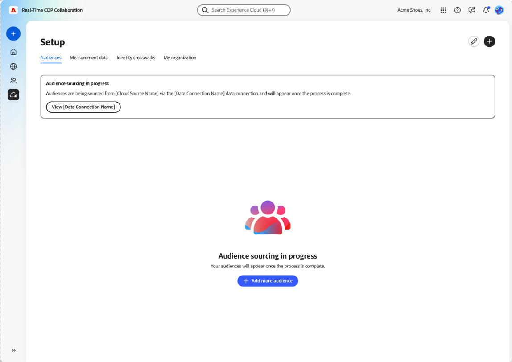

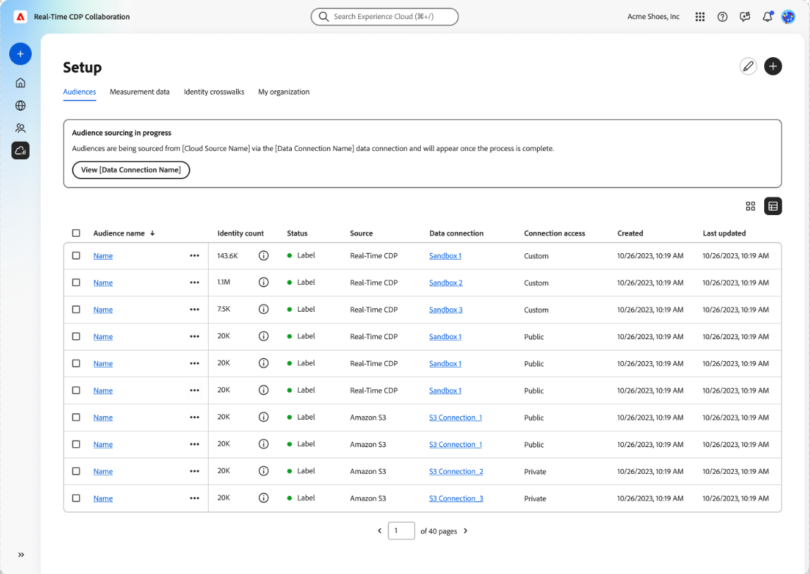

1.14    
The AWS S3 data connection appears in the "My data connections" tab and includes the same functionality and information as audiences sourced from AEP.  
The audience source is "AWS S3".  
The "+ Add audience" option is not available for S3 data connections (this appears when selecting the ellipses on the "My data connections" tab).  
The "+" icon is not available on the details page of the data connection.  
You are informed if the data connection is currently sourcing audiences.  
Copy:  
Title: Audience sourcing in progress  
Body: Audiences are being sourced from [Cloud Source Name] and will appear once the process is complete.

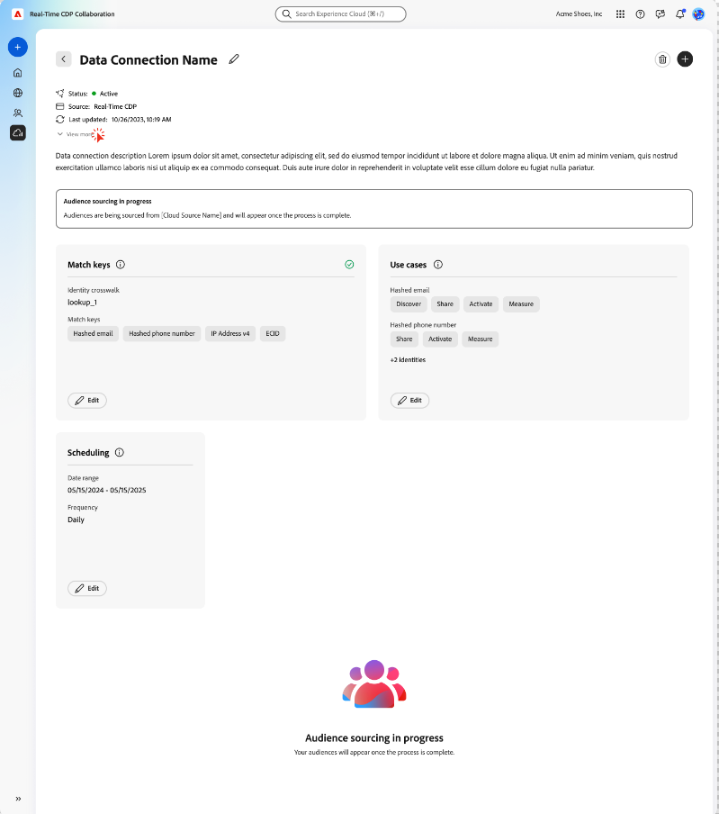
