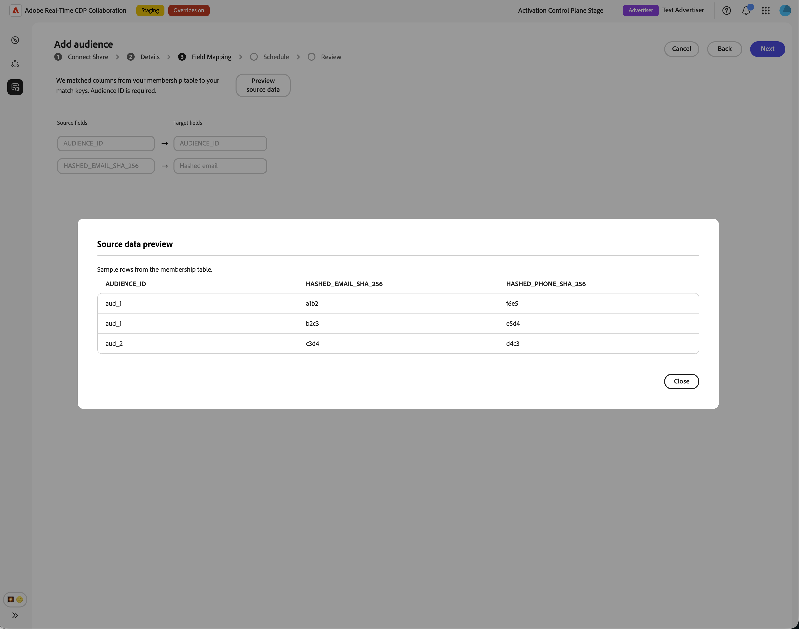
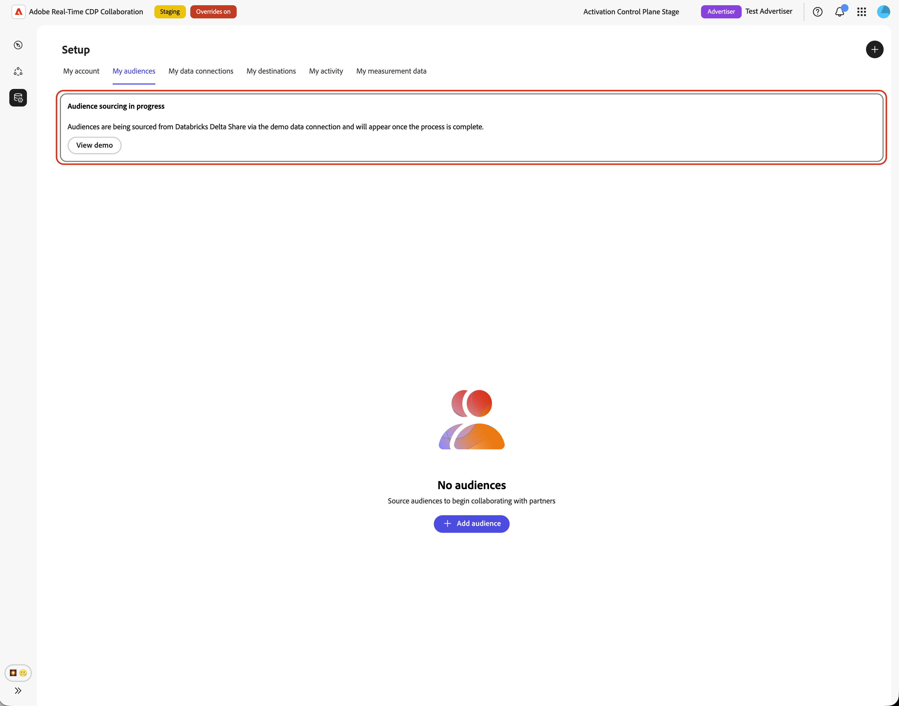
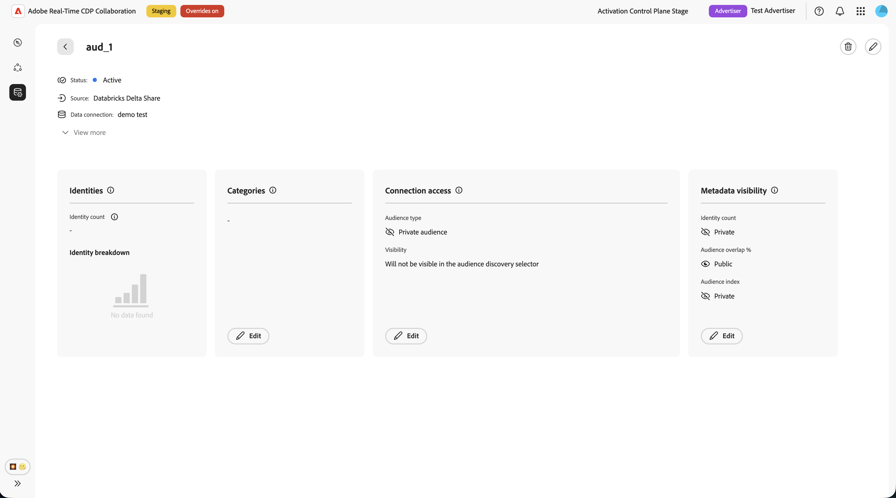
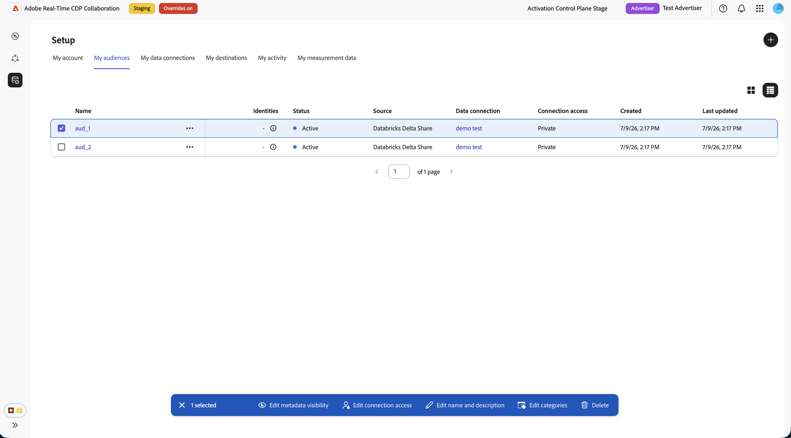

# Configure [!DNL Databricks Delta Share] for audience sourcing

Use this guide to connect [!DNL Databricks Delta Share] to Adobe Real-Time CDP Collaboration and source first-party audiences through the user interface.

When you connect [!DNL Databricks Delta Share], Collaboration reads audience data directly from your Unity Catalog share. After sourcing completes, you can use the audiences for activation and overlap analysis in collaboration projects.

This guide explains how to prepare prerequisites, connect your [!DNL Delta Share], specify source tables, map identity fields, and verify that audience sourcing starts successfully.

Audiences sourced from [!DNL Databricks] follow the same governance and data handling rules as audiences sourced from Adobe Experience Platform and other supported cloud sources.

Other available sourcing methods include [Experience Platform](./onboard-audiences.md), [Amazon S3](./configure-aws-s3-audience-sourcing.md), [Google Cloud Storage](./configure-gcs-audience-sourcing.md), [Snowflake](./configure-snowflake-audience-sourcing.md), [Azure storage](./configure-azure-storage-audience-sourcing.md), and [CSV file upload](./upload-csv-audience-sourcing.md). To learn more about all available sources in Collaboration, see [Sources overview](./source-overview.md).

## Prerequisites {#prerequisites}

Complete the prerequisites in this section before you start the configuration workflow. Missing prerequisites are a common reason that setup fails or audiences do not appear after sourcing. Before you follow this guide, complete [account onboarding and setup](./onboard-account.md).

Some tasks in this guide require help from a [!DNL Databricks] administrator. If you do not administer [!DNL Databricks] for your organization, work with the appropriate administrator before you begin.

### [!DNL Databricks Delta Share] access {#databricks-delta-share-access}

Before proceeding, confirm the following with your [!DNL Databricks] administrator:

* Your organization has published a [!DNL Delta Share] to Adobe's [!DNL Databricks] account using native Databricks-to-Databricks sharing (Unity Catalog). Collaboration does not support bearer-token or OIDC credential entry in the UI for this workflow.
* You know the provider name as registered in Adobe's Unity Catalog metastore, the share name, and the schema that contains your audience tables.
* [!DNL Databricks Delta Share] audience sourcing is available for your Collaboration account and region. If Databricks sourcing is not yet available in your region, contact your Adobe account representative to confirm a timeline.

For step-by-step instructions on publishing a share to Adobe, see the [Publish your Delta Share to Adobe](#publish-delta-share) section in this guide.

### Prepare your audience data {#prepare-audience-data}

Structure your audience tables so that Collaboration can discover audiences and map identities correctly.

* **Membership table (required):** A table within your shared schema that contains one row per profile-audience pair. This table must include a column mappable to `AUDIENCE_ID` and at least one supported match key column. Collaboration uses this table for source-data preview and field mapping.
* **Metadata table (optional):** If you maintain a separate catalog of audiences (one row per audience with audience ID, name, counts, or similar metadata), you can provide this table so Collaboration reads audience definitions from it instead of inferring distinct audience IDs from the membership table alone.
* **Supported match keys:** `HASHED_EMAIL_SHA_256`, `HASHED_PHONE_SHA_256`, `HASHED_IPV4_SHA_256`, `CRM_ID`, `LOYALTY_ID`, `ADFIXUS_ID`, and other match keys enabled for your Collaboration account.
* **Hashing requirements:** All match key values must be trimmed, lowercased, and SHA256-hashed before they are stored in [!DNL Databricks]. Collaboration does not hash or normalize data before ingestion.
* **Column consistency:** The membership table must expose stable column names that Collaboration can map to your enabled match keys.

All match keys present in your membership table must also be enabled for your Collaboration account. To add or enable match keys, see [Set up match keys](./onboard-account.md#set-up-match-keys).

### Values required before you begin {#required-values}

Have the following values ready before starting the configuration wizard.

| Value | Description |
| ----- | ----------- |
| Provider name | The provider identifier that Adobe uses in Unity Catalog to access your [!DNL Delta Share]. Your [!DNL Databricks] administrator or Adobe onboarding contact can provide this value. This value is not the same as your [!DNL Databricks] workspace URL. |
| Share name                | The name of the [!DNL Delta Share] published to Adobe.  |
| Schema                    | The schema within the share that contains your audience tables. |
| Membership table          | The table name within the schema that holds audience membership rows (one row per profile in an audience). |
| Metadata table (optional) | The table name within the schema that lists audiences (one row per audience), if you use a metadata-driven audience catalog. |

{style="table-layout:auto"}

## Configure your [!DNL Databricks] connection {#configure-databricks-connection}

The configuration workflow is a multi-step wizard inside the **[!UICONTROL Setup]** workspace. Complete each step in sequence.

### Add a new data connection {#add-data-connection}

From the **[!UICONTROL My audiences]** tab within the **[!UICONTROL Setup]** workspace, select the add icon () and then select **[!UICONTROL Audience]**.

If this is your first audience, you may also select the **[!UICONTROL Add]** option.

The Add audience workflow appears. Select **[!UICONTROL Add a new data connection]** and then select **[!UICONTROL Next]**.

{zoomable="yes"}

### Select [!DNL Databricks Delta Share] as the data source {#select-databricks-delta-share}

The data source selection screen lists all available connection types. Select **[!UICONTROL Databricks Delta Share]** and then select **[!UICONTROL Next]**.

### Connect your [!DNL Delta Share] {#connect-delta-share}

>[!CONTEXTUALHELP]
>id="rtcdp_collaboration_audience_sharing_databricks"
>title="Add audience from Databricks Delta Share"
>abstract="Connect a Databricks Delta Share to source your audience data. Follow the steps outlined in Experience League to configure your share and grant Adobe access."

Provide the details required to allow Collaboration to access your [!DNL Delta Share]. Enter the provider, share, schema, and table details from your [!DNL Databricks Delta Share]. The required membership table must be available in the shared schema. If you use a metadata table, it must also be available in the same shared schema.
After entering the required information, select **[!UICONTROL Connect]**.

Collaboration validates the share and mounts it in Adobe's workspace. This step may take up to one minute. A progress indicator appears while the connection is established.

| Field | Description |
| --- | --- |
| **[!UICONTROL Provider name]** | The Unity Catalog provider name Adobe uses to consume your share. See [Values required before you begin](#required-values). |
| **[!UICONTROL Share name]** | The name of the [!DNL Delta Share] published to Adobe. |
| **[!UICONTROL Schema]** | The schema within the share that contains your audience tables. |
| **[!UICONTROL Data table]** |  The table name within the schema that holds audience membership rows (one row per profile in an audience). |
| **[!UICONTROL Metadata table]** | The table that lists audiences (one row per audience).  |

If the share cannot be found or the schema is not yet visible, an error message appears. Verify the values with your [!DNL Databricks] administrator and try again.

### Confirm consent and data use acknowledgment {#confirm-consent}

Before proceeding, confirm that you have applied any opt-outs required by law to the audience data you send to Collaboration. If you are unsure whether your data meets this requirement, review the [governance policy and enforcement actions](./onboard-audiences.md#governance-policy-and-enforcement-actions) guide before proceeding. Select the confirmation checkbox and then select **[!UICONTROL OK]** to proceed.

### Provide connection details {#provide-connection-details}

Enter a name and an optional description for this data connection. The name you provide appears in the **[!UICONTROL My data connections]** tab and helps distinguish this source if you manage multiple data connections.

* **[!UICONTROL Data connection name]** (required)
* **[!UICONTROL Data connection description]** (optional)

Select **[!UICONTROL Next]** to continue.

### Map identity fields {#map-identity-fields}

The **[!UICONTROL Mapping]** screen shows how Collaboration maps source columns from your membership table to target identity fields. Collaboration maps fields automatically based on column names and the match keys enabled for your account.

>[!TIP]
>
>Select **[!UICONTROL Preview source data]** to review a sample of your membership table in tabular format, then select **[!UICONTROL Close]** to return to the mapping screen.

Confirm that the displayed mappings reflect the columns in your membership table. Select **[!UICONTROL Next]** to continue.

### Schedule refresh frequency and date range {#schedule-refresh}

The **[!UICONTROL Schedule]** view appears. Use the dropdown menu to select a refresh frequency between one and six days, then set the active date range. Use the calendar icon to specify start and end dates.

>[!IMPORTANT]
>
>To manage your Collaboration credits effectively, set the refresh frequency to match or exceed the update frequency of your underlying data refresh.

### Review and complete the connection {#review-and-complete}

Review the configuration summary before creating the connection. The summary screen displays the following sections:

* **[!UICONTROL Data connection]**: The connection name, provider name, share name, and schema you configured.
* **[!UICONTROL Mapping]**: The source and target identity field mappings.
* **[!UICONTROL Schedule]**: The refresh frequency and active date range.

Verify all sections are correct and then select **[!UICONTROL Complete]**.

A confirmation dialog appears, indicating that Collaboration created the data connection and that audience sourcing is in progress.

## Review sourced audiences {#review-sourced-audiences}

After you complete the configuration wizard, Collaboration begins sourcing audiences from your [!DNL Databricks] tables asynchronously. Navigate to **[!UICONTROL Setup]** > **[!UICONTROL My audiences]** to monitor progress. Sourcing does not complete immediately; the time required depends on the size of your data.

### Monitor audience sourcing progress {#monitor-sourcing-progress}

While Collaboration is retrieving your audience data, a banner at the top of the **[!UICONTROL My audiences]** workspace indicates that sourcing is in progress. Individual audiences appear in the list only after sourcing completes for each audience.

>[!TIP]
>
>Audience sourcing time varies based on the size of your membership table and whether you use a metadata table for audience discovery. Larger datasets may take longer to appear in the **[!UICONTROL My audiences]** workspace.

### View sourced audience details {#view-audience-details}

Once sourcing completes, your [!DNL Databricks] audiences appear in the **[!UICONTROL My audiences]** tab alongside audiences sourced from other connections. Select a row item or **[!UICONTROL View audience]** to open the detail view for a specific audience.

The detail view displays the audience's status, source, and data connection name, along with the following panels:

* **[!UICONTROL Identities]**: The total identity count and breakdown for the audience, once data becomes available.
* **[!UICONTROL Categories]**: Any tags applied for organizing or filtering the audience.
* **[!UICONTROL Connection access]**: Whether the audience is private, public, or shared with specific collaborators.
* **[!UICONTROL Metadata visibility]**: What audience information, such as identity count, overlap percentage, and index, is visible to collaborators.

Review these settings before using the audience in a collaboration project. To update categories, connection access, or metadata visibility, see [View and manage individual audiences](./onboard-audiences.md#view-individual-audiences).

### Edit audience settings {#edit-audience-settings}

You can edit audience metadata directly from the **[!UICONTROL My audiences]** list view without opening the detail view. Select the checkbox for an audience to reveal the action toolbar, then select an action: **[!UICONTROL Edit metadata visibility]**, **[!UICONTROL Edit connection access]**, **[!UICONTROL Edit name and description]**, **[!UICONTROL Edit categories]**, or **[!UICONTROL Delete]**.

### View your [!DNL Databricks] data connection {#view-databricks-connection}

To review the connection itself, including its match keys, navigate to **[!UICONTROL Setup]** > **[!UICONTROL My data connections]**. Your new [!DNL Databricks] connection is available there. The audience source is displayed as **[!UICONTROL Databricks Delta Share]**.

![The My data connections tab showing the [!DNL Databricks Delta Share] data connection with sourcing status information.](../../assets/setup/databricks-audience-sourcing/databricks-my-data-connections-tab.png)

## Known limitations {#known-limitations}

Be aware of the following constraints when configuring and using [!DNL Databricks Delta Share] audience sourcing:

* **Native sharing only:** The UI supports native Databricks-to-Databricks [!DNL Delta Sharing] only. Bearer-token and OIDC authentication flows are not available in the configuration wizard.
* **No in-wizard table browser:** You must enter table names manually. Collaboration validates table names when you preview tables; it does not list all tables in your share automatically.
* **Metadata table row limit:** When you use a metadata table for audience discovery, Collaboration imports up to 100,000 audience rows from that table. Contact Adobe support if your catalog exceeds this limit.
* **Match key constraints:** Once a match key is enabled for a data connection, it cannot be removed. You can add match keys to an existing connection, but you cannot disable or delete them. To change the active match keys, you must [delete the data connection](./manage-data-connection.md#delete-data-connection) and create a new one.
* **Membership table required:** Even when you use a metadata table for audience discovery, you must specify a membership table. Collaboration reads identity rows from the membership table during ingestion.

## Troubleshooting {#troubleshooting}

Use this section to resolve issues that occur during or after configuration. For errors during share connection, review your provider name, share name, and schema with your [!DNL Databricks] administrator.

**Share connection fails or times out**

* Verify that your [!DNL Delta Share] is published to Adobe's [!DNL Databricks] account and that the provider name, share name, and schema are correct.
* Confirm the schema is visible in the share. Newly published shares may take time to propagate.
* If the connection still fails after several minutes, restart the setup and try again, or contact Adobe customer support and provide the provider name, share name, schema, and any relevant error details. Do not include sensitive credentials.

**Table preview fails**

* Confirm the table name is spelled correctly and exists in the schema you specified.
* Ensure the table is included in the [!DNL Delta Share] published to Adobe.
* For metadata-driven discovery, preview both the membership table and the metadata table before continuing.

**Field mapping validation blocks progress**

* Confirm your membership table includes a column mappable to **`AUDIENCE_ID`**.
* Ensure at least two identity fields are fully mapped (source and target).
* Use **[!UICONTROL Preview source data]** to verify column names match your enabled match keys.

**Audiences are not appearing or sourcing is taking longer than expected**

* Sourcing time scales with data volume. Extended processing time is expected for large membership tables.
* If audiences have not appeared within 24 hours, check the **[!UICONTROL My data connections]** tab for error indicators on the connection.
* Verify that your membership table structure and field mappings match the requirements in [Prepare your audience data](#prepare-audience-data).
* If the issue persists, contact Adobe customer support and provide the data connection name and table details.

**The data connection shows a failed status after initially succeeding**

* Confirm that the [!DNL Delta Share] and tables have not been removed or renamed in [!DNL Databricks] since you created the connection.
* Verify that Adobe's access to the share has not been revoked.
* If the issue persists, contact Adobe customer support.

## Publish your [!DNL Delta Share] to Adobe {#publish-delta-share}

[!DNL Databricks] Unity Catalog [!DNL Delta Sharing] lets you share tables securely with other [!DNL Databricks] accounts without copying data. To allow Collaboration to read your audience data, your [!DNL Databricks] administrator must publish a [!DNL Delta Share] to Adobe's [!DNL Databricks] consumer account.

### Before you publish {#before-you-publish}

Work with your Adobe account representative or onboarding contact to obtain:

* Confirmation that Adobe is ready to receive your share in your region.
* The provider name Adobe uses in its Unity Catalog metastore to identify your organization as a share provider.

Prepare the following in your [!DNL Databricks] workspace:

* A [!DNL Delta Share] containing the schema and tables Collaboration will read.
* A membership table with one row per profile-audience pair and columns for **`AUDIENCE_ID`** and match keys.
* An optional metadata table if you plan to use metadata-driven audience discovery.

### Publish the share {#publish}

Follow your organization's [!DNL Databricks Delta Sharing] procedures to grant Adobe's consumer account access to the share. Exact steps depend on your [!DNL Databricks] deployment and governance model. In general:

1. In Unity Catalog, create or identify the share that contains your audience schema and tables.
2. Add the schema (or individual tables) to the share.
3. Grant the share to Adobe's [!DNL Databricks] consumer account using native Databricks-to-Databricks sharing.
4. Confirm with your Adobe contact that the share is visible on the consumer side and note the provider name and share name for the Collaboration configuration wizard.
5. For [!DNL Databricks] product documentation on [!DNL Delta Sharing], see the [Databricks Delta Sharing documentation](https://docs.databricks.com/aws/en/delta-sharing).

### Collect [!DNL Databricks] details for Collaboration {#collect-databricks-details}

After you publish the share, make sure you have the provider name, share name, schema, and table names available for the Collaboration configuration workflow.

Gather the details below before starting the Collaboration configuration wizard.

| Field | Description | Example |
| ------| ----------- | ------- |
| Provider name  | Provider identifier in Adobe's Unity Catalog metastore (from Adobe onboarding) | `your_org_provider`       |
| Share name    | Name of the published [!DNL Delta Share]   | `audience_share_prod`     |
| Schema | Schema  | `collaboration_audiences` |
| Membership table  | Table with profile-audience membership rows  | `audience_members`        |
| Metadata table (optional) | Table listing audiences (one row per audience) | `audience_catalog` |

{style="table-layout:auto"}

## Next steps {#next-steps}

You have configured [!DNL Databricks Delta Share] as a data source in Collaboration. After sourcing completes, your audiences are available in the **[!UICONTROL My audiences]** workspace and ready for use in collaboration projects.

From here, you can:

* [Create and manage collaboration projects](../collaborate/manage-projects.md)
* [Activate audiences within a project](../collaborate/activate.md)
* [Review overlaps and measure performance](../collaborate/measure.md)
* [Manage audience settings and visibility](./onboard-audiences.md#view-individual-audiences)
* [View and manage data connections](./manage-data-connection.md)

For other audience sourcing methods, see:

* [Configure [!DNL Google Cloud Storage] for audience sourcing](./configure-gcs-audience-sourcing.md)
* [Configure [!DNL Amazon S3] for audience sourcing](./configure-aws-s3-audience-sourcing.md)
* [Configure [!DNL Snowflake] for audience sourcing](./configure-snowflake-audience-sourcing.md)
* [Source audiences from Experience Platform](./onboard-audiences.md)
* [Upload a CSV file for audience sourcing](./upload-csv-audience-sourcing.md)
