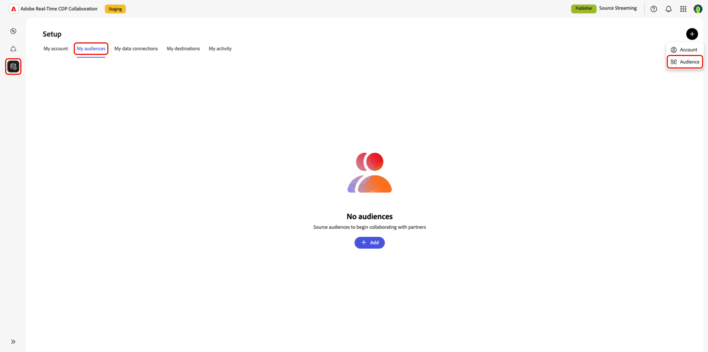
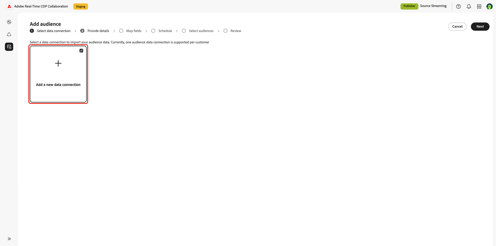
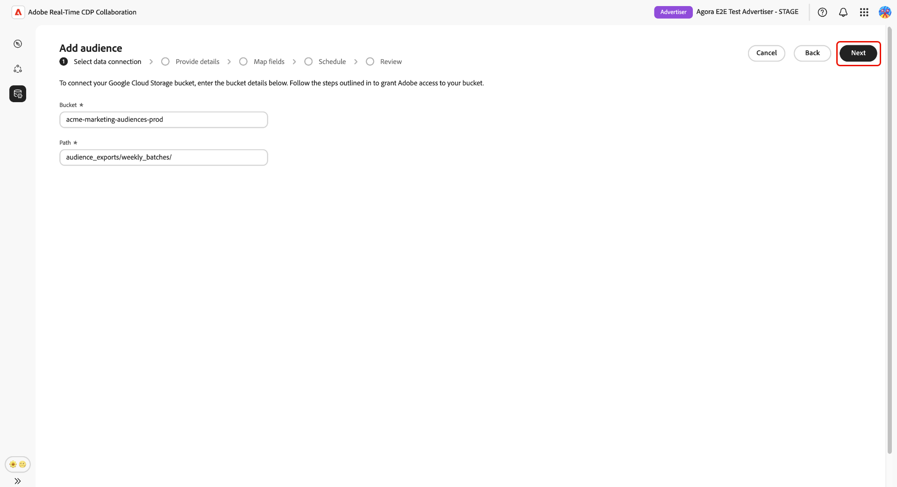

# Configure [!DNL Google Cloud Storage] for audience sourcing

Follow the steps in this guide to connect your [!DNL Google Cloud Storage] (GCS) bucket to Adobe Real-Time CDP Collaboration and begin sourcing first-party audience data through the self-service UI.

## Overview {#overview}

[!DNL Google Cloud Storage] audience sourcing lets you connect a GCS bucket directly to Collaboration and ingest first-party audience data without engineering support. Once connected, Collaboration sources audiences from your bucket on a recurring schedule and makes them available for activation and overlap analysis within your collaboration projects. Sourcing your audiences is a required step before they can be activated or used in overlap analysis with collaborators.

This guide covers the end-to-end configuration workflow: preparing prerequisites, authenticating your GCS bucket, reviewing auto-mapped identity fields, scheduling data refresh, and confirming that sourcing completed successfully.

Audiences sourced from [!DNL Google Cloud Storage] follow the same governance and data handling rules as audiences sourced from Adobe Experience Platform.

Other available sourcing methods include [Experience Platform](./onboard-audiences.md), [Amazon S3](./configure-aws-s3-audience-sourcing.md), [Snowflake](./configure-snowflake-audience-sourcing.md), and [CSV file upload](./upload-csv-audience-sourcing.md).

## Prerequisites {#prerequisites}

Complete all items in this section before starting the configuration workflow. Incomplete prerequisites are the most common reason setup fails or audiences do not appear after sourcing. Before following this guide, you must have completed [account onboarding and setup](./onboard-account.md).

Some steps in this section require action by a [!DNL Google Cloud] administrator. If you are not the GCP administrator for your organization, identify the appropriate person before starting.

### GCS access and permissions {#gcs-access-permissions}

<!-- [LINK REQUIRED: Once the GCS permissions and roles guide is published, replace this NOTE with a direct link to that guide and remove the placeholder instructions below.] -->

>[!NOTE]
>
>A dedicated guide covering the specific [!DNL Google Cloud] IAM roles, service account configuration, and bucket-level permissions required for this integration is pending publication. Until that guide is available, work with your [!DNL Google Cloud] administrator to confirm that Adobe has the permissions required to authenticate against your bucket and read audience files.

Before proceeding, confirm the following with your [!DNL Google Cloud] administrator:

* Adobe has been granted the permissions required to authenticate against your GCS bucket and read audience files. [UNVERIFIED: specific IAM roles and service account or credential requirements to be confirmed in the dedicated GCS permissions guide.]
* [!DNL Google Cloud Storage] audience sourcing is available in your region. Availability varies by region (NA, EMEA, ANZ). If GCS sourcing is not yet available in your region, contact your Adobe account representative to confirm a timeline. [UNVERIFIED: confirm supported regions before publication.]

### Prepare your audience data {#prepare-audience-data}

Your audience files must conform to the **[Audience Sourcing Specification (v1.2)](../../assets/quick-start/RTCDP_Collaboration_Audience_Sourcing_Spec_v1.2.pdf)** before sourcing begins. Review the specification for the full schema definition and field-level examples. Key requirements include:

* **File format:** CSV, using commas as field delimiters and pipes (`|`) as separators for multiple values within a single field.
* **Required fields:** Every record must include an `AUDIENCE_ID` column and at least one supported match key column.
* **Supported match keys:** `HASHED_EMAIL_SHA_256`, `HASHED_PHONE_SHA_256`, `HASHED_IPV4_SHA_256`, `CRM_ID`, `LOYALTY_ID`, `ADFIXUS_ID`.
* **Hashing requirements:** All match key values must be trimmed, lowercased, and SHA256-hashed before upload. Collaboration does not hash or normalize data before ingestion.
* **Column consistency:** If your bucket contains multiple audience files, all files must use identical column structures.

All match keys present in your audience files must also be enabled for your Collaboration account. To add or enable match keys, see [Set up match keys](./onboard-account.md#set-up-match-keys).

### Values required before you begin {#required-values}

Have the following values ready before starting the configuration wizard. The exact credential fields displayed in the Collaboration UI are [UNVERIFIED] pending confirmation of the GCS authentication mechanism.

| Value | Description |
| --- | --- |
| **GCS bucket name** | The name of the [!DNL Google Cloud Storage] bucket containing your audience files. |
| **Folder path** | The path prefix within the bucket where your audience files are stored. [UNVERIFIED: confirm whether GCS requires a trailing slash and whether leading slashes are disallowed, consistent with S3 behavior.] |
| **[UNVERIFIED: credential field]** | [UNVERIFIED: the specific credential or identifier required to authenticate Adobe's access — for example, a service account key, project ID, or equivalent — to be confirmed once the authentication mechanism is finalized.] |

## Configure your [!DNL Google Cloud Storage] connection {#configure-gcs-connection}

The configuration workflow is a multi-step wizard inside the **[!UICONTROL Setup]** workspace. Complete each step in sequence. You can return to any step using the pencil icon on the final review screen before the connection is created.

### Add a new data connection {#add-data-connection}

From the **[!UICONTROL My audiences]** tab within the **[!UICONTROL Setup]** workspace, select the add icon () and then select **[!UICONTROL Audience]**.

If this is your first audience, you may also select the **[!UICONTROL Add]** option.

The Add audience workflow appears. Select **[!UICONTROL Add a new data connection]** and then select **[!UICONTROL Next]**.

{zoomable="yes"}

### Select [!DNL Google Cloud Storage] as the data source {#select-gcs}

The data source selection screen lists all available connection types. Select **[!UICONTROL Google Cloud Storage]** [UNVERIFIED: confirm exact UI label] and then select **[!UICONTROL Next]**.

A prerequisite dialog outlining required configuration steps (for example, GCS bucket setup and IAM role assignment) appears and notes that data must comply with the **[[!UICONTROL Audience Sourcing Specification]](../../assets/quick-start/RTCDP_Collaboration_Audience_Sourcing_Spec_v1.2.pdf)**. Select [!UICONTROL Start onboarding] to confirm these conditions before proceeding with onboarding.

### Authenticate your [!DNL Google Cloud Storage] connection {#authenticate-gcs-connection}

>[!NOTE]
>
>The specific authentication mechanism for [!DNL Google Cloud Storage] — including whether Collaboration uses a service account key file, OAuth 2.0, Workload Identity Federation, or another method — is [UNVERIFIED] pending product confirmation. For reference, the access and permissions requirements are described in [GCS access and permissions](#gcs-access-permissions).

Provide the [!DNL Google Cloud Storage] credentials required to connect your bucket to Collaboration, then select **[!UICONTROL Next]**.

| Field | Description |
| --- | --- |
| **GCS bucket name** | The name of your [!DNL Google Cloud Storage] bucket. See [Values required before you begin](#required-values). |
| **Folder path** | The path prefix within the bucket where your audience files are stored. [UNVERIFIED: confirm path formatting rules.] |

#### Authentication result states {#authentication-result-states}

After entering your credentials and selecting **[!UICONTROL Next]**, Collaboration validates the connection and returns one of the following results. [UNVERIFIED: confirm GCS-specific UI message text before publication.]

| Status | UI message | Description |
| --- | --- | --- |
| **Success** | **[!UICONTROL Authentication successful]** [UNVERIFIED] | Your connection to [!DNL Google Cloud Storage] was established successfully. |
| **Failed** | **[!UICONTROL Authentication failed]** [UNVERIFIED] | Collaboration could not authenticate with the provided credentials. Review your entries and try again. |
| **Access denied** | **[!UICONTROL Access denied]** [UNVERIFIED] | The credentials provided do not have the required permissions to access this bucket. Verify the IAM permissions with your [!DNL Google Cloud] administrator and review [GCS access and permissions](#gcs-access-permissions). |
| **Invalid file format** | **[!UICONTROL Invalid file format]** [UNVERIFIED] | Audience files at the specified path do not match the expected structure. Confirm your files comply with the [Audience Sourcing Specification](../../assets/quick-start/RTCDP_Collaboration_Audience_Sourcing_Spec_v1.2.pdf) before retrying. |
| **No audience files found** | **[!UICONTROL No audience files found]** [UNVERIFIED] | No audience files were found at the specified folder path. Confirm the bucket name and path are correct and that files exist at that location. |
| **Internal error** | **[!UICONTROL An internal error has occurred]** [UNVERIFIED] | An unexpected error occurred. Try again. If the issue persists, contact Adobe customer support. |

### Confirm consent and data use acknowledgment {#confirm-consent}

>[!NOTE]
>
>The order of this consent step relative to the authentication step is [UNVERIFIED] pending UX confirmation. Adjust the position of this section once the UI sequence is finalized.

You must confirm that consent opt-outs have been removed from the audience data before Collaboration can process it. If you are unsure whether your data meets this requirement, review the [governance policy and enforcement actions](./onboard-audiences.md#governance-policy-and-enforcement-actions) guide before proceeding. Select the confirmation checkbox and then select **[!UICONTROL OK]** to proceed.

### Provide connection details {#provide-connection-details}

Enter a name and an optional description for this data connection. The name you provide appears in the **[!UICONTROL My data connections]** tab and helps distinguish this source if you manage multiple data connections.

* **[!UICONTROL Data connection name]** (required)
* **[!UICONTROL Data connection description]** (optional)

Select **[!UICONTROL Next]** to continue.

### Review auto-mapped identity fields {#auto-mapped-fields}

The **[!UICONTROL Mapping]** screen is read-only. Collaboration automatically maps source identity fields from your audience files to target fields based on the column names defined in the Audience Sourcing Specification. You cannot add, remove, or apply transformations to mapped fields at this stage.

>[!NOTE]
>
>Whether a **[!UICONTROL Preview source data]** option is available at this step for GCS-sourced audiences is [UNVERIFIED] pending product confirmation. If the option is present, select it to review a sample of your audience data in tabular format, then select **[!UICONTROL Close]** to return to the mapping screen.

<!-- [3. SCREENSHOT REQUIRED: Mapping screen showing auto-mapped GCS source fields to target identity fields, read-only state.] gcs-mapping-auto-fields.png -->

Confirm that the displayed mappings reflect the fields in your audience files. If they do not, stop and correct your files to conform to the [Audience Sourcing Specification](../../assets/quick-start/RTCDP_Collaboration_Audience_Sourcing_Spec_v1.2.pdf) before proceeding. Select **[!UICONTROL Next]** to continue.

### Schedule data refresh {#schedule-data-refresh}

In the **[!UICONTROL Schedule]** view, set the frequency at which Collaboration retrieves updated audience data from your GCS bucket and define the active date range for sourcing.

Use the **[!UICONTROL Frequency]** dropdown to select a refresh interval. Use the calendar icon to set the **[!UICONTROL Start date]** and **[!UICONTROL End date]** for the active sourcing period. When the end date is reached, sourcing ceases and previously sourced audiences expire and become unavailable for use in collaboration projects. [UNVERIFIED: confirm exact behavior when the end date passes, including whether audiences are retained or removed.]

>[!IMPORTANT]
>
>Set the refresh frequency to match or not exceed the rate at which your underlying GCS audience data is updated. The minimum supported refresh interval is once every six days. Refreshing more frequently than your data changes consumes Collaboration credits without producing updated results. To monitor your credit usage, see [Track your credit consumption activity](./my-activity.md).

<!-- [4. SCREENSHOT REQUIRED: Schedule screen showing the Frequency dropdown and Start date / End date calendar controls.] gcs-schedule-settings.png -->

Select **[!UICONTROL Next]** to continue.

### Review and complete the connection {#review-and-complete}

Review the configuration summary before creating the connection. The summary screen displays the following sections:

* **[!UICONTROL Data connection]**: The GCS bucket credentials and folder path you configured. [UNVERIFIED: confirm exact label once authentication mechanism is known.]
* **[!UICONTROL Details]**: The name and optional description of this data connection.
* **[!UICONTROL Mapping]**: The auto-mapped source and target identity fields.
* **[!UICONTROL Schedule]**: The refresh frequency and active date range.

<!-- [5. SCREENSHOT REQUIRED: Review summary screen displaying the Data connection, Details, Mapping, and Schedule sections with the Complete button visible.] gcs-review-summary.png -->

Select the pencil icon next to any section to return to that step and make changes. When all sections are correct, select **[!UICONTROL Complete]**.

A confirmation dialog appears, indicating that the data connection was created and that audience sourcing is in progress.

## Review sourced audiences {#review-sourced-audiences}

After you complete the configuration wizard, Collaboration begins sourcing audiences from your GCS bucket asynchronously. Navigate to **[!UICONTROL Setup]** > **[!UICONTROL My audiences]** to monitor progress. Sourcing does not complete immediately; the time required depends on the size of your data and the configured refresh frequency.

### Monitor audience sourcing progress {#monitor-sourcing-progress}

While Collaboration is retrieving your audience data, a banner at the top of the **[!UICONTROL My audiences]** workspace indicates that sourcing is in progress. Individual audiences appear in the list only after sourcing completes for each audience.

>[!TIP]
>
>Audience sourcing time varies based on the size of your GCS data and the refresh frequency you configured. Larger datasets or less frequent refresh schedules may take longer to appear in the **[!UICONTROL My audiences]** workspace.

>[!NOTE]
>
>Audience preview behavior after sourcing completes — including what data is displayed and how results can be validated — is [UNVERIFIED] pending product confirmation. This section will be updated once the preview capability is confirmed for [!DNL Google Cloud Storage]-sourced audiences.

### View sourced audience details {#view-audience-details}

Once sourcing completes, your [!DNL Google Cloud Storage] audiences appear in the **[!UICONTROL My audiences]** tab alongside audiences sourced from other connections. Select a row item or **[!UICONTROL View audience]** to open the detail view for a specific audience.

The detail view displays the audience's status, source, and data connection name, along with the following panels:

* **[!UICONTROL Identities]**: The total identity count and breakdown for the audience, once data becomes available.
* **[!UICONTROL Categories]**: Any tags applied for organizing or filtering the audience.
* **[!UICONTROL Connection access]**: Whether the audience is private, public, or shared with specific collaborators.
* **[!UICONTROL Metadata visibility]**: What audience information — such as identity count, overlap percentage, and index — is visible to collaborators.

Review these settings before using the audience in a collaboration project. To update categories, connection access, or metadata visibility, see [View and manage individual audiences](./onboard-audiences.md#view-individual-audiences).

### View your GCS data connection {#view-gcs-connection}

To review or manage the connection itself — including its match keys and scheduling — navigate to **[!UICONTROL Setup]** > **[!UICONTROL My data connections]**. Your new GCS connection is immediately available there. The audience source is displayed as **[!UICONTROL Google Cloud Storage]** [UNVERIFIED: confirm exact source label in UI].

>[!NOTE]
>
>Whether [!DNL Google Cloud Storage] data connections support in-place editing of settings such as refresh frequency or credentials, or whether changes require deleting and recreating the connection, is [UNVERIFIED] pending product confirmation. For confirmed behavior on editing match keys and scheduling for existing connections, see [Manage data connections](./manage-data-connection.md).

## Known limitations {#known-limitations}

Be aware of the following constraints when configuring and using [!DNL Google Cloud Storage] audience sourcing:

* **Match key constraints:** Once a match key is enabled for a data connection, it cannot be removed. You can add match keys to an existing connection, but you cannot disable or delete them. To change the active match keys, you must [delete the data connection](./manage-data-connection.md#delete-data-connection) and create a new one.
* **One active data connection per source:** Only one active [!DNL Google Cloud Storage] data connection is supported at a time. If you need to source audiences from a different bucket, delete the existing connection and create a new one pointing to the new bucket. [UNVERIFIED: confirm whether multiple GCS connections to different buckets are supported, or whether the constraint is strictly one connection per account.]
* **Subfolder support:** [UNVERIFIED: confirm whether GCS, consistent with S3 behavior, restricts audience files to the root of the specified folder path without support for nested subfolder structures.]

## Troubleshooting {#troubleshooting}

Use this section to resolve issues that occur after the initial connection is established. For errors that occur during the authentication step, see [Authentication result states](#authentication-result-states).

>[!NOTE]
>
>[!DNL Google Cloud Storage]-specific error messages and post-setup failure behavior are [UNVERIFIED] pending product confirmation. The entries below are generalized from the [!DNL Amazon S3] connector and will be updated with GCS-confirmed details before publication.

**Audiences are not appearing or sourcing is taking longer than expected**

* Sourcing time scales with data volume and the configured refresh frequency. Extended processing time is expected for large datasets. [UNVERIFIED: confirm the expected maximum sourcing time for GCS connections.]
* If audiences have not appeared within 24 hours, confirm that your audience files exist at the folder path specified during setup and comply with the Audience Sourcing Specification.
* Check the **[!UICONTROL My data connections]** tab for error indicators on the connection. [UNVERIFIED: confirm what connection-level error states are surfaced in the UI for GCS.]
* If the issue persists after completing these steps, contact Adobe customer support and provide the data connection name and bucket details.

**The data connection shows a failed status after initially succeeding** [UNVERIFIED]

* Confirm that the GCS bucket permissions and credentials have not changed since the connection was created. Any change that removes Adobe's access to the bucket causes subsequent sourcing runs to fail.
* Verify that audience files still exist at the configured folder path and conform to the Audience Sourcing Specification.
* If the issue persists after confirming permissions and file availability, [delete the connection](./manage-data-connection.md#delete-data-connection) and create a new one, or contact Adobe customer support.

**Audience file format errors occur during a scheduled refresh** [UNVERIFIED]

* Confirm that updated files in the bucket comply with the column structure and field requirements in the [Audience Sourcing Specification](../../assets/quick-start/RTCDP_Collaboration_Audience_Sourcing_Spec_v1.2.pdf).
* Ensure all files in the configured folder path use identical column structures. Mixed-format files in the same path can cause partial sourcing failures.

## Next steps {#next-steps}

You have configured [!DNL Google Cloud Storage] as a data source in Collaboration. After sourcing completes, your audiences are available in the **[!UICONTROL My audiences]** workspace and ready for use in collaboration projects.

From here, you can:

* [Create and manage collaboration projects](../collaborate/manage-projects.md)
* [Activate audiences within a project](../collaborate/activate.md)
* [Review overlaps and measure performance](../collaborate/measure.md)
* [Manage audience settings and visibility](./onboard-audiences.md#view-individual-audiences)
* [Manage this data connection's match keys and schedule](./manage-data-connection.md)

For other audience sourcing methods, see:

* [Configure [!DNL Amazon S3] for audience sourcing](./configure-aws-s3-audience-sourcing.md)
* [Configure [!DNL Snowflake] for audience sourcing](./configure-snowflake-audience-sourcing.md)
* [Source audiences from Experience Platform](./onboard-audiences.md)
* [Upload a CSV file for audience sourcing](./upload-csv-audience-sourcing.md)
