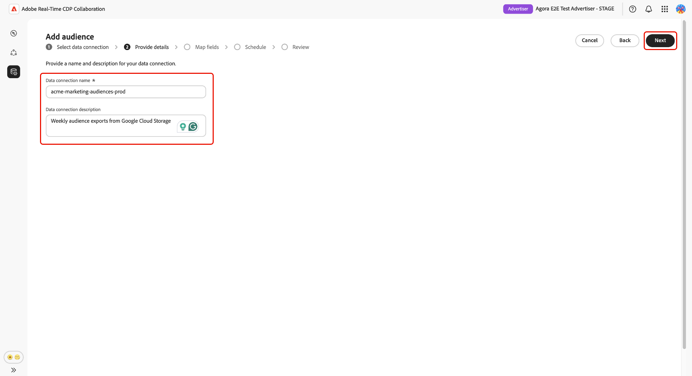
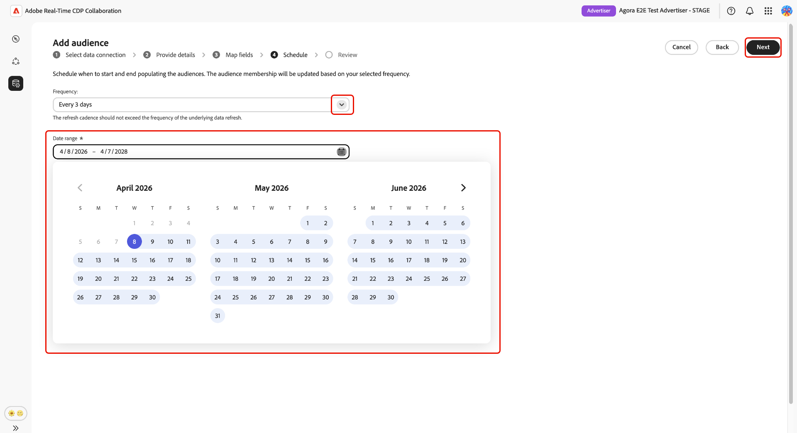
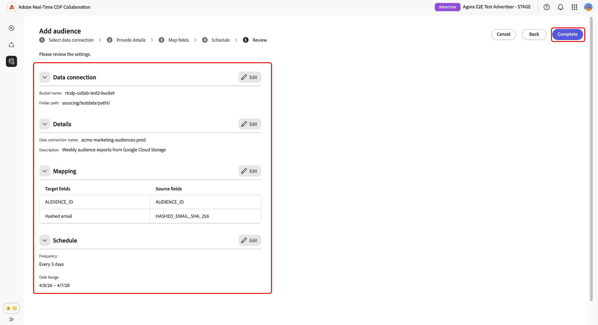
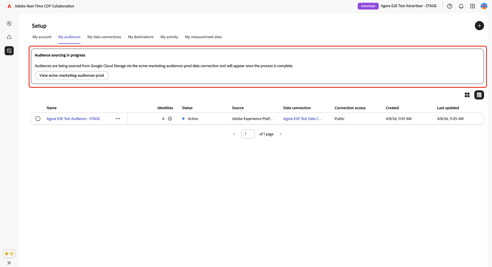

# Configure [!DNL Google Cloud Storage] for audience sourcing

Follow the steps in this guide to connect your [!DNL Google Cloud Storage] (GCS) bucket to Adobe Real-Time CDP Collaboration and begin sourcing first-party audience data through the UI.

Connect a GCS bucket to Collaboration to ingest first-party audience data directly without engineering support. Once connected, Collaboration sources audiences from your bucket on a recurring schedule and makes them available for activation and overlap analysis within your collaboration projects. Sourcing your audiences is a required step before you can activate them or use them in overlap analysis with collaborators.

This guide covers the end-to-end configuration workflow: preparing prerequisites, authenticating your GCS bucket, reviewing auto-mapped identity fields, scheduling data refresh, and confirming that sourcing completed successfully.

Audiences sourced from [!DNL Google Cloud Storage] follow the same governance and data handling rules as audiences sourced from Adobe Experience Platform.

Other available sourcing methods include [Experience Platform](./onboard-audiences.md), [Amazon S3](./configure-aws-s3-audience-sourcing.md), [Snowflake](./configure-snowflake-audience-sourcing.md), and [CSV file upload](./upload-csv-audience-sourcing.md).

## Prerequisites {#prerequisites}

Complete all items in this section before starting the configuration workflow. Incomplete prerequisites are the most common reason setup fails or audiences do not appear after sourcing. Before following this guide, you must have completed [account onboarding and setup](./onboard-account.md).

Some steps in this section require action by a [!DNL Google Cloud] administrator. If you are not the [!DNL Google Cloud] administrator for your organization, identify the appropriate person before starting.

### GCS access and permissions {#gcs-access-permissions}

Before proceeding, confirm the following with your [!DNL Google Cloud] administrator:

* Adobe has been granted the permissions required to authenticate against your GCS bucket and read audience files. For step-by-step instructions, see the [permission setup section](#setup-gcs-permissions).
* [!DNL Google Cloud Storage] audience sourcing is available in your region. Availability varies by region (NA, EMEA, ANZ). If GCS sourcing is not yet available in your region, contact your Adobe account representative to confirm a timeline.

### Prepare your audience data {#prepare-audience-data}

Your audience files must conform to the **[Audience Sourcing Specification (v1.2)](../../assets/quick-start/RTCDP_Collaboration_Audience_Sourcing_Spec_v1.2.pdf)** before sourcing begins. Review the specification for the full schema definition and field-level examples. Key requirements include:

* **File format:** CSV, using commas as field delimiters and pipes (`|`) as separators for multiple values within a single field.
* **Required fields:** Every record must include an `AUDIENCE_ID` column and at least one supported match key column.
* **Supported match keys:** `HASHED_EMAIL_SHA_256`, `HASHED_PHONE_SHA_256`, `HASHED_IPV4_SHA_256`, `CRM_ID`, `LOYALTY_ID`, `ADFIXUS_ID`.
* **Hashing requirements:** All match key values must be trimmed, lowercased, and SHA256-hashed before upload. Collaboration does not hash or normalize data before ingestion.
* **Column consistency:** If your bucket contains multiple audience files, all files must use identical column structures.

All match keys present in your audience files must also be enabled for your Collaboration account. To add or enable match keys, see [Set up match keys](./onboard-account.md#set-up-match-keys).

### Values required before you begin {#required-values}

Have the following values ready before starting the configuration wizard. 

| Value | Description |
| --- | --- |
| **[!UICONTROL Bucket]** | The name of the [!DNL Google Cloud Storage] bucket containing your audience files. |
| **[!UICONTROL Path]** | The path prefix within the bucket where your audience files are stored (for example, `sourcing/testdata/path1/`). |

## Configure your [!DNL Google Cloud Storage] connection {#configure-gcs-connection}

The configuration workflow is a multi-step wizard inside the **[!UICONTROL Setup]** workspace. Complete each step in sequence. You can return to any step using the pencil icon on the final review screen before you create the connection.

### Add a new data connection {#add-data-connection}

From the **[!UICONTROL My audiences]** tab within the **[!UICONTROL Setup]** workspace, select the add icon () and then select **[!UICONTROL Audience]**.

If this is your first audience, you may also select the **[!UICONTROL Add]** option.

The Add audience workflow appears. Select **[!UICONTROL Add a new data connection]** and then select **[!UICONTROL Next]**.

{zoomable="yes"}

### Select [!DNL Google Cloud Storage] as the data source {#select-gcs}

>[!CONTEXTUALHELP]
>id="rtcdp_collaboration_audience_sourcing_specifications_gcs"
>title="Prepare your data for onboarding"
>abstract="Read the Audience Sourcing Specification guide to learn how to format and structure audience data from Google Cloud Storage for Collaboration."
>additional-url="https://www.adobe.com/go/rtcdp-collaboration-audience-sourcing" text="See the guide" 

The data source selection screen lists all available connection types. Select **[!UICONTROL Google Cloud Storage]** and then select **[!UICONTROL Next]**.

A prerequisite dialog outlining required configuration steps (for example, GCS bucket setup and IAM role assignment) appears and notes that data must comply with the **[[!UICONTROL Audience Sourcing Specification]](../../assets/quick-start/RTCDP_Collaboration_Audience_Sourcing_Spec_v1.2.pdf)**. Select **[!UICONTROL Start onboarding]** to confirm compliance before proceeding.

### Enter your [!DNL Google Cloud Storage] connection details {#authenticate-gcs-connection}

Provide the details required to allow Collaboration to access your [!DNL Google Cloud Storage] bucket. After entering the required information, select **[!UICONTROL Next]**.

| Field | Description |
| --- | --- |
| **[!UICONTROL Bucket]** | The name of your [!DNL Google Cloud Storage] bucket. See [Values required before you begin](#required-values). |
| **[!UICONTROL Path]** | The path prefix within the bucket where your audience files are stored. |

### Confirm consent and data use acknowledgment {#confirm-consent}

You must confirm that consent opt-outs have been removed from the audience data before Collaboration can process it. If you are unsure whether your data meets this requirement, review the [governance policy and enforcement actions](./onboard-audiences.md#governance-policy-and-enforcement-actions) guide before proceeding. Select the confirmation checkbox and then select **[!UICONTROL OK]** to proceed.

### Provide connection details {#provide-connection-details}

Enter a name and an optional description for this data connection. The name you provide appears in the **[!UICONTROL My data connections]** tab and helps distinguish this source if you manage multiple data connections.

* **[!UICONTROL Data connection name]** (required)
* **[!UICONTROL Data connection description]** (optional). 

Select **[!UICONTROL Next]** to continue.

### Review auto-mapped identity fields {#auto-mapped-fields}

The **[!UICONTROL Mapping]** screen is read-only. Collaboration automatically maps source identity fields from your audience files to target fields based on the column names defined in the Audience Sourcing Specification. You cannot add, remove, or apply transformations to mapped fields at this stage.

>[!TIP]
>
>Select **[!UICONTROL Preview source data]** to review a sample of your audience data in tabular format, then select **[!UICONTROL Close]** to return to the mapping screen.

{zoomable="yes"}

Confirm that the displayed mappings reflect the fields in your audience files. If they do not, stop and correct your files to conform to the [Audience Sourcing Specification](../../assets/quick-start/RTCDP_Collaboration_Audience_Sourcing_Spec_v1.2.pdf) before proceeding. Select **[!UICONTROL Next]** to continue.

### Schedule data refresh {#schedule-data-refresh}

In the **[!UICONTROL Schedule]** view, set the frequency at which Collaboration retrieves updated audience data from your GCS bucket and define the active date range for sourcing.

Use the **[!UICONTROL Frequency]** dropdown to select how often Collaboration retrieves updated audience data from your GCS bucket. Available intervals range from **[!UICONTROL Daily]** to **[!UICONTROL Every 6 days]**.
 
Type a date range in the input field, or select the calendar icon to set the **[!UICONTROL Start date]** and **[!UICONTROL End date]** for the active sourcing period. When the end date is reached, sourcing ceases and previously sourced audiences expire and become unavailable for use in collaboration projects. 

>[!IMPORTANT]
>
>Set the refresh frequency to match or not exceed the rate at which your underlying GCS audience data is updated. The minimum supported refresh interval is once every six days. Refreshing more frequently than your data changes consumes Collaboration credits without producing updated results. To monitor your credit usage, see [Track your credit consumption activity](./my-activity.md).

Select **[!UICONTROL Next]** to continue.

### Review and complete the connection {#review-and-complete}

Review the configuration summary before creating the connection. The summary screen displays the following sections:

* **[!UICONTROL Data connection]**: The GCS bucket credentials and folder path you configured.
* **[!UICONTROL Details]**: The name and optional description of this data connection.
* **[!UICONTROL Mapping]**: The auto-mapped source and target identity fields.
* **[!UICONTROL Schedule]**: The refresh frequency and active date range.

Select the pencil icon () next to any section to return to that step and make changes. When all sections are correct, select **[!UICONTROL Complete]**.

A confirmation dialog appears, indicating that Collaboration created the data connection and that audience sourcing is in progress.

## Review sourced audiences {#review-sourced-audiences}

After you complete the configuration wizard, Collaboration begins sourcing audiences from your GCS bucket asynchronously. Navigate to **[!UICONTROL Setup]** > **[!UICONTROL My audiences]** to monitor progress. Sourcing does not complete immediately; the time required depends on the size of your data and the configured refresh frequency.

### Monitor audience sourcing progress {#monitor-sourcing-progress}

While Collaboration is retrieving your audience data, a banner at the top of the **[!UICONTROL My audiences]** workspace indicates that sourcing is in progress. Individual audiences appear in the list only after sourcing completes for each audience.

>[!TIP]
>
>Audience sourcing time varies based on the size of your GCS data and the refresh frequency you configured. Larger datasets or less frequent refresh schedules may take longer to appear in the **[!UICONTROL My audiences]** workspace.

### View sourced audience details {#view-audience-details}

Once sourcing completes, your [!DNL Google Cloud Storage] audiences appear in the **[!UICONTROL My audiences]** tab alongside audiences sourced from other connections. Select a row item or **[!UICONTROL View audience]** to open the detail view for a specific audience.

The detail view displays the audience's status, source, and data connection name, along with the following panels:

* **[!UICONTROL Identities]**: The total identity count and breakdown for the audience, once data becomes available.
* **[!UICONTROL Categories]**: Any tags applied for organizing or filtering the audience.
* **[!UICONTROL Connection access]**: Whether the audience is private, public, or shared with specific collaborators.
* **[!UICONTROL Metadata visibility]**: What audience information — such as identity count, overlap percentage, and index — is visible to collaborators.

Review these settings before using the audience in a collaboration project. To update categories, connection access, or metadata visibility, see [View and manage individual audiences](./onboard-audiences.md#view-individual-audiences).

### Edit audience settings {#edit-audience-settings}

You can edit audience metadata directly from the **[!UICONTROL My audiences]** list view without opening the detail view. Select the checkbox for an audience to reveal the action toolbar, then select an action: **[!UICONTROL Edit metadata visibility]**, **[!UICONTROL Edit connection access]**, **[!UICONTROL Edit name and description]**, **[!UICONTROL Edit categories]**, or **[!UICONTROL Delete]**.

### View your GCS data connection {#view-gcs-connection}

To review or manage the connection itself, including its match keys and scheduling, navigate to **[!UICONTROL Setup]** > **[!UICONTROL My data connections]**. Your new GCS connection is immediately available there. The audience source is displayed as **[!UICONTROL Google Cloud Storage]**.

## Known limitations {#known-limitations}

Be aware of the following constraints when configuring and using [!DNL Google Cloud Storage] audience sourcing:

* **Match key constraints:** Once a match key is enabled for a data connection, it cannot be removed. You can add match keys to an existing connection, but you cannot disable or delete them. To change the active match keys, you must [delete the data connection](./manage-data-connection.md#delete-data-connection) and create a new one.
* **One active data connection per source:** Only one active [!DNL Google Cloud Storage] data connection is supported at a time. If you need to source audiences from a different bucket, [delete the existing connection](./manage-data-connection.md#delete-data-connection) and create a new one pointing to the new bucket.
* **Subfolder support:** Audience files must be located directly within the specified folder path. Collaboration does not traverse subfolders within that path.

## Troubleshooting {#troubleshooting}

Use this section to resolve issues that occur after you establish the initial connection. For errors that occur during authentication, review your credentials and bucket permissions, or contact your administrator.

**Audiences are not appearing or sourcing is taking longer than expected**

* Sourcing time scales with data volume and the configured refresh frequency. Extended processing time is expected for large datasets.
* If audiences have not appeared within 24 hours, confirm that your audience files exist at the folder path you specified during setup and comply with the Audience Sourcing Specification.
* Check the **[!UICONTROL My data connections]** tab for error indicators on the connection.
* If the issue persists after completing these steps, contact Adobe customer support and provide the data connection name and bucket details.

**The data connection shows a failed status after initially succeeding**

* Confirm that the GCS bucket permissions and credentials have not changed since you created the connection. Any change that removes Adobe's access to the bucket causes subsequent sourcing runs to fail.
* Verify that audience files still exist at the configured folder path and conform to the Audience Sourcing Specification.
* If the issue persists after confirming permissions and file availability, [delete the connection](./manage-data-connection.md#delete-data-connection) and create a new one, or contact Adobe customer support.

**Audience file format errors occur during a scheduled refresh**

* Confirm that updated files in the bucket comply with the column structure and field requirements in the [Audience Sourcing Specification](../../assets/quick-start/RTCDP_Collaboration_Audience_Sourcing_Spec_v1.2.pdf).
* Ensure all files in the configured folder path use identical column structures. Mixed-format files in the same path can cause partial sourcing failures.

## Set up [!DNL Google Cloud Storage] permissions {#setup-gcs-permissions}

[!DNL Google Cloud Storage] provides a secure, scalable way to store and access your data in the cloud. To allow Adobe to read from your GCS buckets, you must configure the appropriate Identity and Access Management (IAM) permissions and service account access in your [!DNL Google Cloud] account.

### Collect Adobe's [Google Service Account] information {#collect-account-information}

To get started, note the [!DNL Google Service Account] for Adobe that matches your region. You will need this information to grant Adobe access in later steps.

| Region | [!DNL Google Service Account] |
| ------------- | --------------- |
| North America | `kk9930000@va3-22da.iam.gserviceaccount.com` |
| EMEA | `kze830000@sfc-eufrankfurt-1-g4a.iam.gserviceaccount.com` |
| Australia | `knhv20000@sfc-au-1-nla.iam.gserviceaccount.com` |

{style="table-layout:auto"}

### Set up IAM role {#setup-iam-role}

>[!IMPORTANT]
>
>You must have **Account Admin** privileges in your [!DNL Google Cloud] account to complete this setup. If you do not have these privileges, contact your administrator before proceeding.

Follow the steps below to create a custom IAM role with the necessary permissions and assign it to the Adobe service account. This ensures Adobe has secure access to your GCS audience data.

#### Create IAM role {#create-iam-role}

First, create a custom IAM role in your [!DNL Google Cloud] project with the necessary permissions to assign to Adobe.

In the **[!DNL IAM & Admin]** page of the [[!DNL Google Cloud] Console](https://console.cloud.google.com), navigate to **[!DNL Roles]** and select **[!DNL Create role]**. Fill in the required information such as the title and ID for your new role. 

Then add the following permissions to the role:

| Permission | Purpose |
| ------------- | --------------- |
| `storage.buckets.get` | Read bucket metadata. |
| `storage.objects.get` | Read object data and metadata. |
| `storage.objects.list` | List objects in a bucket. |

For more information on permissions, see [GCS IAM permissions](https://cloud.google.com/storage/docs/access-control/iam-permissions). For step-by-step instructions, see [how to create custom roles](https://docs.cloud.google.com/iam/docs/creating-custom-roles).

#### Assign IAM role to Adobe {#assign-role}

Next, open the [**[!DNL Buckets]** page](https://console.cloud.google.com/storage/browser) in the [!DNL Google Cloud Console] and select the bucket that contains your audience data. 

Navigate to the **[!DNL Permissions]** tab, choose **[!DNL View by principals]**, and then select **[!DNL Grant access]**.

In the **[!DNL Add principals]** dialog, add the [Adobe Google Service Account](#collect-account-information) as the principal and assign the custom IAM role you created earlier. Select **[!DNL Save]** to confirm the setup. 

Adobe now has secure access your audience data in the selected GCS bucket. Review any additional [prerequisites](#prerequisites) as needed, or proceed to [begin sourcing audiences from GCS into Collaboration](#configure-gcs-connection).

## Next steps {#next-steps}

You have configured [!DNL Google Cloud Storage] as a data source in Collaboration. After sourcing completes, your audiences are available in the **[!UICONTROL My audiences]** workspace and ready for use in collaboration projects.

From here, you can:

* [Create and manage collaboration projects](../collaborate/manage-projects.md)
* [Activate audiences within a project](../collaborate/activate.md)
* [Review overlaps and measure performance](../collaborate/measure.md)
* [Manage audience settings and visibility](./onboard-audiences.md#view-individual-audiences)
* [Manage this data connection's match keys and schedule](./manage-data-connection.md)

For other audience sourcing methods, see:

* [Configure [!DNL Amazon S3] for audience sourcing](./configure-aws-s3-audience-sourcing.md)
* [Configure [!DNL Snowflake] for audience sourcing](./configure-snowflake-audience-sourcing.md)
* [Source audiences from Experience Platform](./onboard-audiences.md)
* [Upload a CSV file for audience sourcing](./upload-csv-audience-sourcing.md)
