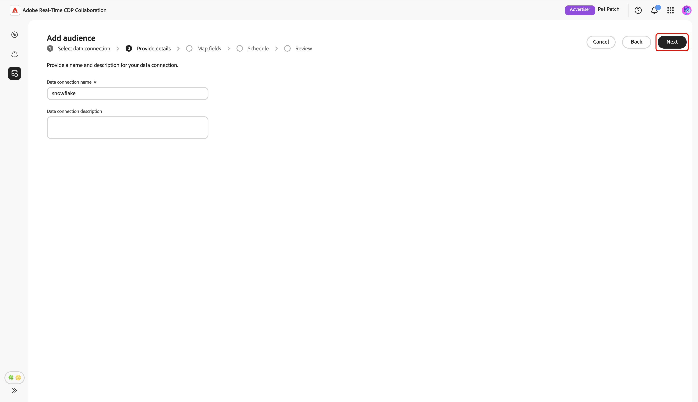

# Configure [!DNL Snowflake] for audience sourcing

Learn how to configure and connect your [!DNL Snowflake Secure Data Share] in the Adobe Real-Time CDP Collaboration UI to source audience data for activation and overlap analysis.

## Overview {#overview}

[!DNL Snowflake] is one of the supported options for sourcing first-party audience data into Collaboration. Other available methods include sourcing audiences from [Experience Platform](./onboard-audiences.md), connecting an [[!DNL AWS S3] bucket](./configure-aws-s3-audience-sourcing.md), or uploading a [CSV file](./upload-csv-audience-sourcing.md).

Follow the steps below to connect your [!DNL Snowflake Secure Data Share] and source your audience data into Collaboration. Once the setup is complete, you can review, activate, and manage your sourced audiences for your collaboration projects.

## Prerequisites {#prerequisites}

Before configuring your [!DNL Snowflake] connection, make sure you meet the following prerequisites:

* You have created a [!DNL Snowflake Share] and set up the necessary permissions in your [!DNL Snowflake] account to grant Adobe access to your [!DNL Snowflake Secure Data Share].
* You have the following [!DNL Snowflake Share] values ready:

  * **Share name**
  * **Account identifier**
  * **Schema**
  * **View**

* The audience data in your [!DNL Snowflake Secure Data Share] must meet the format requirements outlined in the [Audience Sourcing Specification (v1.2)](../../assets/quick-start/RTCDP_Collaboration_Audience_Sourcing_Spec_v1.2.pdf) guide.
* All match keys in your [!DNL Snowflake] audience file must also be enabled for your Collaboration account. Learn how to [enable match keys](./onboard-account.md#set-up-match-keys) or [add new match keys](./onboard-account.md#edit-match-keys) to your account.

## Configure your [!DNL Snowflake] connection {#configure-snowflake-connection}

From the **[!UICONTROL My audiences]** tab within the **[!UICONTROL Setup]** workspace, select the add icon () and then select **[!UICONTROL Audience]**.  

If this is your first audience, you may also select the **[!UICONTROL Add audience]** option.

The Add audience workflow appears. Select **[!UICONTROL Add a new data connection]** and then select **[!UICONTROL Next]**.

{zoomable="yes"}

### Select [!DNL Snowflake] as the data connection {#select-snowflake}

Next, select **[!UICONTROL Snowflake]** as a data connection, followed by **[!UICONTROL Next]**.  

![The data connection selection screen with [!DNL Snowflake] available as a selectable option.](../../assets/setup/snowflake-audience-sourcing/select-snowflake-data-connection.png)

### Review audience file {#review-audience-file}

A dialog appears, explaining the requirements of the [!DNL Snowflake Share] and the [!DNL Snowflake] audience file before you can start sourcing. Make sure your [!DNL Snowflake Share] is created with the correct share name, account identifier, schema, and view. To confirm that your audience data is formatted and structured correctly for use in Collaboration, review the **[[!UICONTROL Audience Sourcing Specification]](../../assets/quick-start/RTCDP_Collaboration_Audience_Sourcing_Spec_v1.2.pdf)** guide.

Once finished, select **[!UICONTROL Start onboarding]**.

![Prepare your [!DNL Snowflake Share] for onboarding dialog with a link to the Audience Sourcing Specifications.](../../assets/setup/snowflake-audience-sourcing/prepare-snowflake-share-onboarding-dialog.png)
 
### Authenticate [!DNL Snowflake Share] connection {#authenticate-snowflake-share-connection}

In this step, you need to provide the required [!DNL Snowflake Share] credentials to connect your [!DNL Snowflake Share] to Collaboration:

| Field              | Description | Example                      |
|--------------------|-------------|------------------------------|
| Share name         | The name of your [!DNL Snowflake Share]. | `ADOBE_DATA_SHARE` |
| Account identifier | The unique identifier of your Snowflake account. | `CUSTOMER_ORG.CUSTOMER_SNOWFLAKE_ACCOUNT` |
| Schema             | The schema within your [!DNL Snowflake Share] that contains your audience data.| `CUSTOMER_SCHEMA` |
| View               | The actual dataset that Collaboration pulls in audience data. | `SECURE_VIEW_FOR_ADOBE` |

{style="table-layout:auto"}

After entering all the required credentials, select **[!UICONTROL Next]**.

![The [!DNL Snowflake Share] connection form with the Share name, Account identifier, Schema, and View fields filled out, and the Next button highlighted.](../../assets/setup/snowflake-audience-sourcing/snowflake-authentication-credentials-form.png)

A confirmation dialog appears at the bottom of the next page, confirming your [!DNL Snowflake Share] was successfully connected to Collaboration.

![A confirmation dialog confirms your [!DNL Snowflake Share] connection was successfully established.](../../assets/setup/snowflake-audience-sourcing/snowflake-share-connection-established.png)

### Provide name and description {#provide-name-description}

In the **[!UICONTROL Provide details]** view, enter a descriptive name and optional description for your [!DNL Snowflake] data connection. When finished, select **[!UICONTROL Next]**.

### Map fields {#map-fields}

The **[!UICONTROL Mapping]** screen is read-only at this time. You cannot add, delete, or apply transformations. Collaboration automatically maps source identity fields from your [!DNL Snowflake Share] data to target fields based on the **[Audience Sourcing Specification (v1.2)](../../assets/quick-start/RTCDP_Collaboration_Audience_Sourcing_Spec_v1.2.pdf)**.

Visually confirm the mapped fields and select **[!UICONTROL Next]** to continue. You can also preview a sample data from your [!DNL Snowflake Share] with the **[!UICONTROL Preview source data]** option.

When you choose to preview, the **[!UICONTROL [!DNL Snowflake Share] data preview]** dialog appears with a sample data displayed in tabular format. Review this, then select **[!UICONTROL Close]**.

![[!DNL Snowflake Share] data preview dialog shows the sample data from your [!DNL Snowflake Share] and the Close option highlighted.](../../assets/setup/snowflake-audience-sourcing/preview-source-data.png)

<!-- NOTE: Manual mapping will be available in the future. -->
<!-- In the **[!UICONTROL Map fields]** screen, you can use the **[!UICONTROL Source field]** and **[!UICONTROL Target field]** dropdowns to update the auto-mapped fields, or include additional fields with the **[!UICONTROL Add field]** option. Once finished, select **[!UICONTROL Next]**. -->

<!--  -->

### Schedule refresh frequency and date range {#refresh-frequency-date-range}

Next, in the **[!UICONTROL Schedule]** view, use the dropdown menu to select refresh frequency between one and six days. Then use the calendar icon to specify start and end dates for sourcing audience.

>[!IMPORTANT]
>
>To manage your Collaboration credits effectively, set the refresh frequency to match or not exceed the update frequency of your underlying [!DNL Snowflake] data. The minimum supported refresh interval is once every six days.

### Review and complete the connection {#review-and-complete}

Finally, review your configuration settings in the summary screen. This view contains a summary of the following sections:

* **[!UICONTROL Data connection]**: Displays the Share name, account identifier, scheme and view of your [!DNL Snowflake Share].
* **[!UICONTROL Details]**: Displays the name and optional description of your data connection to help identify it later.
* **[!UICONTROL Mapping]**: Displays how the source fields from your audience file map to target fields used in Collaboration.
* **[!UICONTROL Schedule]**: Displays how often the connection refreshes audience data and the active date range for sourcing.

Select the pencil icon () if you need to edit a section. Select **[!UICONTROL Complete]** to confirm all sections.

A confirmation dialog confirms that the data connection was created successfully and audience sourcing is in progress.

## Review sourced audiences {#review-sourced-audiences}

After the setup is complete, Collaboration begins sourcing audiences from your [!DNL Snowflake Share]. If audience sourcing is in progress, a banner is displayed at the top of the view.

>[!TIP]
>
>Audience sourcing time varies based on the size of your [!DNL Snowflake] data and the refresh frequency you configured. Larger datasets or less frequent refresh schedules may take longer to appear in the **[!UICONTROL My audiences]** workspace.

When the sourcing finishes, your audiences are available in the **[!UICONTROL My Audiences]** tab with the same features and information as audiences sourced from Experience Platform.

When in grid view or table view, select a row item or **[!UICONTROL View audience]** to see an overview of a specific audience. It displays the audience's status, source, and data connection name, along with detailed panels for **[!UICONTROL Identities]**, **[!UICONTROL Categories]**, **[!UICONTROL Connection access]**, and **[!UICONTROL Metadata visibility]**. See [how to view an individual audience](./onboard-audiences.md#view-individual-audiences) for details.

Use this view to confirm audience configuration and visibility settings before using the audience in collaboration projects.

## View your [!DNL Snowflake] data connection {#view-snowflake-connection}

Your newly added [!DNL Snowflake] connection is immediately available in the **[!UICONTROL My data connections]** tab. The audience source is displayed as [!UICONTROL [!DNL Snowflake]].

Your [!DNL Snowflake] data connection includes the same functionality and details as other audience data connections. Learn more about [how to view and manage data connections](../setup/manage-data-connection.md).  

![My data connections tab shows the [!DNL Snowflake] data connection with sourcing status information.](../../assets/setup/snowflake-audience-sourcing/data-connection-tab-snowflake.png)

## Next steps {#next-steps}

You have now successfully configured and connected your [!DNL Snowflake] as a data source in Collaboration. After sourcing completes, you can [create collaboration projects](../collaborate/manage-projects.md), [activate audiences](../collaborate/activate.md), [review overlaps and insights](../collaborate/measure.md), and [manage your audience settings and visibility](./onboard-audiences.md).

For information about other audience sourcing methods, see the following documentations:

* [Configure [!DNL Amazon S3] for audience sourcing](./configure-aws-s3-audience-sourcing.md)
* [Source audiences from Experience Platform](./onboard-audiences.md)
* [Upload CSV file for audience sourcing](./upload-csv-audience-sourcing.md)
