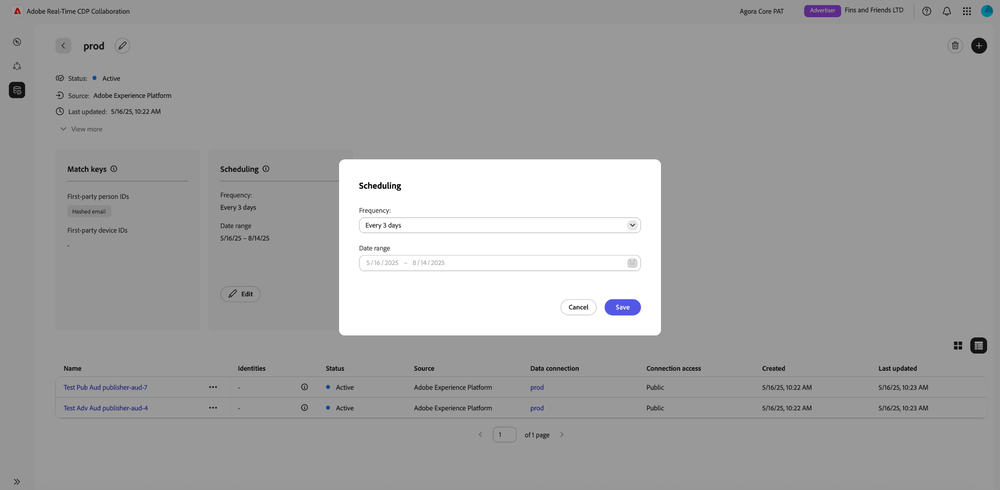

# Manage data connections

{{limited-availability-release-note}}

## Overview

Use data connections in Real-Time CDP Collaboration to source audiences from various platforms. Learn how to manage match keys and schedule data refreshing for your existing data connections. Additionally, you'll be able to filter audiences by different attributes for more granular insights.

## View data connections

To view existing data connections, navigate to **[!UICONTROL Setup]** and then select the **[!UICONTROL My data connections]** tab. All your current data connection are displayed, showing a brief overview for each connection. For a complete view of a data connection's information, including its match keys, scheduling details, and audiences, select **[!UICONTROL View data connection]** on the corresponding connection.

{zoomable="yes"}

### Match keys {#match-keys}

>[!CONTEXTUALHELP]
>id="rtcdp_collaboration_manage_dataconnections_matchkeys"
>title="Match keys"
>abstract="Match keys determine how data from different sources will be matched. The match keys shown below are the target fields you mapped your source fields to."

Match keys are the target fields you [mapped your source fields to](./onboard-audiences.md#map-fields). To learn more about how match keys work, see the [match keys](./onboard-account.md#set-up-match-keys) guide.

{zoomable="yes"}

### Scheduling {#scheduling}

>[!CONTEXTUALHELP]
>id="rtcdp_collaboration_manage_dataconnections_scheduling"
>title="Scheduling"
>abstract="View the scheduling details for your data connection, and edit the configurations if required."

View and manage the scheduling settings for your data connections. Scheduling determines how often the audience is refreshed.

After a data connection is created, you can update its refresh frequency and start and end dates directly from the **[!UICONTROL Scheduling]** section of the data connection workspace.

>[!NOTE]
>
>When sourcing audiences from Adobe Experience Platform, audiences become available within 24 hours after the data connection is established. After the initial sourcing, audience data refreshes according to the defined frequency.

For more information on scheduling, see the [scheduling section](/help/guide/setup/onboard-audiences.md#schedule) in the guide to configuring audiences.

{zoomable="yes"}

## Edit data connection {#edit-data-connection}

Read the following sections to learn how to update match keys and scheduling settings of an existing data connection.

### Edit match keys {#edit-match-keys}

>[!IMPORTANT]
>
>Before editing the match keys for a data connection, note the following:
>
>* Only match keys that are configured for your account can be used for data connections.
>* At this time, you can add additional match keys to a data connection, but once a match key is enabled, it cannot be removed.

Select **[!UICONTROL Edit]** from the **[!UICONTROL Match keys]** section.

{zoomable="yes"}

A confirmation dialog appears, explaining that any changes to the data connection will apply to all associated audiences. Select **[!UICONTROL OK]** to confirm. You can choose to skip this confirmation in the future.

{zoomable="yes"}

In the **[!UICONTROL Match keys]** dialog, you can view the existing mappings between source fields and their corresponding target fields (match keys). You can edit a match key by updating the mapped source field, or add additional mapping field rows to populate new match keys.

{zoomable="yes"}

#### Add match keys {#add-match-keys}

Select **[!UICONTROL Add field]** to add a new field row.

{zoomable="yes"}

Next, select the empty source field. The **[!UICONTROL Select source field]** dialog appears with the **[!UICONTROL Identity namespaces]** and **[!UICONTROL Profile attributes]** options. You can filter the list and find the desired source field with the search option.

Choose the source field that you want, followed by **[!UICONTROL Select]**. 

{zoomable="yes"}

In the **[!UICONTROL Match keys]** dialog, use the dropdown menu to map the new source field to a target field. All available target fields are the match keys configured for your Collaborator account. If you don't see the target field you need, [edit your account's match keys](./onboard-account.md#edit-match-keys) to add it.

Use the **[!UICONTROL Apply transformation]** option if you want to source a non-hashed field to a hashed target field, for example, when mapping a plain text email source field to the **[!UICONTROL Hashed email]** target field.

{zoomable="yes"}

After you finish mapping fields, review your updates and select **[!UICONTROL Confirm]** to apply the changes.

{zoomable="yes"}

A confirmation dialog confirms that the match keys were updated successfully.

### Edit scheduling {#edit-scheduling}

After a data connection is created, you can update its refresh frequency and its start and end dates directly from the **[!UICONTROL Scheduling]** section of the data connection workspace.

You can edit the frequency of an existing data connection to better control how often audiences are refreshed. To edit the schedule, select **[!UICONTROL Edit]** from within the data connection in the scheduling card.

{zoomable="yes"}

A confirmation dialog appears, explaining that any changes to the data connection will apply to all associated audiences. Select **[!UICONTROL OK]** to confirm. You can choose to skip this confirmation in the future.

{zoomable="yes"} 

In the **[!UICONTROL Scheduling]** dialog, select the dropdown menu to update the **[!UICONTROL Frequency]**. Set the refresh frequency to run daily or every two to six days. 

{zoomable="yes"}

Next, select **[!UICONTROL Date range]** if you want to update the period during which audiences are populated and refreshed.

{zoomable="yes"}

When you're done, review the updates and select **[!UICONTROL Save]** to apply your changes.

{zoomable="yes"}

## Delete data connection

Deleting a data connection will remove all underlying audiences, associated settings, and usage across Collaboration. This action cannot be undone.

To delete an existing data connection, select the delete icon () within an individual data connection's workspace.

{zoomable="yes"}

A confirmation dialogue will appear. Select **[!UICONTROL Delete]** to finish deleting the data connection.

{zoomable="yes"}

## Manage audiences {#manage-audiences}

A list of audiences attached to the data connection are displayed at the bottom of the workspace. The list displays a brief overview of each audience, including its status, source, and connection access. To edit an audience's categories, connection access, or metadata visbility, select the audience's name. For a complete guide on managing an audience, refer to the [view individual audiences](./onboard-audiences.md#view-individual-audiences) guide.

{zoomable="yes"}

## Next steps

After managing your data connections, you can [discover overlaps](/help/guide/collaborate/discover.md) between your audiences and the audiences that your collaborator has made discoverable.
