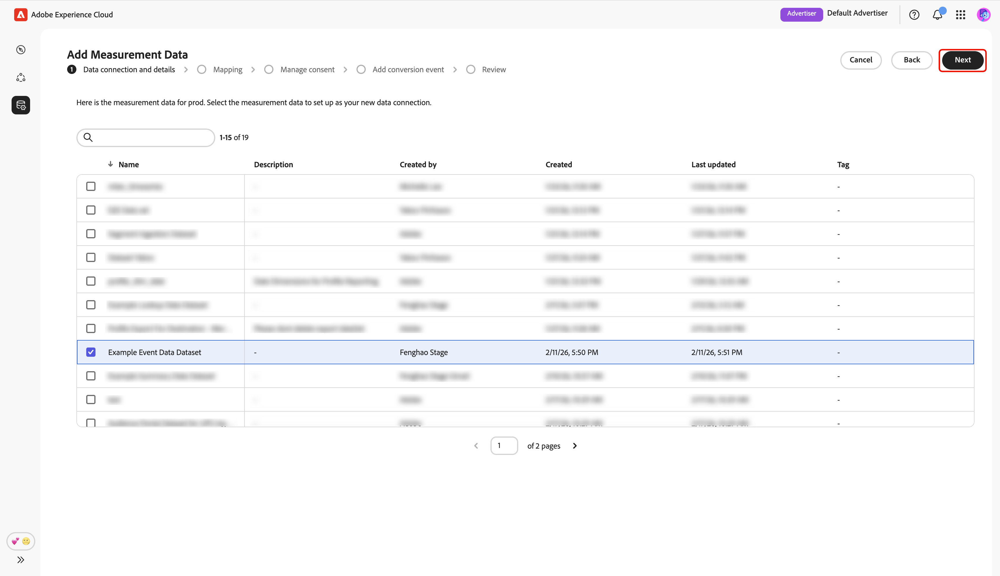
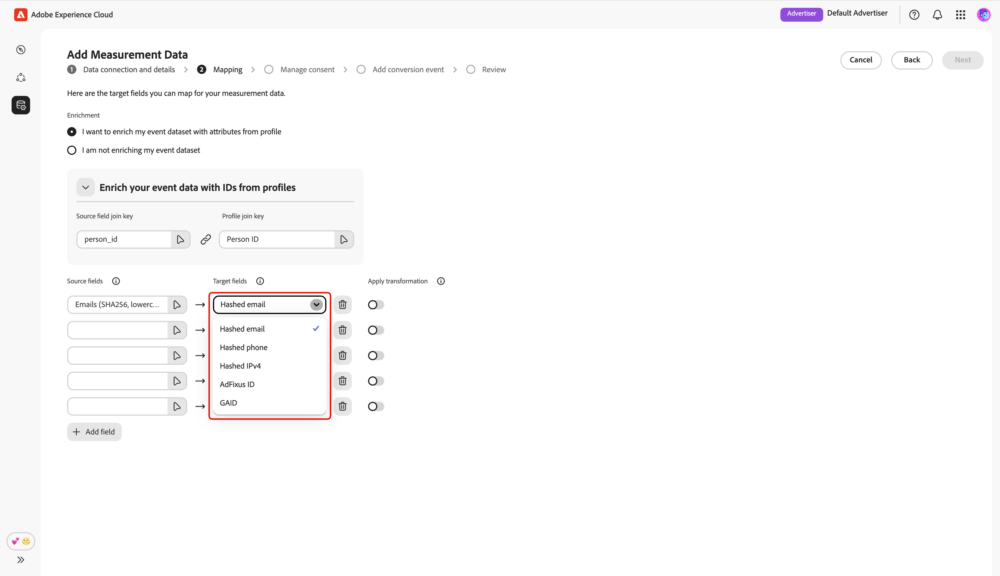
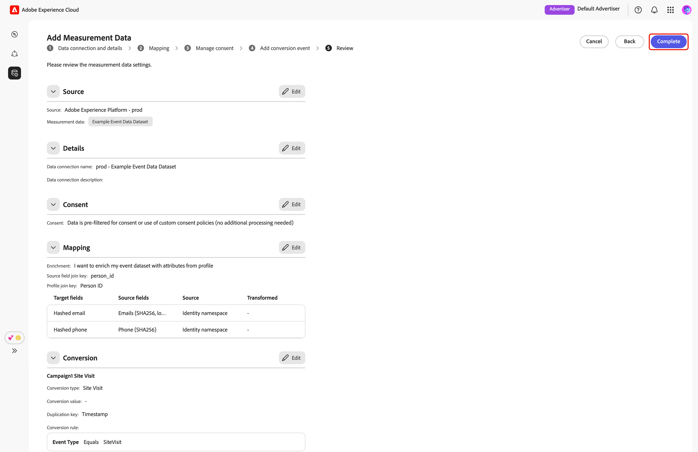

# Add and manage measurement data {#add-and-manage-measurement-data}

>[!CONTEXTUALHELP]
>id="rtcdp_collaboration_onboard_measurement_data"
>title="Read more"
>abstract=""

>[!CONTEXTUALHELP]
>id="rtcdp_collaboration_measurement_data_target_fields"
>title="Target fields"
>abstract="Placeholder for measurement target fields."

>[!CONTEXTUALHELP]
>id="rtcdp_collaboration_measurement_data_source_fields"
>title="Source fields"
>abstract="Placeholder for measurement source fields."

>[!CONTEXTUALHELP]
>id="rtcdp_collaboration_import_measurement_mapping_source_fields"
>title="Map source fields"
>abstract="Placeholder for measurement mapping of source fields."

>[!CONTEXTUALHELP]
>id="rtcdp_collaboration_import_measurement_mapping_target_fields"
>title="Map target fields"
>abstract="Placeholder for measurement mapping of target fields."

{{limited-availability-release-note}}

This document outlines the steps to add campaign measurement data to Adobe Real-Time CDP Collaboration. Publishers can work with Adobe teams to upload campaign measurement data. After that data is uploaded and processed, both publisher and advertiser will be able to view extensive [campaign measurement reports](/help/guide/collaborate/measure.md).

## Add measurement data {#add-measurement-data}

As an advertiser, you can upload your measurement data containing conversion events to Collaboration for use in campaign measurement reports. Conversion data typically includes fields such as user identifiers (for example, hashed email or device IDs), timestamp of the conversion event, and specific conversion event details such as purchase or sign-up.

<!-- To upload measurement data:

1. Prepare your dataset using the required schema, ensuring all identifiers are hashed (SHA256, lowercase), and that necessary metadata fields—such as `campaign_id`, `activation_id`, and `conversion_type`—are included.
2. Access the Collaboration interface and navigate to the measurement data upload section within your project or connection.
3. Select or create a suitable data connection for uploading measurement data.
4. Map your dataset fields to the target fields required by Collaboration. This ensures your user identifiers and event attributes are correctly matched for reporting and attribution purposes.
5. Confirm consent and governance settings are in place according to your organization and partner requirements.
6. Review your configuration, then submit the data for upload. -->

To source measurement data, navigate to the **[!UICONTROL My measurement data]** tab within the **[!UICONTROL Setup]** workspace. Select the add icon () and then select **[!UICONTROL Measurement data]**. 

If this is your first measurement data, you may also select the **[!UICONTROL Add]** option.

{zoomable="yes"}

The **[!UICONTROL Add measurement data]** screen appears, displaying a summary of steps to source measurement data. Select **[!UICONTROL Start onboarding]**.

{zoomable="yes"}

### Data connection and details {#data-connection-and-details}

The **[!UICONTROL Add measurement data]** workflow begins with the first step-configure the data connection and details of your measurement data.

#### Select measurement data type {#select-measurement-data-type}

Measurement data can be conversion events or exposure logs. For advertiser, your measurement data type is **[!UICONTROL Conversion Data]**. 

Select the data type, followed by **[!UICONTROL Next]**. 

{zoomable="yes"}

#### Select data connection {#select-data-connection}

A data connection is the source from where you are sourcing measurement data. To add a data connection, select **[!UICONTROL Add a new data connection]**, then select **[!UICONTROL Next]**.

{zoomable="yes"}

#### Select data source {#select-data-source}

Next, choose the source for your data connection. Currently, the only supported data source is Adobe Experience Platform.

Select your data source, then select **[!UICONTROL Next]**.

{zoomable="yes"}

#### Select sandbox {#select-sandbox}

Select the sandbox that includes the measurement data that you want to use for Collaboration campaign measurement reports. Choose the sandbox from the list of available sandboxes and then select **[!UICONTROL Next]**.

{zoomable="yes"}

#### Select measurement dataset {#select-measurement-dataset}

A list of datasets in the selected sandbox appears. Select a dataset as your measurement data, then select **[!UICONTROL Next]**. You can use the Search option to filter and find the preferred dataset.

{zoomable="yes"}

#### Provide name and details {#provide-name-and-details}

Next, provide a name and a description for your data connection. This information will help you identify the data connection later on.

{zoomable="yes"}

### Mapping fields {#mapping-fields}

The next step is to map fields from your measurement data to the corresponding target fields used in Collaboration. You can also choose to enrich your event dataset with attributes from Real‑Time Customer Profile by mapping join keys, and use these attributes to break down measurement reports.

In the **[!UICONTROL Mapping]** screen, select the empty source field. 

{zoomable="yes"}

The **[!UICONTROL Select source field]** dialog appears, displaying a list of available source fields grouped under options such as **[!UICONTROL Identity namespace]** and **[!UICONTROL Event schema]**. You can use the search option to filter and find the source field from the list.

Choose the source field that you want, followed by **[!UICONTROL Select]**. 

{zoomable="yes"}

Next, use the dropdown menu to map the selected source field to an appropriate target field. All available target fields are the [match keys configured for your Collaborator account](./onboard-account.md#set-up-match-keys).

{zoomable="yes"}

You can add or remove mapping rows as necessary. If you need to map a non-hashed source field to a hashed target field (for example, mapping a plain text email to [!UICONTROL Hashed email]), use the **[!UICONTROL Apply transformation]** option to apply the required hashing.

When you are done, review the mapped fields and join keys if enrichment is enabled. Then, select **[!UICONTROL Next]**.

{zoomable="yes"}

### Manage consent {#manage-consent}

Before proceeding, you must acknowledge that your data usage in Collaboration complies with your Real-Time CDP data governance policies. All data is already filtered according to consent requirements or any applicable custom consent policies, so no further processing is required.

To confirm your acknowledgement, select **[!UICONTROL Next]**.

{zoomable="yes"}

If you enable profile enrichment during the [mapping step](#mapping-fields), you can configure consent policies from a list of pre-defined options. This includes setting marketing actions for your audiences, defining consent rules for your data, and filtering audience to include or exclude for consent.

{zoomable="yes"}

### Add conversion event {#add-conversion-event}

Next, define the conversion events that you want to measure the impact of your campaigns on, for example, site visits, registrations, or completed purchases.

Provide the name of the conversion event, then use the dropdown menu to select the conversion type.

{zoomable="yes"}

You can enter a value for the conversion, or leave it empty if you do not wish to assign a value at this time.

Next, you need to specify the duplication key to indicate which rows in your event dataset belong to the same underlying conversion event (for example, the same timestamp during a sign-up process). This prevents counting the same conversion multiple times in measurement reports. To do this, select **[!UICONTROL Duplication key]**. In the **[!UICONTROL Duplication key]** dialog, find and choose the key, followed by **[!UICONTROL Select]**.

{zoomable="yes"}

After specifying the duplication key, you can add up to **5** conditions to include only relevant rows from the event dataset for the conversion. Choose to apply all or any of these conditions.

Select **[!UICONTROL Add condition]**, then select the condition option.

{zoomable="yes"}

In the dialog, find and choose a source field for the condition rule, followed by **[!UICONTROL Select]**.

{zoomable="yes"}

Use the dropdown menu to select a logic operator, then enter the value for the confition rule.

{zoomable="yes"}

If you want to add more conversion events, select **[!UICONTROL Add conversion]**. Once finished, review the conversion configurations and select **[!UICONTROL Next]**.

{zoomable="yes"}

### Review {#review}

The **[!UICONTROL Review]** screen appears with a summary of measurement data settings. Review and ensure all the information are correct. If you need to change any section, use the **[!UICONTROL Edit]** option.

Finally, select **[!UICONTROL Complete]** to complete adding your measurement data.

{zoomable="yes"}

A confirmation dialog confirms that your measurement data was created successfully. You can see the new measurement data in **[!UICONTROL My measurement data]** workspace.
