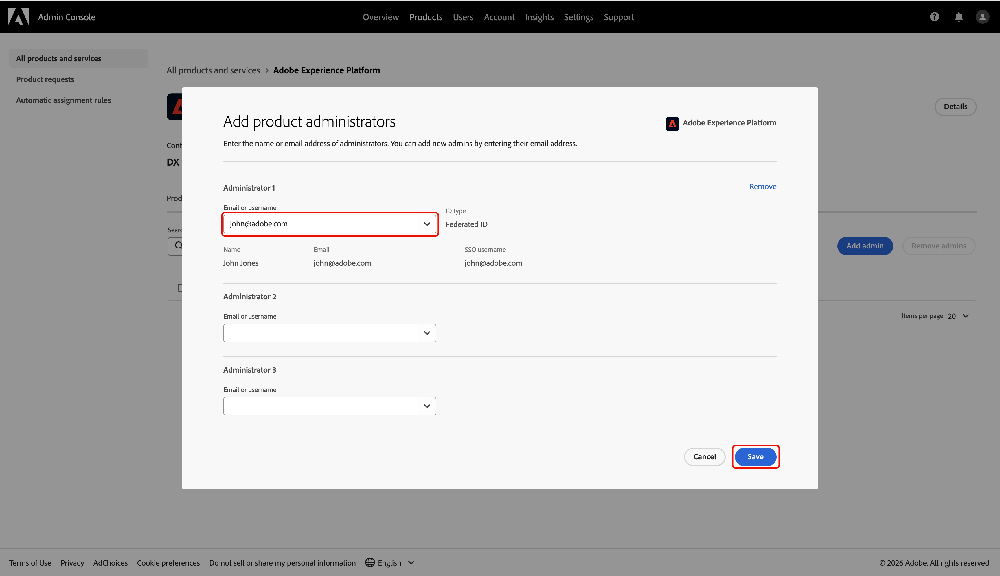
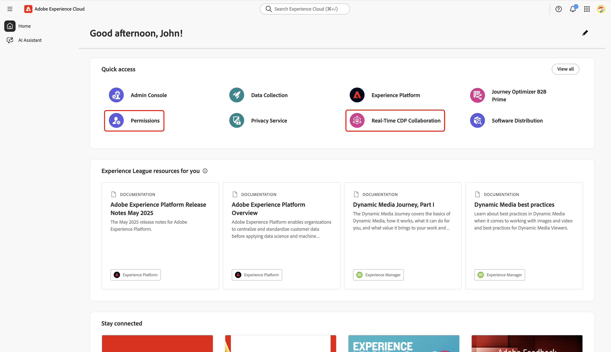

# Configure administrator access for Collaboration Starter onboarding

As the first user from your organization to access Adobe Experience Platform through Collaboration Starter, you are responsible for setting up and managing access for your team. You must grant yourself the necessary administrator and user permissions to begin working in Real-Time CDP Collaboration. This guide explains how to configure the required access in the Admin Console before you can manage permissions for Collaboration in the **[!UICONTROL Permissions]** interface.

## Prerequistes {#prerequisites}

Before continuing, ensure that you have:

* Accepted the invitation from your licensed Collaboration partner. For more information about the invitation requirements, see [Collaboration Starter overview](../overview/starter-overview.md#prerequisites).
* Reviewed and signed the Collaboration terms and conditions.
* Received your Adobe welcome email and completed your first-time account creation.

## Set up access {#setup-access}

When your Adobe account is created through the Starter workflow, you are automatically assigned the system administrator role. This allows you to manage users and product access in the Admin Console. However, you do not yet have access to **[!UICONTROL Permissions]**, which is required to manage access for Collaboration.

Use the Admin Console to grant yourself both **product administrator access** to Experience Platform and **user access** to Experience Platform products to get into **[!UICONTROL Permissions]**.

To learn more about roles and products in Experience Cloud, read the [access control overview](../permissions/overview.md) documentation. 

>[!TIP]
>
>Throughout this guide, an **administator** will refer to **both system and product administators**.

### Configure product administrator access {#configure-product-admin-access}

Read this section to grant yourself administrator privileges to start setting up access for Collaboration Starter.

#### Access Admin Console {#access-admin-console}

To begin, sign in to [Adobe Experience Cloud](https://experience.adobe.com/){target="_blank"} with your credentials. You can see a list of your available products within the **[!UICONTROL Quick access]** section. Select **[!UICONTROL Admin Console]**.

{zoomable="yes"}

#### Access Adobe Experience Platform product dashboard {#access-adobe-experience-platform}

The [Admin Console](https://adminconsole.adobe.com/) workspace opens in a new tab. Select **[!UICONTROL Adobe Experience Platform]** from the **[!UICONTROL Products]** list under **[!UICONTROL Products and services]**.

{zoomable="yes"}

#### Add product admin {#add-product-admin}

In the **[!UICONTROL Adobe Experience Platform]** product dashboard, navigate to the **[!UICONTROL Admins]** tab. Then select **[!UICONTROL Add admin]**.

{zoomable="yes"}

Enter your email address or username in the **[!UICONTROL Add product administrators]** dialog, then select the correct account from the dropdown. Once finished, select **[!UICONTROL Save]**.

{zoomable="yes"}

You are now a product administrator and can add users or other admins to the product within the Admin Console. Next, grant yourself user access to the Experience Platform product to access and perform functions in Permissions.

### Configure user access {#configure-user-access}

To manage Collaboration permissions, you must have **user access** to the product in addition to administrator access. User access can be configured by a system or product administrator.

>[!TIP]
>
>If you are following along from the previous section, you should already be in the **[!UICONTROL Adobe Experience Platform]** product dashboard within the Admin Console. From here, proceed to [add yourself as a user](#add-user).

To begin configuring your user access, complete the following steps:

1. [Access the Admin Console from the Adobe Experience Cloud homepage](#access-admin-console).
2. [Navigate to the Adobe Experience Platform product dashboard](#access-adobe-experience-platform).

#### Add user to product {#add-user}

You are now in the **[!UICONTROL Adobe Experience Platform]** product dashboard. Navigate to the **[!UICONTROL Users]** tab, then select **[!UICONTROL Add users]**.

{zoomable="yes"}

The **[!UICONTROL Add users to this product]** dialog appears, prompting you to enter your name, user group or email address. Fill in the values, then select your account from the dropdown list.

{zoomable="yes"}

Next, select the add icon  under **[!UICONTROL Products]**.

A dialog appears with a list of available [product profiles](https://helpx.adobe.com/enterprise/using/manage-product-profiles.html). Select **[!UICONTROL AEP-Default-All-Users]** and **[!UICONTROL Default Production All Access]**. Then select **[!UICONTROL Apply]**.

{zoomable="yes"}

Finally, select **[!UICONTROL Save]** to finish adding new user to the product.

{zoomable="yes"}

After you have user access, navigate back to [Adobe Experience Cloud](https://experience.adobe.com/){target="_blank"}. Confirm that **[!UICONTROL Permissions]** and **[!UICONTROL Real-Time CDP Collaboration]** are available under **[!UICONTROL Quick access]**.

{zoomable="yes"}

>[!TIP]
>
>If **[!UICONTROL Permissions]** and **[!UICONTROL Real-Time CDP Collaboration]** don't appear in **[!UICONTROL Quick access]**, try signing out and back in.

## Next steps {#next-steps}

You now have both **administrator access** and **user access** to enter Permissions where you can define roles, assign specific permissions, and manage user access for Collaboration features and resources. For step-by-step instructions, refer to the [Permission controls guide](https://example.com).
<!-- TODO: link to Permission controls doc -->
